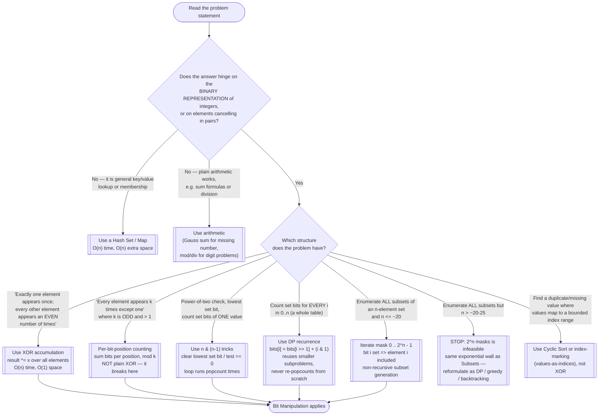

# Bit Manipulation — Recognition Diagram

Use this flowchart when you are staring at a new problem and trying to decide whether bit tricks are the right tool, or whether the problem actually wants a hash set, plain arithmetic, or dynamic programming instead.

## How to read it

Start at the top and answer each diamond honestly before moving on — the most common mistake is reaching for XOR because the problem says "single unique element," without checking what the *distractors'* multiplicities are. The **first real fork** is whether binary representation matters at all: if you are doing ordinary lookup ("have I seen this value?"), a hash set is simpler and more general, and if arithmetic already solves it (sum formula, division), do not obscure the code with bit tricks. Bit Manipulation earns its complexity only when the problem's structure mirrors the algebra of bits.

The **second fork** separates the four working flavors by their exact preconditions: XOR cancellation needs every distractor to appear an **even** number of times; per-bit-position counting handles odd multiplicities like "everything thrice, answer once"; `n & (n-1)` covers single-value properties (power-of-two tests, popcount); and the Counting Bits DP exists precisely because re-popcounting each of `0..n` independently wastes work that the `bits[i >> 1]` subproblem already did. Mask enumeration is the only exponential flavor — before using it, confirm `n <= ~20` and remember that beyond that boundary it is the same wall recursive Subsets hits, so the exit at the bottom right applies. When two flavors look plausible, the Similar Patterns section of this module's [README](../README.md) and the worked traces in [trace-diagram.md](trace-diagram.md) are worth checking before committing.
