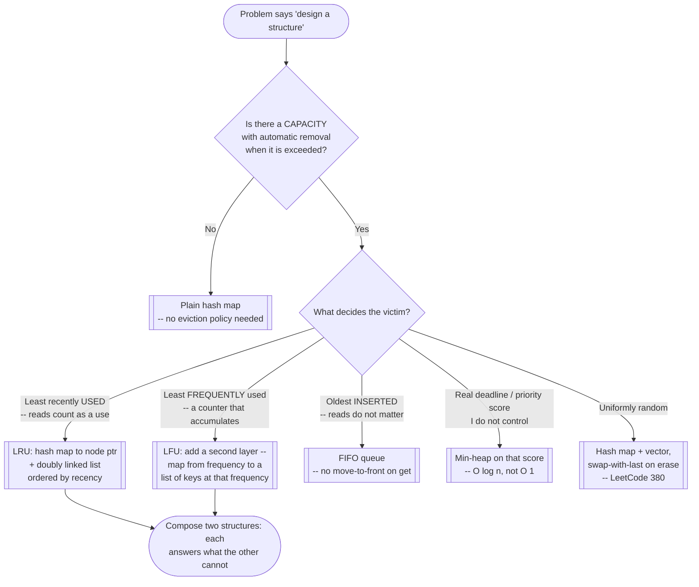
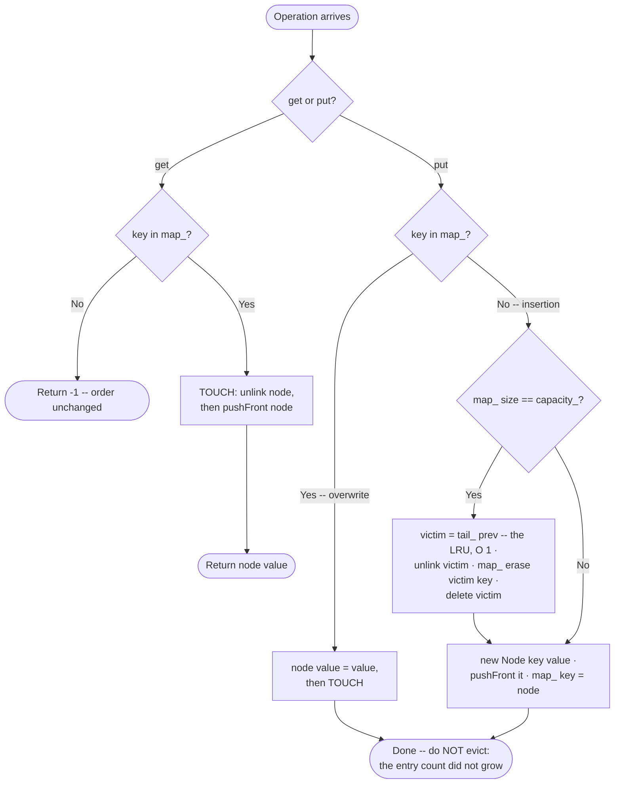
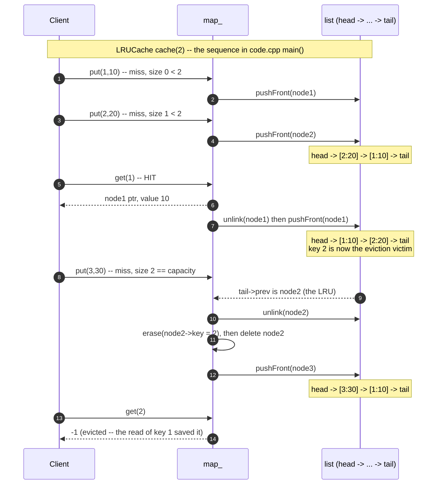

# LRU Cache (Design With Data Structures)


> **In one line:** a hash map for O(1) lookup plus a doubly linked list for O(1) reordering — every access unlinks a node and re-inserts it at the front; eviction removes whatever sits at the tail.

```cpp
int get(int key) {
  auto it = map_.find(key);
  if (it == map_.end()) return -1;
  unlink(it->second);
  pushFront(it->second);          // touched: move to the front (most recently used)
  return it->second->value;
}

void put(int key, int value) {
  auto it = map_.find(key);
  if (it != map_.end()) { it->second->value = value; unlink(it->second); pushFront(it->second); return; }
  if (static_cast<int>(map_.size()) == capacity_) {
    Node* lru = tail_->prev;      // the LEAST recently used node sits at the tail
    unlink(lru); map_.erase(lru->key); delete lru;
  }
  Node* fresh = new Node{key, value, nullptr, nullptr};
  pushFront(fresh);
  map_[key] = fresh;
}
```

**O(1)** for both `get` and `put` · **O(capacity)** space. Full runnable version: [code.cpp](code.cpp)

### Pick your depth

| Time | Path |
|------|------|
| **5 min** — refresher | [cheatsheet.md](cheatsheet.md) → answer its recall questions from memory |
| **20 min** — never seen this before | the code above → run [code.cpp](code.cpp) yourself → [problems/](problems/) |
| **40 min** — want the *why* | read on ↓ for the reasoning and tradeoffs, then [exercises.md](exercises.md) |

---
## Intent

Support `get(key)` and `put(key, value)` in `O(1)` each, while automatically evicting the **least recently used** entry once the cache is full — the canonical "design a data structure" interview question, and the template for a whole family of similar design problems (LFU Cache, design a browser history, design a rate limiter).

## Real Life Analogy

Think of **a small desk with room for exactly five open folders, in an office whose archive room is three floors down.** Every time you need a folder you either already have it on the desk (a hit — cheap, you just reach for it) or you walk down three floors to fetch it (a miss — expensive). The desk is your cache; the archive is your database.

Now the interesting part: when you come back up with a sixth folder and the desk is full, *which* of the five do you send back down? The rule almost everyone converges on without being taught is **"the one I have not touched in the longest time"** — because the folder you were reading two minutes ago is probably the one you will want again in two minutes, and the one you have not opened since this morning probably belongs downstairs. That is the entire LRU policy: recency of use as a proxy for probability of reuse.

Now watch *how* you physically implement that rule on a real desk, because this is where the data structure comes from. You do not scan all five folders comparing timestamps. You keep them in a **stack**, and every single time you touch a folder — even just to read one line — you pull it out and drop it back **on top**. The stack silently maintains itself in recency order as a side effect of normal use, and the folder to evict is always simply *the one at the bottom*. Two properties fall out for free: finding the victim requires no search (it is at a known position), and "touching" a folder requires no search either, because you were already holding it. The one thing a physical desk hides is the hard part — on a desk, "find the folder labelled Q3-invoices" is a quick eyeball scan of five spines; in a cache holding a million entries that scan *is* the whole cost, and it is exactly the cost the hash map exists to delete.

## Problem

### What engineering problem exists?

A cache has to answer two completely different questions on every single operation, and it has to answer both fast:

- **"Where is the entry for this key?"** — a pure lookup, keyed by an arbitrary, unordered key (a user ID, a URL, a query hash).
- **"Which entry is the least recently used one?"** — a pure *ordering* question, where the order changes on every access, including reads.

The interview framing (LeetCode 146) is: implement a class with a fixed `capacity`, where `get(key)` returns the value or `-1` if absent, `put(key, value)` inserts or overwrites, and **both operations must run in `O(1)`** — and both operations count as a "use" that refreshes the key's recency. The `O(1)` requirement is not decoration; it is the entire problem. Drop it and this is a ten-line exercise.

> **Term: recency vs. frequency.** *Recency* asks "how long ago was this key last touched?" — one timestamp per key, and one touch overwrites the previous one entirely. *Frequency* asks "how many times has this key been touched?" — a counter that accumulates. LRU evicts by recency, LFU (LeetCode 460, `problems/02-lfu-cache.cpp`) evicts by frequency. They disagree sharply on a key that was hammered a thousand times yesterday and not once today: LRU throws it out, LFU keeps it.

### Why is this problem difficult?

- **Neither of the two obvious structures can answer both questions.** A hash map answers "where is this key" in `O(1)` and has, by construction, *no* notion of order — `std::unordered_map`'s iteration order is an artifact of bucket layout and rehashing, and carries no information about access time at all. A list or array answers "what is at the end" in `O(1)` and has *no* notion of keyed lookup — finding a given key means a linear scan. Each structure is complete for one question and useless for the other.
- **A read has to mutate the structure.** This is the detail that surprises people. In a normal data structure, `get` is a pure query. In an LRU cache, `get` is a *write*: it must move the touched entry to the most-recently-used position. That single fact is responsible for most of LRU's real-world problems — it makes reads contend on shared state (which is why Postgres does not use LRU for its buffer pool; see Real Interview/Production Examples).
- **Removing an entry from the middle of a sequence in `O(1)` needs the right kind of sequence.** On a `std::vector`, erasing from the middle shifts every following element: `O(n)`. On a *singly* linked list, unlinking a node requires its predecessor, which means a scan from the head: `O(n)`. Only a **doubly** linked list lets you unlink a node you already hold a pointer to in genuinely constant time, because the node itself knows both of its neighbours.
- **The two structures have to point at each other correctly, and stay consistent.** The map's values must be *pointers into the list*, not copies of the data and not positional indices — a position is invalidated by every other operation, and a copy leaves you with two sources of truth. Every eviction must remove the entry from *both* structures; forgetting either half leaves a dangling map entry pointing at freed memory, or an orphaned list node that can never be found again.

### What happens if we ignore it?

- **The `O(n)` cache that is slower than no cache.** Store `(key, value, lastUsedTimestamp)` in a vector and scan for the minimum timestamp on every eviction. At capacity 100 nobody notices. At capacity 100,000 the eviction scan costs more than the database query the cache was supposed to avoid, and it costs it on the *hot path* of every miss.
- **Insertion-order eviction masquerading as LRU.** Skip the move-to-front inside `get` and you have silently built a FIFO cache. It still compiles, still evicts, still passes a naive test, and quietly throws away your hottest key the moment it is the oldest *inserted* one — a bug that shows up as an unexplained cache hit-rate cliff in production, not as a crash.
- **Unbounded memory growth.** A cache with no eviction policy is not a cache, it is a memory leak with good latency. In a long-lived Node or JVM service, an "optimization" that memoizes results in a plain map is one of the most common causes of a slow OOM over days of uptime.

## Why Not Other Approaches?

**"Hash map plus a timestamp per entry; scan for the oldest on eviction."**
`get` and `put` are genuinely `O(1)` — you just stamp a counter into the entry. Eviction is the problem: finding the minimum timestamp is an `O(n)` scan over the whole cache. Since evictions happen on essentially every miss once the cache is warm, this is `O(n)` on the common path. It also needs no less memory than the linked-list version (a timestamp is 8 bytes, two pointers are 16 — the same order), so it buys nothing in exchange.

**"Hash map plus a min-heap keyed on last-access time."**
This fixes eviction to `O(log n)` — pop the min. But it breaks `get`: refreshing a key's recency means updating its key *inside* the heap, which requires a decrease-key/sift operation at a known heap position, so you now also need a map from key to heap index, and you must maintain that index map through every sift. You end up with more moving parts than the linked-list solution, and you have traded `O(1)` for `O(log n)` on both operations to get there. A heap is the right answer when the ordering key is a *value you cannot control* (a real deadline, a priority score); it is the wrong answer when the ordering key is "most recently touched," because that ordering only ever changes by moving one element to one end — and moving an element to the end of a list is `O(1)`.

**"A `std::vector` in recency order, or a singly linked list to save a pointer."**
Both are `O(n)` on the operation that matters most. `std::vector::erase` from the middle shifts every subsequent element down; a singly linked node cannot reach its predecessor, so unlinking it means walking from the head to find one. (For small caches the vector's cache locality can genuinely beat a pointer-chasing list in wall-clock terms despite the worse asymptotics — but the interview asks for `O(1)`, and at real cache sizes the memmove dominates. And the singly-linked "store a pointer to the *previous* node instead" workaround technically achieves `O(1)` while forcing every insert and evict to fix up *neighbouring* keys' map entries, which is a reliable source of bugs.)

**"`std::map` (a balanced tree) ordered by access counter."**
Ordered maps give you `begin()` as the minimum in `O(1)`, but every insert, erase, and re-key is `O(log n)`, and re-keying on every `get` means an erase plus an insert — two tree rebalances per read. Strictly worse than the target for no gain.

**Tradeoff summary:** every alternative fails on exactly one of the two questions. Timestamp-scan and vector-erase fail on the ordering side (`O(n)`), heap and ordered-map fail on the constant-factor side (`O(log n)` and two rebalances per read), and singly-linked fails on the "unlink from the middle" requirement. The hash-map-plus-doubly-linked-list combination is the only arrangement where *both* questions are answered by the structure that is naturally good at it, with the map handing the list the one thing the list cannot find for itself — a pointer to the node.

## Solution

**Compose the two structures instead of choosing between them, and have the hash map's value be a pointer into the list.**

The insight is that the linked list's `O(n)` weakness is *only* "find the node for a given key." It is `O(1)` at everything else: unlink a node you hold, insert at the front, read the node at the back. So delegate the one thing it is bad at to the hash map, which is `O(1)` at exactly that and nothing else. The map never needs to know about ordering; the list never needs to know about keys. Neither structure is modified or made cleverer — they are just wired together so that each one's output is the other's missing input.

Concretely: a **`std::unordered_map<int, Node*>`** from key to the address of a list node, and a **doubly linked list of those nodes maintained in recency order**, most-recently-used at the front, least-recently-used at the back. Each `Node` stores its own `key` *and* `value` — the key is duplicated deliberately, and it is not redundant: on eviction you start from the back of the list holding only a `Node*`, and you need that node's key to erase the correct map entry. Without the key stored in the node, eviction would require an `O(n)` reverse lookup through the map, reintroducing the exact cost the design exists to remove.

Two small techniques make the implementation clean rather than fiddly:

**Sentinel nodes.** Allocate two permanent dummy nodes, `head_` and `tail_`, that hold no data and are never removed. The real entries always live strictly between them. This means every node that gets unlinked is guaranteed to have both a `prev` and a `next` that are non-null, so `unlink` is unconditionally two pointer assignments with no null checks and no "is this the first/last element" special cases. The list is never empty from the pointer-manipulation code's point of view, which eliminates an entire class of off-by-one bug at the cost of two node allocations for the process lifetime.

**One shared "touch" operation.** Refreshing a key's recency is always the same two steps — `unlink(node)` then `pushFront(node)` — whether it was triggered by a `get`, by a `put` that overwrote an existing key, or by a fresh insertion (which skips the unlink, having nothing to unlink yet). Writing it once and calling it from all three places is what keeps the read-is-a-write requirement from being forgotten in one of the branches.

## Architecture

Four participants, each with exactly one job:

1. **The hash map (`std::unordered_map<int, Node*>`).** The *index*. Its only responsibility is answering "given a key, what is the address of its node?" in `O(1)` average time. It stores pointers, never values — there is exactly one copy of each cached value, living in its node, so there is no synchronization problem between two copies. `map_.size()` doubles as the cache's current occupancy, which is why `code.cpp` needs no separate `size_` counter.

2. **The doubly linked list.** The *recency order*. Its only responsibility is maintaining the sequence most-recently-used → least-recently-used, and supporting three `O(1)` primitives: unlink a given node, push a node to the front, and read the node at the back. It has no idea what a key is; it never searches for anything.

3. **The sentinels (`head_`, `tail_`).** Fixed, dataless boundary markers. `head_->next` is *the* most-recently-used real entry; `tail_->prev` is *the* eviction victim. Their purpose is purely to guarantee that every real node has real neighbours on both sides.

4. **The `Node` itself.** The single storage location for one cache entry: `key`, `value`, `prev`, `next`. It is simultaneously a member of both structures — the map points *at* it, the list threads *through* it — which is precisely how one `O(1)` lookup in the map yields an `O(1)` reposition in the list. Storing the `key` alongside the `value` is what makes eviction `O(1)` in the other direction, list → map.

The invariant that ties it together, and the one to state out loud in an interview: **`map_` and the list always contain exactly the same set of keys, and `map_[k]` is always the address of the unique list node whose `key == k`.** Every operation must preserve it, and every bug in a hand-written LRU cache is a violation of it — a key erased from one structure but not the other, or a node freed while the map still points at it.

## Execution Flow

**`get(key)`**, step by step:

1. Look `key` up in `map_`. If it is absent, return the sentinel miss value (`-1` in the LeetCode formulation) and stop — nothing about the recency order changes on a miss.
2. It is present, so `it->second` is a `Node*` pointing directly at the entry. No scan of the list happened, and none will.
3. `unlink(node)` — splice the node out of its current position by pointing its predecessor and successor at each other. Because sentinels guarantee both exist, this is two assignments with no branching. The node's own `prev`/`next` are now stale, which is harmless because the next step overwrites both.
4. `pushFront(node)` — reinsert it immediately after `head_`, making it the most-recently-used entry. Four pointer assignments, no allocation: the node was never destroyed, only re-threaded.
5. Return `node->value`. Total work: one hash lookup and six pointer writes, independent of cache size.

**`put(key, value)`**, step by step:

1. Look `key` up in `map_`.
2. **If it is present** (an overwrite, not an insertion): set `node->value = value`, then `unlink` + `pushFront` exactly as in `get` — an overwrite is a use — and return. Critically, **do not evict here**: the entry count did not change, so the cache cannot have exceeded capacity. Evicting on this path is a real bug that silently shrinks the cache on every update.
3. **If it is absent**, this is an insertion and the count is about to grow, so check capacity *before* inserting: is `map_.size() == capacity_`?
4. **If at capacity, evict first.** Take `Node* lru = tail_->prev` — the least-recently-used real entry, reachable in `O(1)` precisely because the list is doubly linked and has a tail sentinel.
5. `unlink(lru)` to remove it from the ordering.
6. `map_.erase(lru->key)` to remove it from the index. This is the step that needs the key stored *inside* the node; going from a `Node*` back to its key any other way would be a linear search.
7. `delete lru` to release the memory. In C++ this is mandatory — no garbage collector will do it — and skipping it leaks exactly one `Node` per eviction, which for a long-running cache is unbounded growth in the one component whose entire purpose was to bound memory.
8. **Now insert.** Allocate `Node* fresh = new Node{key, value, nullptr, nullptr}`, `pushFront(fresh)` to make it most-recently-used, and record `map_[key] = fresh` so the index and the list agree again.
9. The invariant from Architecture holds at every step boundary: after step 7 both structures have lost the victim; after step 8 both have gained the new entry.

## Recognition Diagram



Full walkthrough in [images/recognition-diagram.md](images/recognition-diagram.md).

## Flow Diagram



Full walkthrough in [images/flow-diagram.md](images/flow-diagram.md).

## Trace Diagram



Full walkthrough in [images/trace-diagram.md](images/trace-diagram.md).

## Implementation

[code.cpp](code.cpp) is a **generic, reusable template** rather than a LeetCode submission — the goal is to see the composition (map indexing into a sentinel-bracketed doubly linked list) in isolation before reading the four worked problems in [problems/](problems/).

It exposes `LRUCache(int capacity)`, `get`, `put`, and a `size()` accessor used by the tests, and keeps the pointer surgery in two private one-line helpers, `unlink` and `pushFront`, so that every public operation reads as a sequence of named intentions rather than raw pointer assignments. `main()` runs eleven assertions covering the update-in-place path, the eviction path, and a capacity-1 cache.

## Code Walkthrough

**`struct Node`** (in [code.cpp](code.cpp)). Four fields: `key`, `value`, `prev`, `next`, all default-initialized so the sentinels can be built with `new Node()`. Storing `key` in the node — not just `value` — is what makes step 6 of the `put` execution flow `O(1)`; it is the single most commonly omitted field when writing this from memory.

**The constructor.** Allocates both sentinels and links them to each other (`head_->next = tail_; tail_->prev = head_;`). From this moment the list is a valid, non-empty chain, so `unlink` and `pushFront` never need a null check. `capacity_` is stored as-is; note the class does not defend against `capacity <= 0`, which is fine for the LeetCode constraints (`1 <= capacity`) but is called out in Common Mistakes as something to raise unprompted in an interview.

**`unlink(Node* n)`** (in [code.cpp](code.cpp)). `n->prev->next = n->next; n->next->prev = n->prev;`. Two assignments, no branches, no null tests — the sentinels are doing all the work here. It deliberately does *not* clear `n->prev`/`n->next`; every caller either immediately re-inserts the node (which overwrites both) or deletes it, so clearing them would be dead stores.

**`pushFront(Node* n)`** (in [code.cpp](code.cpp)). Splices `n` between `head_` and the current first real node. The order of the four assignments matters: `n->next` and `n->prev` are set *before* `head_->next->prev` and `head_->next` are overwritten, because the second pair destroys the pointer the first pair needs to read. Reordering these lines is the classic way this function breaks.

**`get(int key)`** (in [code.cpp](code.cpp)). One `map_.find`, an early return of `-1` on a miss, then `unlink` + `pushFront` on the found node, then return its value. The two lines that look optional are the whole pattern: a `get` that skips them is a FIFO cache.

**`put(int key, int value)`** (in [code.cpp](code.cpp)). Three distinct paths, in the order the execution flow describes: overwrite-and-touch-then-*return* (the early `return` is load-bearing — falling through would run the eviction check on an operation that did not grow the cache), evict-if-full, then insert. The capacity comparison is written `static_cast<int>(map_.size()) == capacity_` because `size()` returns an unsigned `size_t` and comparing it directly against a signed `int` is exactly the `-Wall` sign-compare warning this repo's compile flags surface.

**`~LRUCache()`** (in [code.cpp](code.cpp)). Walks from `head_` following `next` and deletes every node including both sentinels. Worth noting for interview purposes: this class owns raw pointers and defines a destructor but no copy constructor or copy assignment operator, so copying an `LRUCache` would double-free. A production version would either delete those two operations explicitly or hold nodes in a `std::list`.

**Files in [problems/](problems/).** Four standalone, independently compilable solutions, each redefining what it needs rather than including `code.cpp`. `01` (LeetCode 146) is the canonical LRU build; `02` (LeetCode 460) adds the frequency layer that LRU's structure does not generalize to for free; `03` (LeetCode 1472) composes the same map-plus-sequence thinking around a different access pattern (browser back/forward), showing that the pattern is "pick the structure that makes your specific operation `O(1)`", not "always use a linked list"; `04` (LeetCode 1797) swaps recency ordering for time-based expiry, a design variant that needs only the hash-map half. Index in [problems/README.md](problems/README.md).

## Advantages

- **True `O(1)` worst case on the ordering half.** Unlike heap- or tree-based schemes, nothing here is logarithmic. The list operations are a fixed number of pointer writes regardless of how many entries the cache holds, and eviction requires no search at all.
- **Exact LRU semantics, not an approximation.** The entry evicted is provably the least recently used one, which makes the structure easy to reason about and easy to test deterministically — a property that matters more in an interview and in a unit test than it does in a production cache (see the Redis discussion below).
- **Reads and writes share one code path for recency.** `unlink` + `pushFront` is the only recency-mutating operation in the class, called from three places. There is exactly one place to get it right.
- **Sentinels eliminate boundary conditions.** No "if this is the head", no "if the list is empty", no null checks in the hot path. The two wasted node allocations buy a measurable reduction in bug surface.
- **The composition generalizes.** "Index with a hash map, order with the structure whose `O(1)` operation you actually need" solves LFU (map to frequency buckets), `O(1)` random access (map to a vector index), and browser history (map plus a cursor into a list) — the four `problems/` files are four instances of the same move.

## Disadvantages

- **Per-entry memory overhead is large relative to small values.** Every entry costs two pointers (16 bytes on a 64-bit build) for the list, plus the `unordered_map` node's own bucket pointer and stored key, plus two separate heap allocations with their own allocator headers. Caching an `int` keyed by an `int` — 8 bytes of payload — can easily cost 80–100 bytes of real memory. At a few million keys this is the dominant cost, and it is the specific reason Redis refuses to implement true LRU (see Real Interview/Production Examples).
- **Pointer chasing is cache-hostile.** Each node is a separate allocation at an arbitrary address, so walking or touching entries means dependent loads that miss L1/L2. A `std::vector`-based cache with worse asymptotics can win in wall-clock time at small sizes purely on locality.
- **A read mutates shared state, so reads cannot be concurrent.** `get` writes to four nodes and to the list head. Under concurrency every read needs the same exclusive lock as a write, which turns the cache into a single serialization point — the head of the list is touched by *every* operation, making it the hottest possible contention point. This is not a small caveat; it is why real multi-core caches use sharding, striped locks, or an entirely different eviction algorithm.
- **Exact LRU is not scan-resistant.** One sequential pass over a large key range — a batch job, an analytics query, a `SCAN` — touches every key once, and each touch promotes a key that will never be read again to the front, flushing the genuinely hot working set out of the cache. LRU has no way to distinguish "read once, ever" from "read constantly." LFU, ARC, 2Q, and W-TinyLFU all exist primarily to fix this one flaw.
- **Manual memory management in C++.** Raw `new`/`delete` with a hand-written destructor, no copy semantics, and a dangling-pointer failure mode if the map and list ever disagree. The `std::list` + iterator variant (see Tradeoffs) avoids all of this.

## Tradeoffs

**What we gain versus a timestamp scan:** eviction drops from `O(n)` to `O(1)` for the same order of memory overhead (two pointers instead of one timestamp). Pure win at any nontrivial capacity.

**What we gain versus a heap:** `O(1)` instead of `O(log n)` on both operations, and no key-to-heap-index map to maintain through sifts. The heap wins only when the ordering key is externally determined (a TTL deadline, a priority) rather than "whatever was touched last."

**What we lose versus a plain hash map:** roughly 16–24 bytes per entry, worse locality, and a mutation on every read. If nothing ever needs to be evicted, all of that is pure cost.

**Hand-rolled nodes versus `std::list` + iterators.** `std::unordered_map<int, std::list<std::pair<int,int>>::iterator>` plus `list.splice(list.begin(), list, it)` implements the same cache in about a third of the code, with no raw pointers, no sentinels, and no destructor — `splice` moves a node between positions in `O(1)` and, crucially, **does not invalidate the iterator**, which is what makes the stored iterators stay valid across every operation. The hand-rolled version exists here because interviewers usually want to see that you know *why* it needs to be doubly linked, and `splice` hides exactly that. In production code, reach for `std::list`.

**Exact LRU versus approximated LRU.** Exact LRU costs two pointers and a structural mutation per read. Sampled/approximated LRU (pick `k` random keys, evict the oldest of those) costs zero pointers and only a timestamp write per read, and gets a *statistically* near-identical hit rate. At Redis's scale the approximation is strictly the better engineering decision; at interview scale the exact version is what is being asked for. Knowing which one you are being asked for — and that the other exists — is the actual signal.

**Recency versus frequency.** LRU adapts instantly to a shifting working set and is trivially cheap to maintain; LFU resists scan pollution but needs a decay mechanism or it ossifies around keys that were hot last week. Neither dominates; hybrids (ARC, W-TinyLFU) exist because the right answer is workload-dependent.

## Complexity

**Time:** `get` and `put` are **`O(1)`** — but the two halves of that claim have different strengths, and the distinction is a good interview answer. The doubly linked list operations (`unlink`, `pushFront`, reading `tail_->prev`) are `O(1)` **worst case**: a fixed number of pointer writes, no loop, no size dependence. The `unordered_map` operations are `O(1)` **average**, degrading to `O(n)` in the pathological case where every key hashes to the same bucket, and with an *amortized* cost from occasional rehashing (which is `O(n)` for the one insertion that triggers it, spread over the `n` insertions that preceded it). So the honest statement is: `O(1)` worst case for the ordering, `O(1)` average and amortized for the lookup — and the hash map, not the list, is the part with a bad case.

**Space:** **`O(capacity)`** — exactly one `Node` and one map entry per cached key, and the cache never exceeds `capacity` entries by construction. The constant factor is the concern rather than the asymptotics: see Disadvantages for why 8 bytes of payload can cost 80+ bytes of resident memory.

| Approach | `get` | `put` (with eviction) | Extra space per entry |
|---|---|---|---|
| Hash map + doubly linked list (this pattern) | `O(1)` avg | `O(1)` avg | 2 pointers + map node |
| Hash map + timestamp, scan on evict | `O(1)` avg | `O(n)` | 1 timestamp + map node |
| Hash map + min-heap on last-access | `O(log n)` | `O(log n)` | heap slot + index map entry |
| `std::map` keyed by access counter | `O(log n)` | `O(log n)` | tree node (3 pointers + colour) |
| Sampled/approximate LRU (Redis-style) | `O(1)` | `O(k)`, `k` = sample size | ~3 bytes of clock, no pointers |

## Common Mistakes

- **Using a singly linked list, or storing indices/values in the map instead of node pointers.** Removing an arbitrary node from a singly linked list needs its predecessor, which means a scan — reintroducing the `O(n)` cost the whole structure exists to avoid. Positional indices are invalidated by every other operation, and storing a *copy* of the value in the map gives you two sources of truth to keep in sync. *Avoid:* the map's value type is `Node*`, always, and the list is doubly linked, always.
- **Forgetting to move a node to the front on `get`, not just on `put`.** A cache is "least recently *used*," and a read is a use. Omitting the move-to-front in `get` silently converts the structure into insertion-order (FIFO) eviction. It compiles, it evicts, and it passes any test that never reads a key before it would have been evicted — which is why this bug reaches production. *Avoid:* factor `unlink` + `pushFront` into one named `touch` step and call it from `get` and from the overwrite branch of `put`; the moment it has a name, a missing call is visible.
- **Not storing the key inside the node.** Eviction starts from `tail_->prev`, which is a `Node*`. To remove that entry from the map you need its key. If the node only holds a value, the only way back to the key is a linear scan of the map — `O(n)` on the eviction path, which is the common path. *Avoid:* treat `key` as a mandatory node field, and write the `map_.erase(lru->key)` line before you write the eviction logic around it.
- **Running the eviction check on the overwrite path of `put`.** Updating an existing key does not change the entry count, so checking "am I at capacity?" and evicting there removes a live entry for no reason, shrinking the usable cache by one on every update until it holds nothing. *Avoid:* the overwrite branch must `return` early; only the insertion branch may evict.
- **Skipping sentinel head/tail nodes and hand-checking `nullptr` at both ends.** Real (non-sentinel) head/tail pointers force every unlink and insert to special-case "is this the first or last real node," and to handle the list becoming empty. That is four extra branches in the two hottest functions, each of which is an opportunity for an off-by-one. *Avoid:* allocate two dummy nodes in the constructor and never touch that decision again.
- **Not freeing evicted nodes in C++.** A `delete` is required on eviction, or the cache leaks one `Node` per eviction for its entire lifetime — an unbounded leak in the component whose purpose is bounding memory. The mirror-image bug is `delete`-ing the node *before* reading `lru->key` for the map erase, which is a use-after-free. *Avoid:* fixed order — unlink, erase from map (reading the key), then delete.
- **Assuming `capacity` is positive.** With `capacity == 0`, the insertion path evicts the entry it is about to add, or — depending on how the check is written — inserts a node into a cache that should hold nothing and never evicts it. LeetCode guarantees `capacity >= 1`, so this never fails a submission, but stating the assumption unprompted is a cheap and reliable signal in an interview. *Avoid:* either assert it in the constructor or say out loud that you are assuming it.
- **Writing the four `pushFront` assignments in the wrong order.** `head_->next = n` before `n->next = head_->next` loses the pointer to the old first node, silently truncating the list to one entry and orphaning everything else (which the map still points at). *Avoid:* set the new node's own two pointers first, then fix its neighbours.

## When To Use

- **Any "design a cache/structure with `O(1)` access plus an eviction policy" question.** LRU is the base case; LFU (LeetCode 460, `problems/02-lfu-cache.cpp`) is the same composition with one extra layer — a map from frequency to a list of keys at that frequency, plus a tracked minimum frequency.
- **You need a bounded-memory cache in front of an expensive resource** — a database, a remote API, a filesystem, a CPU-heavy pure computation — and recency is a reasonable predictor of reuse (which it is for most request-driven workloads).
- **You have a hash map and you also need *some* order over its contents, maintained in `O(1)`.** The general move is "map for the lookup, second structure for the order"; LRU is the instance where the order is recency and the second structure is a doubly linked list.
- **You need `O(1)` removal of an arbitrary element from a sequence.** This is the doubly-linked-list-plus-index composition in its own right, whether or not the ordering means "recency" — as in LeetCode 380 (Insert Delete GetRandom O(1), in [exercises.md](exercises.md)), where the second structure is a vector and the trick is swap-with-last.
- **Memoizing inside a long-lived process** where an unbounded memo table would be a slow memory leak — bounding it with LRU turns "leaks until OOM" into "holds the hot set."

## When NOT To Use

- **You only need key-value storage with no eviction.** A plain hash map is simpler, faster, and uses less memory per entry. Do not pay 16 bytes and a mutation-per-read for a policy you never invoke.
- **You need thread-safe concurrent access at scale.** This template has no locking, and adding one global mutex makes the list head a serialization point that every read must pass through. Real concurrent caches shard the keyspace across independently locked segments, or drop exact LRU entirely in favour of an approximation whose reads do not mutate shared structure (see Postgres's clock sweep and Redis's sampling below). Reach for Caffeine, Guava, `lru-cache`, or Redis itself before hand-rolling a concurrent LRU.
- **Eviction should be driven by time, not capacity.** "Expire 60 seconds after write" is a TTL problem, not an LRU problem — the right structures are a min-heap or timing wheel keyed by expiry, or simply a per-entry deadline checked lazily on read. TTL is about *freshness/correctness*; LRU is about *capacity*. Production caches usually need both, and they are independent mechanisms.
- **The workload is dominated by large sequential scans.** LRU is not scan-resistant: a single full pass promotes every cold key and flushes the hot set. Use LFU, 2Q, ARC, W-TinyLFU, or a separate scan buffer (Postgres's `BufferAccessStrategy` rings are exactly this).
- **The number of entries is small and fixed.** At a dozen entries, a linear scan over a flat array beats pointer chasing on wall-clock time and is a tenth of the code.
- **Frequency, not recency, predicts reuse in your data.** If a small set of keys is overwhelmingly popular over long horizons and access order is bursty, LFU's hit rate is materially better — which is precisely why Redis added `allkeys-lfu` in 4.0 rather than leaving LRU as the only serious option.

## Real Interview/Production Examples

LeetCode 146 is one of the most frequently asked "design" questions in the industry, and it is asked for a specific reason: it is the shortest problem that forces a candidate to *compose* two data structures and then defend the composition. The follow-up is almost always either 460 (LFU) or "now make it thread-safe," both of which are in this module.

Beyond interviews, this exact set of tradeoffs shows up in systems the reader already runs:

**Redis — `maxmemory-policy`, and why it deliberately does *not* implement true LRU.** When `maxmemory` is reached, Redis evicts according to `maxmemory-policy`: `noeviction` (fail writes), `allkeys-lru`, `allkeys-lfu`, `allkeys-random`, and the `volatile-*` variants that only consider keys with a TTL set (`volatile-ttl` evicts the nearest expiry first). The important part for this module is that **`allkeys-lru` is not the structure in `code.cpp`** — it is an *approximation*. Redis does not maintain a doubly linked list of all keys in recency order. Instead, every object carries a small `lru` field (24 bits, holding a coarse clock at roughly second granularity), and on eviction Redis **samples** `maxmemory-samples` keys at random (default 5) and evicts the oldest one it sampled; since Redis 3.0 the sampled candidates go into a persistent 16-entry eviction pool so good victims found in one cycle carry over to the next. The reason this is the right call is exactly the Disadvantages section above: a true LRU list would add ~16 bytes of pointers to *every single key* in a database that routinely holds hundreds of millions of them, and — worse — it would turn every `GET` into a structural write to a globally shared list, which is a disaster for memory locality and for anything resembling concurrency. The approximation costs three bytes of clock per object, mutates nothing shared on a read, and yields a hit rate close enough to exact LRU that the difference is measurable only in synthetic benchmarks. Redis 4.0 added `allkeys-lfu` for scan-resistant workloads, reusing the same 24-bit field split into 16 bits of "last decay time" and an 8-bit *logarithmic* counter (tuned by `lfu-log-factor` and decayed by `lfu-decay-time`), so that a key hit a million times and a key hit ten thousand times remain distinguishable in 8 bits. `OBJECT IDLETIME` and `OBJECT FREQ` expose the respective fields per key.

**PostgreSQL's buffer pool — clock sweep, and why it is not LRU.** `shared_buffers` is a fixed array of 8 KB pages that needs a replacement policy, and Postgres does *not* use LRU. Each buffer descriptor carries a `usage_count` capped at a small value (5), and `StrategyGetBuffer` advances a single circular `nextVictimBuffer` pointer: if the buffer it lands on has a nonzero `usage_count` it decrements it and moves on; the first buffer it finds with `usage_count == 0` and no pins becomes the victim. That is GCLOCK / clock-sweep, an approximation of LRU. The motivation is the concurrency point from Disadvantages: with dozens of backends servicing millions of buffer hits per second, a strict LRU list would require taking a lock on one global list *on every read hit* — turning the buffer pool's happiest path into its worst contention point. Clock sweep touches only the descriptor of the buffer being hit (a `usage_count` bump), with no shared list to reorder. Postgres separately solves LRU's scan-pollution problem with `BufferAccessStrategy` ring buffers: sequential scans, `VACUUM`, and bulk writes are given a small fixed ring of buffers to recycle among themselves, so a `VACUUM` over a terabyte table cannot flush the working set. (Historically 8.0 used an ARC-like policy and moved to clock sweep in 8.1.)

**CDN edge caches.** A POP's RAM tier is usually LRU or segmented-LRU, but the interesting production detail is **admission** rather than eviction: the majority of objects requested at an edge are one-hit wonders, and admitting them means each one evicts something popular. So edge caches gate insertion — "cache on second hit," tracked with a Bloom filter or a compact frequency sketch — which is the core idea of TinyLFU/W-TinyLFU (the algorithm behind Caffeine, the standard JVM cache). The lesson generalizes: once your miss stream contains a lot of never-to-be-repeated keys, *what you let in* matters more than *what you throw out*.

**HTTP cache layers.** Browser caches, `Cache-Control: max-age` / `s-maxage`, `stale-while-revalidate`, and `ETag`/`If-None-Match` revalidation are all about **freshness**, not capacity — they answer "is this copy still valid?" A browser's or proxy's disk cache *also* has a size limit, and *that* is where an LRU-ish policy runs, independently. Confusing the two is a common design error: TTL expiry and LRU eviction are orthogonal mechanisms, and a cache generally needs both — one for correctness, one for memory.

**Memcached.** Uses a segmented LRU (HOT/WARM/COLD queues since 1.5) with a background LRU crawler, plus a deliberate optimization worth knowing: an item is only bumped toward the head if it has not been bumped in the last ~60 seconds. Same reasoning as Redis — avoiding a structural mutation on every single read is worth more than exact ordering.

## Where I Can Use This

Five concrete places in a Node/NestJS + Postgres + Redis stack:

1. **An in-process L1 cache in front of Redis, inside a NestJS service.** Redis is a network hop — sub-millisecond, but a hop, plus serialization on both ends. For a config table, a feature-flag set, or a permissions map read on nearly every request, a bounded in-process LRU (the `lru-cache` npm package, or `@nestjs/cache-manager` with an in-memory store) collapses that hop to a pointer dereference. The bound is the whole point: a plain `Map` here is a slow OOM across days of uptime, and the `max` option is what makes it a cache instead of a leak. Worth knowing how the JS implementation differs: `lru-cache` v7+ stores its linked list as index-based `Uint32Array`s rather than per-entry objects with `prev`/`next` properties, specifically to avoid allocating two object references per entry and the GC pressure that comes with it — the same memory-overhead concern that drove Redis to sampling, solved differently. Pair it with a short TTL, because an in-process cache has no invalidation channel: if another pod writes to Postgres, your L1 copy is stale until it expires.
2. **Memoizing expensive pure computations per request-handler.** A permissions-tree resolution, a pricing-rule evaluation, a compiled JSONLogic expression, a parsed and validated schema. These are deterministic in their inputs and expensive to recompute, and the input space is unbounded (so an unbounded memo is unsafe) but heavily skewed (so a small LRU captures most of the value). Key on a stable hash of the inputs and size the cache by measured hit rate, not by guess.
3. **Choosing and defending `maxmemory-policy` on your actual Redis instances.** This is the direct payoff. If Redis is a pure cache, `noeviction` (the default) is wrong — it makes writes fail once memory fills instead of shedding cold data. If every key has a TTL and you want expiry-order eviction, `volatile-ttl`; if some keys are permanent (sessions you must not lose) mixing them with cache keys in the same instance is the real bug, and separate instances or logical databases are the fix. If your traffic includes periodic full scans or batch jobs that touch every key once, `allkeys-lfu` will hold a materially better hit rate than `allkeys-lru`, for exactly the scan-resistance reason above. And you can measure rather than guess: `INFO stats` gives `keyspace_hits`/`keyspace_misses` and `evicted_keys`, and `OBJECT FREQ` shows the LFU counter per key under an LFU policy.
4. **A bounded dedup/idempotency window on a queue consumer.** A BullMQ or SQS consumer that must not process the same message ID twice needs a set of recently seen IDs, and that set must not grow forever. An LRU of the last N IDs (or the same idea in Redis with a TTL per ID) gives a bounded, self-cleaning dedup window. Note the honest tradeoff: this is a *probabilistic* guarantee — a duplicate arriving after N other messages will slip through — so it is a cheap optimization in front of a real idempotency key in Postgres, not a replacement for one.
5. **Bounding a connection-, client-, or rate-limiter-state map keyed by something unbounded.** Per-tenant HTTP clients, per-API-key rate-limit counters, per-user WebSocket subscription state — anything keyed by a value an external caller controls. Keyed maps like these are the classic unbounded-growth vector in a long-lived Node process, and an LRU bound turns "one attacker with a million distinct API keys OOMs the pod" into "the cold entries get evicted." For rate limiting specifically, be explicit that eviction means losing the counter, which is a security decision, not just a memory one — hence rate limiters usually live in Redis with TTLs rather than in-process.

## Similar Patterns

- **Trie** ([../trie/](../trie/)): the other "build a custom composite structure to make one specific operation cheap" pattern in this family. Different operation (prefix matching) and different shape (a tree of children maps), but the same underlying move — the standard containers do not answer your question efficiently, so you compose a structure that does.
- **Monotonic Stack/Queue** ([../monotonic-stack-queue/](../monotonic-stack-queue/)): also maintains an order-sensitive sequence with `O(1)` amortized updates and also *discards* elements, but the discard rule is a value comparison against the incoming element rather than a recency or frequency policy, and there is no keyed lookup at all.
- **Fast & Slow Pointers / In-Place Reversal** ([../../linked-list-patterns/in-place-reversal/](../../linked-list-patterns/in-place-reversal/)): shares the underlying pointer-surgery skill — this pattern is, mechanically, a doubly linked list whose nodes are indexed externally, and the `unlink`/`pushFront` care about assignment order is the same care those patterns need.
- **Segment Tree / Fenwick Tree** ([../segment-tree-fenwick-tree/](../segment-tree-fenwick-tree/)): the same design philosophy applied to range queries — accept extra memory and extra invariants to buy an asymptotically better operation.

| Pattern | Structures composed | What becomes `O(1)` (or better) | Ordering rule |
|---|---|---|---|
| **LRU Cache** (`problems/01`) | Hash map + doubly linked list | Keyed lookup **and** evict-least-recently-used | Recency of access; a read reorders |
| **LFU Cache** (`problems/02`) | Hash map + map from freq to list + `minFreq` | Keyed lookup **and** evict-least-frequently-used | Accumulated access count |
| **Browser History** (`problems/03`) | Array/list of visited pages + cursor | Back / forward / visit in amortized O(1) | Position relative to a moving cursor |
| **Authentication Manager** (`problems/04`) | Hash map from token to expiry time | Generate, renew, and count unexpired tokens | Expiry timestamp per token |
| **Monotonic Stack** | Single stack | Next-greater/next-smaller element | Value comparison against the incoming element |
| **Trie** | Tree of per-character child maps | Prefix lookup / autocomplete | Lexicographic by construction |

## Interview Discussion

Nobody spends interview time on whether you can write `n->prev->next = n->next`. What gets probed is whether you understand **why two structures are necessary**, and whether you can state the invariant that couples them. The strongest possible opening is not code — it is one sentence: *"a hash map gives me `O(1)` lookup but no order, a doubly linked list gives me `O(1)` reordering and `O(1)` tail removal but no lookup, so I'll store `key -> Node*` in the map and keep those same nodes threaded through the list in recency order."* Everything after that is mechanical, and interviewers relax visibly once they hear it.

The second thing being probed is whether you notice, unprompted, that **`get` mutates**. Candidates who describe `get` as a read-only lookup and only later bolt on the move-to-front have not internalized what "least recently *used*" means, and it is the difference between LRU and FIFO.

Common follow-ups:

- *"Now make it thread-safe."* A single `std::mutex` around every public method is the correct first answer, and you should immediately volunteer why it is unsatisfying: every operation — including reads — mutates the list head, so a reader-writer lock buys nothing (there are no pure readers), and the head becomes a single contention point. The real answers are **sharding** (partition the keyspace by hash into N independently locked sub-caches, which is what Java's Guava and Caffeine do) and **giving up exact LRU** so that reads no longer mutate shared structure — the Redis and Postgres decisions described above. Naming that second option is what separates a memorized answer from an understood one.
- *"Make it LFU instead."* Expects the frequency layer: `key -> (value, freq)`, plus `freq -> doubly linked list of keys at that frequency`, plus a tracked `minFreq`. The two details that catch people: on a `get`, the key moves from bucket `f` to bucket `f+1` and bucket `f` may become empty, so `minFreq` needs updating; and ties *within* a frequency bucket are broken by LRU, which is why each bucket is itself a recency-ordered list rather than a set. See `problems/02-lfu-cache.cpp`.
- *"Add a TTL per entry."* Expects the recognition that TTL and LRU are independent axes. Two viable designs: lazy expiry (check the deadline on read, treat an expired entry as a miss, which is cheap but lets dead entries occupy capacity) or an active structure (a min-heap or timing wheel keyed by deadline, plus a background sweeper). Redis does both — lazy expiry on access *and* a background sampling cycle — and saying so is a strong answer.
- *"Would you actually implement this in production?"* The expected answer is no: use `std::list` with `splice` in C++, Caffeine on the JVM, `lru-cache` in Node, or Redis with an appropriate `maxmemory-policy`. Being able to say *why* the library version is better (no raw pointers, no copy-constructor footgun, tested concurrency, better admission policies) matters more than the ability to write it from scratch — while still being able to write it from scratch.
- *"What is the memory overhead per entry, really?"* Expects an actual estimate rather than "`O(1)` per entry": two 8-byte pointers, plus the `unordered_map` node's bucket pointer and stored key, plus per-allocation allocator overhead, plus the map's bucket array amortized across entries — realistically 60–100 bytes for a tiny key/value. This is the number that makes Redis's decision obviously correct, and it is a good place to bring that up.

Common misconceptions:

- **"`O(1)` here is worst case."** Only the list half is. The hash map is `O(1)` *average*, with `O(n)` worst-case bucket collisions and amortized rehashing — and under adversarially chosen keys against a known hash function, that worst case is reachable on purpose (this is the hash-flooding DoS class of attack).
- **"LRU gives the best hit rate."** LRU is a *heuristic*, and the theoretical optimum (Bélády's MIN — evict the entry that will be used furthest in the future) requires knowing the future. LRU is beaten in practice by LFU on scan-heavy workloads and by ARC/W-TinyLFU on mixed ones; its real selling points are that it is cheap, adaptive, and easy to reason about.
- **"The linked list stores the values, so the map is just an index."** The list nodes store both key and value, and the key is not redundant — eviction is `key`-less without it, because you arrive at the victim holding only a `Node*` and still need to erase the right map entry.
- **"A hash map has no order, so `unordered_map`'s iteration order is roughly insertion order."** It is not any order you can rely on; it reflects bucket layout and changes on rehash. (JavaScript's `Map` *is* specified to preserve insertion order, which is why the smallest JS LRU implementations can get away with `delete` + `set` on read and `keys().next().value` for the victim — a genuine language difference worth knowing if you write both C++ and Node.)
- **"Capacity is the only thing that triggers removal."** In real caches, TTL expiry, explicit invalidation, and memory pressure all remove entries too, and they are separate mechanisms with separate failure modes.

## Summary

- An LRU cache must answer two unrelated questions fast on every operation: "where is this key" (unordered lookup) and "what is the least recently used entry" (a total order that changes on every access, including reads).
- No single standard container answers both: a hash map has `O(1)` lookup and no order; a list has `O(1)` reordering and `O(n)` lookup. The pattern is to **compose** them so each supplies the other's missing input.
- The concrete design: `unordered_map<key, Node*>` for the index, plus a **doubly** linked list of those same nodes in recency order, most-recently-used at the front, victim at `tail_->prev`.
- Doubly linked, not singly: unlinking a node you already hold requires reaching its predecessor, and only a doubly linked node can.
- Each node stores its **key as well as its value**, so eviction can go from a `Node*` back to a map key in `O(1)`.
- Sentinel `head_`/`tail_` nodes remove every boundary condition from `unlink`/`pushFront` at the cost of two permanent allocations.
- `get` is a **write**: it must move the touched node to the front, or the cache silently degrades to FIFO.
- `put` on an existing key must update, touch, and **return early** — it did not grow the cache, so it must not evict.
- Complexity: `O(1)` worst case for the list operations, `O(1)` average/amortized for the map, `O(capacity)` space with a large constant factor (60–100 bytes for a tiny entry).
- The two production weaknesses are that reads mutate shared state (fatal for concurrency) and that LRU is not scan-resistant (one full pass flushes the hot set) — which is exactly why Redis uses **sampled, approximate** LRU with an optional LFU mode, and why Postgres uses a **clock sweep** with scan-specific buffer rings instead of LRU at all.

## Key Takeaways

1. The pattern is *composition*: hash map for `O(1)` keyed lookup, doubly linked list for `O(1)` reordering and tail eviction, with the map's values being pointers into the list.
2. The list must be **doubly** linked, because unlinking a node in `O(1)` requires reaching its predecessor without a scan.
3. Every node stores its **key** as well as its value — otherwise eviction cannot find the map entry to erase without an `O(n)` search.
4. Sentinel head/tail nodes turn `unlink` and `pushFront` into unconditional pointer assignments with zero boundary cases.
5. A `get` is a mutation. Skip the move-to-front and you have built a FIFO cache that still compiles, still evicts, and quietly tanks your hit rate.
6. The overwrite path of `put` must not evict — the entry count did not change.
7. The `O(1)` claim is worst-case for the list and average/amortized for the hash map; the hash map is the half with a bad case.
8. Per-entry memory overhead (two pointers plus map node plus allocator headers) is the reason production systems at scale — Redis above all — deliberately choose an *approximated* LRU over an exact one.
9. Reads mutating shared state is LRU's fatal concurrency flaw; the real-world fixes are sharding (Caffeine, Guava) or abandoning exact LRU (Redis sampling, Postgres clock sweep).
10. LRU is a heuristic, not an optimum: it is not scan-resistant, which is why `allkeys-lfu`, 2Q, ARC, and W-TinyLFU exist — and why knowing *when* recency is the wrong proxy matters more than knowing how to write the linked list.

---

## Further Reading

**Books**
- *Introduction to Algorithms* (CLRS) — Cormen, Leiserson, Rivest, Stein — doubly linked list operations and hash table analysis, the two mechanical building blocks this pattern composes.
- *Designing Data-Intensive Applications* — Martin Kleppmann — caching layers, invalidation, and where a cache sits relative to the system of record.
- *Database Internals* — Alex Petrov — a chapter-level treatment of buffer pool eviction (LRU, CLOCK, LFU, 2Q, and why real databases pick the ones they do).
- *Cracking the Coding Interview* — Gayle Laakmann McDowell — the "design a data structure" chapter, with LRU as a worked example.

**Open Source Projects / GitHub Repositories**
- Redis — `src/evict.c` (`performEvictions`, the eviction pool, `estimateObjectIdleTime`) and `src/object.c` (`LFUGetTimeInMinutes`, `LFULogIncr`, `LFUDecrAndReturn`) — the actual approximated-LRU and logarithmic-LFU implementations described above; short, readable, and heavily commented.
- PostgreSQL — `src/backend/storage/buffer/freelist.c` (`StrategyGetBuffer`, the clock sweep, and the `BufferAccessStrategy` rings) — the canonical example of choosing clock sweep over LRU for concurrency reasons.
- `ben-manes/caffeine` (Java) — the reference W-TinyLFU implementation, including its frequency sketch and admission filter; its wiki's efficiency comparisons across real traces are the best public data on how LRU stacks up against alternatives.
- `isaacs/node-lru-cache` (npm `lru-cache`) — the standard Node implementation, notable for its index-based typed-array linked list chosen to minimize per-entry allocation.
- `google/guava` — `CacheBuilder` / `LocalCache` — segmented, striped-lock LRU-ish caching, the practical answer to "now make it thread-safe."
- `memcached/memcached` — `items.c` — segmented LRU (HOT/WARM/COLD) plus the LRU crawler and the ~60-second bump throttle.

**Official Documentation**
- Redis docs — "Key eviction" (`maxmemory-policy`, `maxmemory-samples`, `lfu-log-factor`, `lfu-decay-time`) and the `OBJECT FREQ` / `OBJECT IDLETIME` command pages.
- PostgreSQL docs — "Resource Consumption" (`shared_buffers`) and the `pg_buffercache` extension for inspecting what the buffer pool actually holds.
- MDN — HTTP caching (`Cache-Control`, `ETag`, `stale-while-revalidate`) — the freshness axis that sits orthogonally to capacity-based eviction.
- cppreference.com — `std::list::splice` (the `O(1)`, iterator-preserving move that makes the standard-library LRU variant possible) and `std::unordered_map` complexity guarantees.
- LeetCode — LRU Cache (146), LFU Cache (460), Design HashMap (706), Insert Delete GetRandom O(1) (380), Design Browser History (1472), All O`one Data Structure (432).

**Blog Articles**
- antirez (Salvatore Sanfilippo) — "Random notes on improving the Redis LRU algorithm" — the author's own writeup of why Redis samples instead of maintaining a list, with hit-rate graphs comparing exact LRU against 3-, 5-, and 10-sample approximations.
- "TinyLFU: A Highly Efficient Cache Admission Policy" — Einziger, Friedman, Manes — the paper behind Caffeine; makes the case that *admission* control matters more than eviction order once one-hit wonders dominate the miss stream.
- The ARC paper — "ARC: A Self-Tuning, Low Overhead Replacement Cache" — Megiddo & Modha — the canonical treatment of balancing recency against frequency adaptively, and why neither alone is sufficient.
- Bruce Momjian's "Inside PostgreSQL Shared Memory" talk notes — an accessible explanation of the clock sweep and buffer pinning for readers coming from application code rather than database internals.
