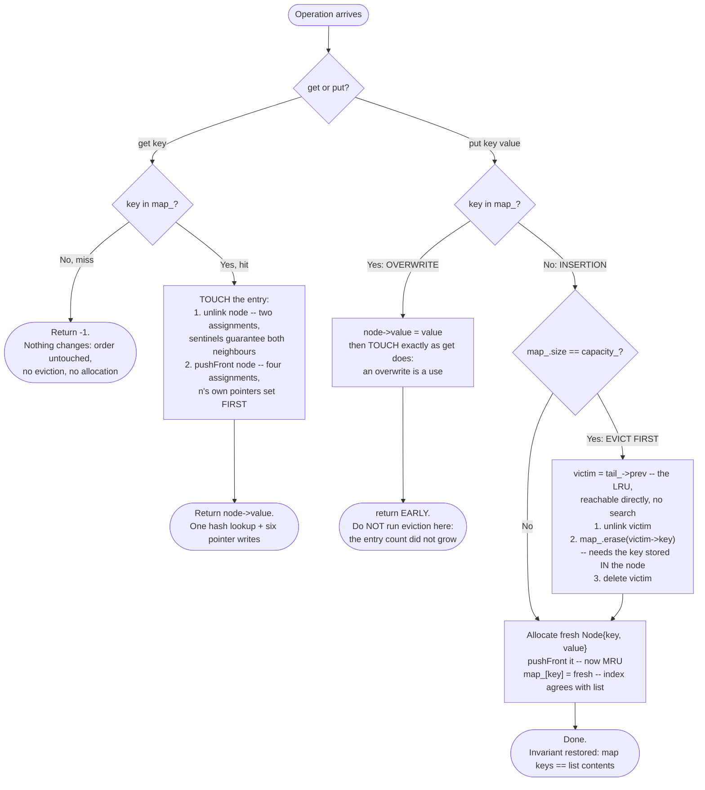

# LRU Cache — Flow Diagram (get / put)

This traces the control flow of the two operations in [code.cpp](../code.cpp) — the shape behind every problem in [problems/](../problems/). See [trace-diagram.md](trace-diagram.md) for a concrete worked example with actual values and evictions.

## How to read it

Every path through this diagram is O(1) by construction, and it is worth checking *why* per branch rather than taking it on faith: the miss path is one hash lookup; the hit and overwrite paths are one hash lookup plus `touch` — which is `unlink` (two pointer writes, no branches because the sentinels guarantee both neighbours exist) followed by `pushFront` (four pointer writes, no allocation because the node was never destroyed, only re-threaded); and the insert path adds at most one eviction whose three steps are all direct pointer or map access. Nothing loops, nothing scans, nothing depends on cache size.

The **two load-bearing details** are the ones first-time implementations get wrong. First, the overwrite branch's early return: updating an existing key does not change the entry count, so running the capacity check there evicts a live victim for no reason, shrinking the usable cache by one on every update until it holds nothing. Second, the eviction step order — unlink from the list, erase from the map *using the key read out of the node*, then delete — is not stylistic. Erasing after deleting would read freed memory; deleting before erasing loses the key needed for the erase. The key lives inside the `Node` precisely so that middle step is possible in O(1) starting from only a `Node*`.

Also notice what the diagram does *not* contain: any search. The victim is never found — it is always sitting at a known address (`tail_->prev`). That is the payoff of maintaining recency order continuously on every operation instead of reconstructing it at eviction time.
