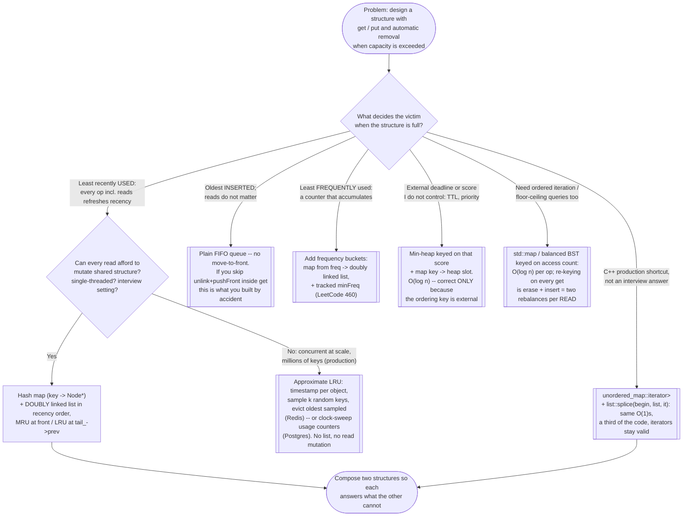

# LRU Cache — Recognition Diagram

Use this flowchart when a problem says "design a structure" with a capacity and an eviction rule, and you are deciding whether hash-map-plus-doubly-linked-list is the right composition — or whether the eviction key, the concurrency story, or the language context points somewhere else.

## How to read it

The **first fork** is the victim-selection rule, not the data structures — naming the rule precisely is where the whole solution falls out. "Least recently *used*" contains a trap worth saying out loud: *used* includes reads, which means `get` must reorder the structure, which means the ordering structure must support **O(1) repositioning of an arbitrary node you already hold** — and that single requirement eliminates the timestamp scan (repositioning is free but finding the victim is O(n)), the min-heap (finding the victim is cheap but refreshing a key is O(log n) plus an index map), and the ordered map (two tree rebalances per read). The doubly linked list is not chosen for being a linked list; it is chosen because it is the only standard shape whose unlink-a-node-you-hold and insert-at-front are both genuinely constant time.

The **second fork**, on the LRU branch, separates the interview answer from the production one. In an interview you hand-roll the sentinel-bracketed list exactly as in [code.cpp](../code.cpp) because the point being tested is that you know *why* it must be doubly linked — knowledge that `std::list::splice` hides. In real C++ production code the splice variant in [code.cpp](../code.cpp)'s Tradeoffs discussion implements the identical cache in a third of the code with no raw pointers and no destructor. And if the setting is Redis-or-Postgres scale — millions of keys, reads from many cores — exit left to approximate LRU before writing any list at all: at that scale the ~16 bytes of pointers per key and the per-read structural mutation cost more than exactness earns back. The sibling design problems (LFU via buckets, TTL expiry via heaps) are deliberately shown as *different branches*, not variations: changing the victim rule changes the required second structure.
