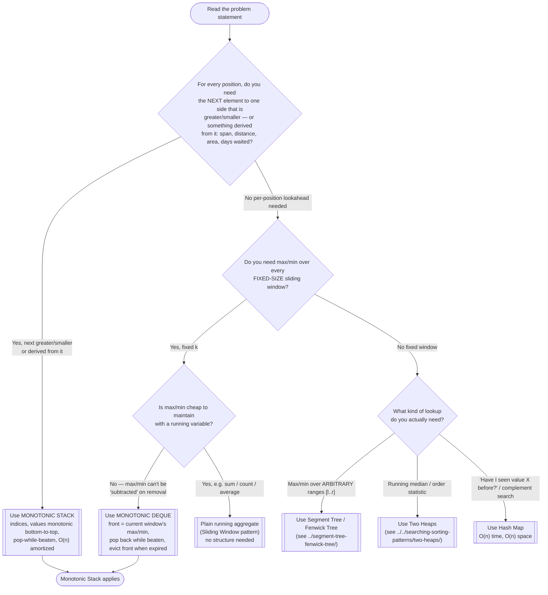

# Monotonic Stack/Queue — Recognition Diagram

Use this flowchart when you are staring at a new problem and trying to decide whether a Monotonic Stack/Deque is the right tool, or whether the problem actually wants a Hash Map, a Heap, or Sliding Window instead.

## How to read it

Start at the top and answer each diamond honestly before moving on. The **first fork** is the per-position lookahead question: if the problem can be restated as "for each element, find the next thing to its right (or left) that beats it," or as a quantity computed from that answer — stock spans, daily temperature waits, histogram rectangles, visible buildings — a monotonic stack is almost always the intended tool, because the naive per-position scan is O(n²) and this collapses it to O(n) amortized.

The **second fork** separates the two flavors of this module. A *fixed-size* window whose answer is max/min specifically is the **monotonic deque**: max/min cannot be maintained by a plain running variable because removing an element from the window may remove the current max, and there is no way to "un-add" it the way you would for a sum. If your running quantity *is* subtractable (sum, count, product-with-care), you do not need any structure at all — that is the ordinary Sliding Window pattern.

The **third fork** catches the classic misapplications: arbitrary range-max queries belong to Segment Trees ([../segment-tree-fenwick-tree/](../segment-tree-fenwick-tree/)), running medians to Two Heaps ([../../searching-sorting-patterns/two-heaps/](../../searching-sorting-patterns/two-heaps/)), and pure value-existence lookups to a hash map. When unsure between the deque flavor and the general Sliding Window pattern, re-read the Similar Patterns section of this module's [README](../README.md).
