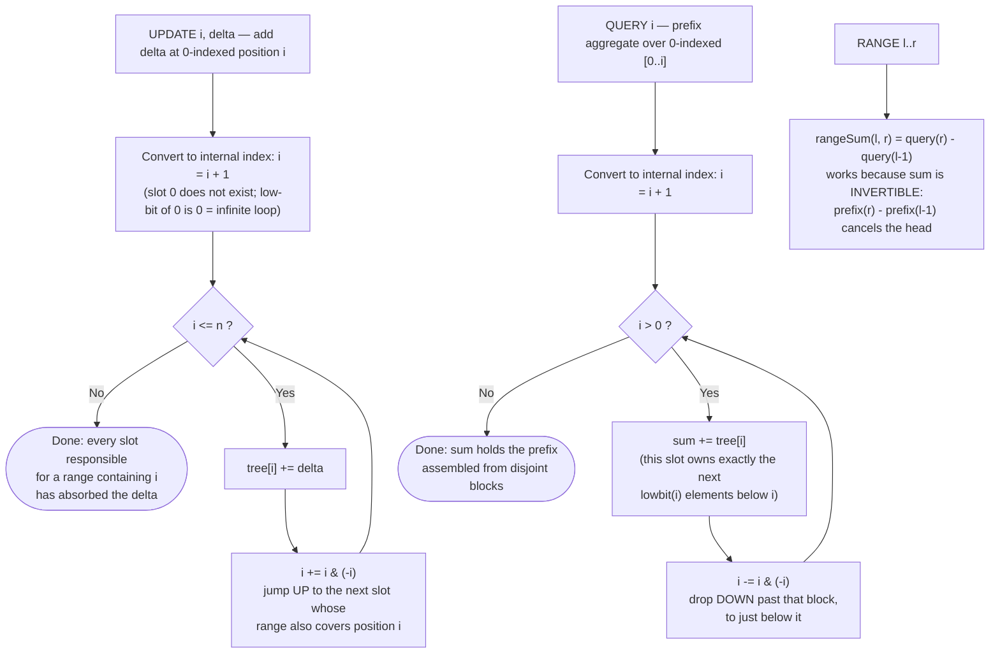

# Segment Tree / Fenwick Tree — Flow Diagram (Fenwick Low-Bit Jumps)

This traces the control flow of the Fenwick Tree's two O(log n) walks — the `i += i & (-i)` update climb and the `i -= i & (-i)` query descent. See [trace-diagram.md](trace-diagram.md) for a concrete worked example with actual numbers, and the module [README](../README.md) for the segment tree's recursive alternative.

## How to read it

Both loops are the same skeleton — "do O(1) work at `i`, then add or subtract the lowest set bit" — differing only in direction. The key insight is what `i & (-i)` means: it isolates the **lowest set bit** of `i`, which is exactly the *size of the range* slot `i` is responsible for. Slot 12 (binary `1100`) owns 4 elements ending at 12; slot 8 (`1000`) owns 8. So:

- **Querying** is peeling the prefix into disjoint blocks: from `i`, take the block owned by `i` (size `lowbit(i)`), then jump to just below that block and repeat. The number of iterations equals the number of 1-bits in `i` — at most log2(n).
- **Updating** is the reverse responsibility walk: adding a delta at position `p` must touch every slot whose range contains `p`. From any such slot, `i += lowbit(i)` lands on the *next larger* slot that also contains `p` — each jump strictly increases `i` by at least doubling the low bit eventually, giving at most log2(n) hops before passing `n`.

Two details in the diagram are where all real bugs live. First, the **+1 conversion**: internally the tree is 1-indexed because `lowbit(0) == 0` would make both loops spin forever; forgetting either conversion shifts every answer silently. Second, the **invertibility gate** on `rangeSum`: subtracting prefixes only makes sense for operations with an inverse (sum, count, XOR). Min/max have no inverse, so arbitrary-range min queries need a Segment Tree instead — this is the single most common conceptual error with Fenwick Trees.
