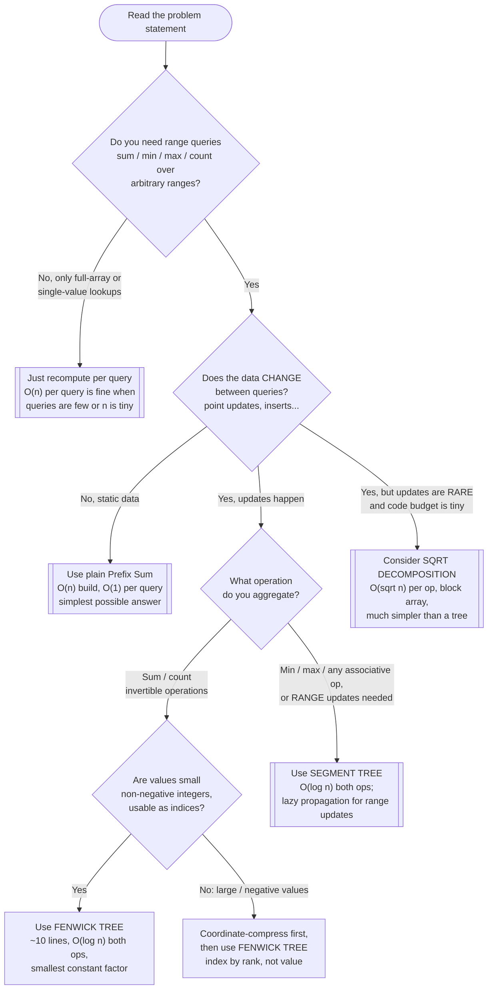

# Segment Tree / Fenwick Tree — Recognition Diagram

Use this flowchart when you are staring at a new problem and trying to decide whether a Fenwick/Segment Tree is the right tool, or whether the problem actually wants a plain Prefix Sum, Sqrt Decomposition, or just recomputation.

## How to read it

Start at the top and answer each diamond honestly before moving on. The **first fork** is whether you even have *ranges*: many problems that look like range problems actually only ever ask about the whole array or single elements, and a loop beats a tree there. The **second fork** is mutability — this is the entire reason the pattern exists. Static data + range sums is the textbook Prefix Sum case ([../../array-string-patterns/prefix-sum/](../../array-string-patterns/prefix-sum/)); reaching for a Fenwick Tree there buys you nothing except more code and O(log n) queries where O(1) was available.

The **third fork** picks between the two trees of this module: sums and counts are *invertible*, so a Fenwick's `query(r) - query(l-1)` trick works and you get away with ~10 lines; min/max (or any non-invertible op) forces the full Segment Tree, as does true range-update support via lazy propagation. The **compression detour** on the sum branch is not optional in practice — LeetCode-style counting problems (inversions, smaller-numbers-after-self) hand you negative or huge values, and the fix is always the same: index by *rank* in the sorted distinct values, never by raw value.

Finally, the Sqrt Decomposition exit exists for honesty's sake: if updates trickle in rarely and you want 20 lines instead of 60, an O(√n)-per-operation block array is a legitimate engineering answer even though it loses asymptotically.
