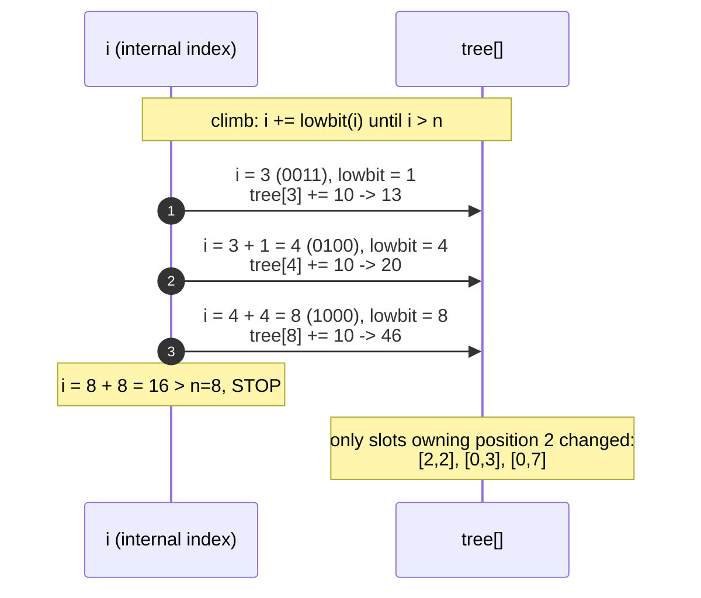
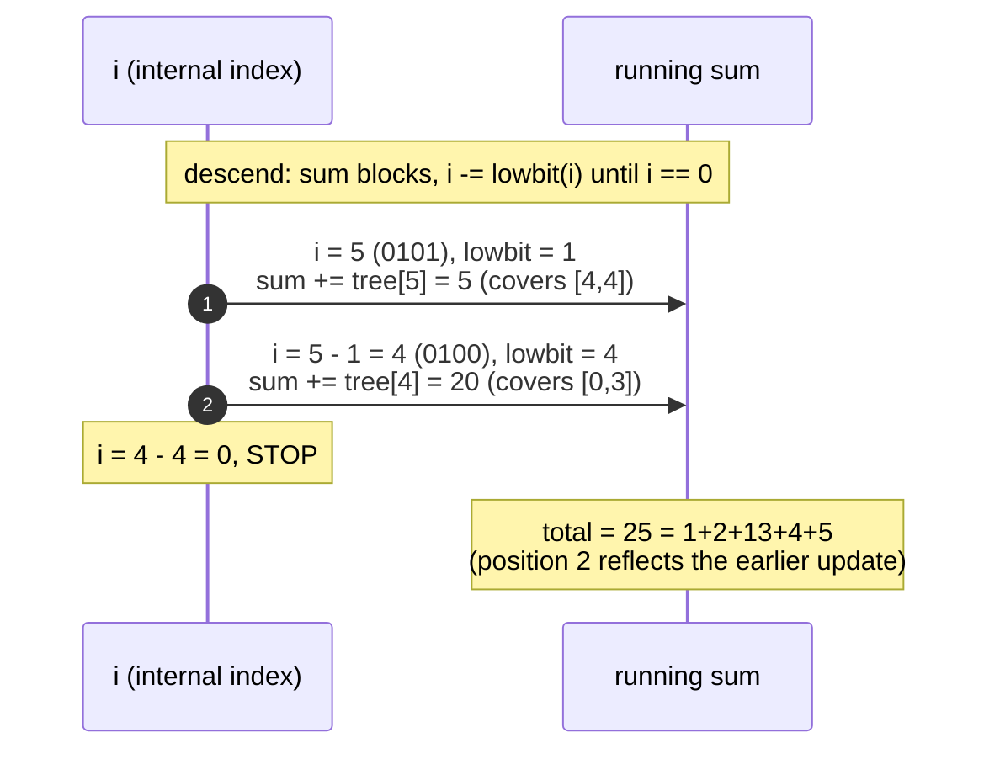

# Segment Tree / Fenwick Tree — Trace Diagram (Worked Example)

This traces the exact Fenwick Tree state for the example used in [code.cpp](../code.cpp):

```
nums = [1, 2, 3, 4, 5, 6, 7, 8]   (0-indexed positions)
index:  0  1  2  3  4  5  6  7
n = 8
```

After building (each `update(i, nums[i])`), the internal 1-indexed `tree` array holds:

```
internal slot:   1   2   3    4   5    6   7    8
binary:       0001 0010 0011 0100 0101 0110 0111 1000
owns range:   [0,0] [0,1] [2,2] [0,3] [4,4] [4,5] [6,6] [0,7]
tree value:      1    3    3   10    5   11    7   36
                 ^         ^         ^         ^
              1          3        5+6       1+...+8
```

Each slot owns exactly `lowbit(slot)` elements ending at that slot — e.g. slot 6 (`0110`) has lowbit 2 and owns `[4,5]`, holding `5+6=11`.

## Operation 1 — `update(2, +10)` (add 10 at position 2)

Internal index: `2 + 1 = 3` (binary `0011`).



## Operation 2 — `query(4)` (prefix sum of positions `[0..4]`)

Internal index: `4 + 1 = 5` (binary `0101`).



The two blocks `[0,3]` and `[4,4]` are **disjoint** and tile `[0,4]` exactly — that is why a plain addition of two slots is a valid prefix answer.

## Operation 3 — `rangeSum(2, 4)` (sum of positions `[2..4]`)

```
rangeSum(2, 4) = query(4) - query(1)
               =     25    -    3        (query(1): slot 2 owns [0,1] = 1+2)
               =     22                  = 13 + 4 + 5  -- matches code.cpp's test
```

## How to read it

Follow the binary, not the decimal. In the update climb, each hop adds the current lowest set bit, so `3 -> 4 -> 8` reads `0011 -> 0100 -> 1000`: every slot visited is one whose owned range contains position 2, and there are at most log2(n)+1 of them. In the query descent, each hop *subtracts* the lowest set bit, so `5 -> 4 -> 0` reads `0101 -> 0100 -> 0000`: each visited slot hands you one disjoint block of the prefix, and the number of hops equals the number of 1-bits in the starting index.

Notice operation 3 costs **two** prefix queries but changes nothing in the tree — range sums are derived, never stored. And notice the whole trace needed only three touched slots per operation on an array of 8; at n = 10^6 that is still ~20 per operation, which is the entire argument for O(log n).
