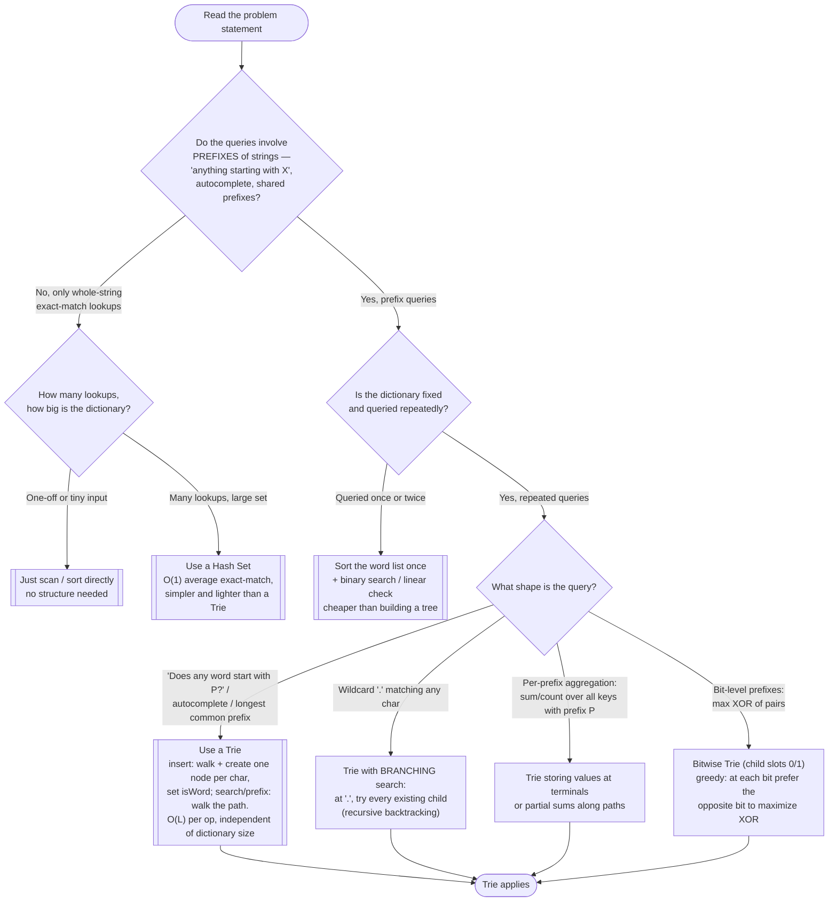

# Trie — Recognition Diagram

Use this flowchart when you are staring at a new problem and trying to decide whether a Trie is the right tool, or whether the problem actually wants a hash set, sorting + binary search, or something else entirely.

## How to read it

Start at the top and answer each diamond honestly before moving on. The **first fork** is the entire decision in miniature: does the word *prefix* appear in the problem's own vocabulary ("starts with", "common prefix", "complete this word")? If queries only ever name whole strings, a hash set wins on simplicity and memory, and no amount of cleverness makes a Trie better at exact match — that is the right-hand exit.

The **second fork** guards against the other classic mistake: building a Trie for data you will query once or twice. A Trie pays an up-front construction cost of O(total characters); if there is no amortization across many queries, sorting once and binary searching (see [Modified Binary Search](../../../searching-sorting-patterns/modified-binary-search/)) is cheaper and simpler.

The **third fork** picks the Trie *variant*. The vanilla insert/search/prefix triple from this module's [README](../README.md) covers autocomplete-style queries; wildcards force the single-path walk to branch recursively ([problems/02](../problems/02-design-add-and-search-words-data-structure.cpp)); per-prefix aggregation stores values or running sums in nodes; and bit-level problems reuse the identical skeleton with two child slots instead of 26 ([problems/04](../problems/04-maximum-xor-of-two-numbers-in-an-array.cpp)). Recognizing that all four are "the same pattern with different alphabets" is the real skill this diagram is trying to train.
