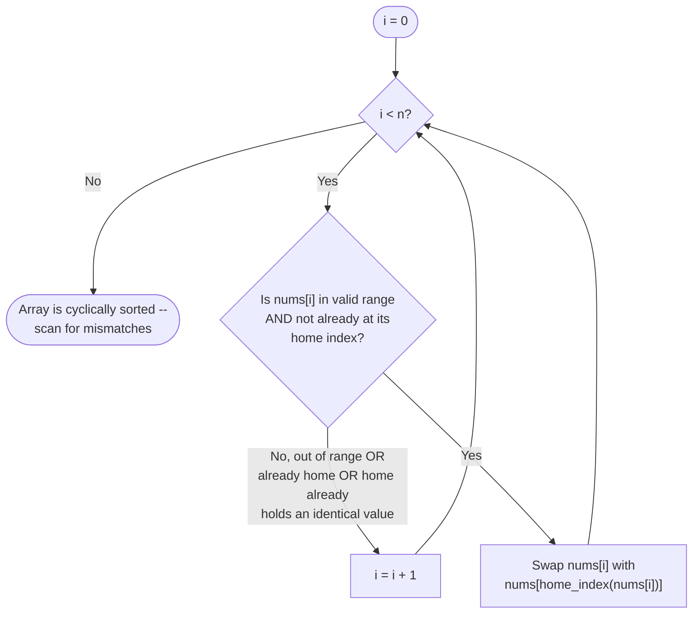

# Cyclic Sort — Flow Diagram

**How to read it:** the loop never advances `i` after a productive swap — it deliberately re-examines the same position, because a swap just brought a NEW value there that itself might need to move again. The cursor only advances when the current position is settled: either the value is out of range, already correctly placed, or a duplicate whose home is already taken. This is what makes the total work bounded by `O(n)` — every swap places some value into a final home it will never leave, and there are only `n` homes to fill.
