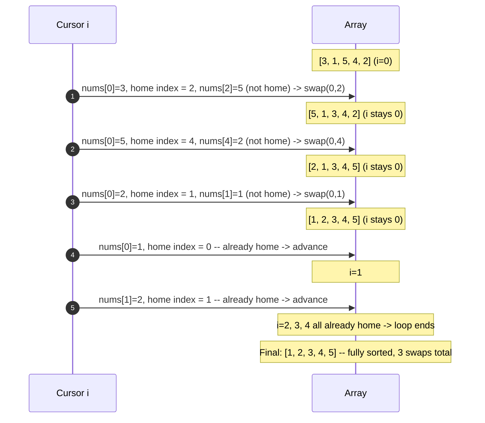

# Cyclic Sort — Trace Diagram

Tracing `cyclic_sort` on `[3, 1, 5, 4, 2]` (a complete permutation of `[1..5]`), one swap at a time.

**How to read it:** position 0 needed three swaps before it settled, because each swap brought in a brand-new value that itself wasn't home yet — this is exactly why the cursor doesn't advance after a swap. Once a value lands in its correct home (like the final `1` at index 0), it is never touched again for the rest of the run. Total swaps across the whole array never exceed `n`, because each swap permanently places one more value into its final position.
