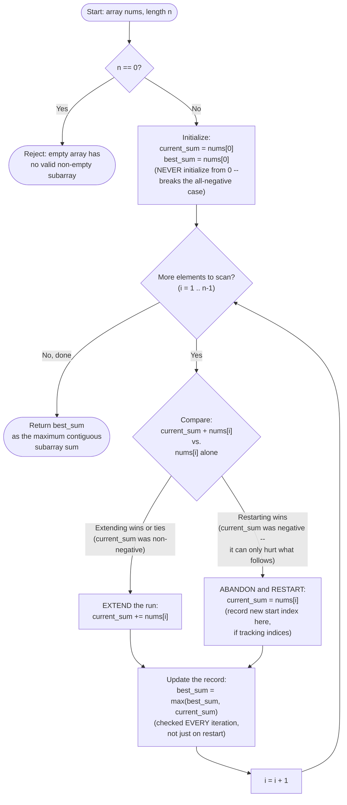

# Kadane's Algorithm — Flow Diagram

This traces the control flow of the vanilla Kadane's Algorithm — the running-sum extend-or-restart loop that underlies every variant in this module. See [trace-diagram.md](trace-diagram.md) for a concrete worked example with actual numbers.

## How to read it

The loop body has exactly one decision point (the "Decide" diamond) and exactly one unconditional follow-up ("Update") — that simplicity is the entire algorithm. Every iteration does a fixed, constant amount of work: one addition, one comparison to decide extend-vs-restart, and one more comparison to (possibly) update the record. Because the loop runs exactly `n - 1` times regardless of the data, the total work is always `O(n)` — there is no data-dependent branching that could make this faster or slower in the best/worst case, unlike, say, a data-dependent early exit in a search algorithm.

Notice that "Update" happens **after every single iteration**, on both the "Extend" and "Restart" branches alike — this is the detail that the Common Mistakes section of the [README](../README.md) warns is easy to get wrong. If you only checked `best_sum` inside the "Restart" branch (reasoning "a new run just started, let me see if the *previous* run was the best"), you would miss cases where the best sum occurs in the middle of an ongoing run, not at a boundary. The "Decide" diamond and the "Update" step are two separate, independent checks — conflating them is the most common structural bug in a from-scratch Kadane's implementation.
