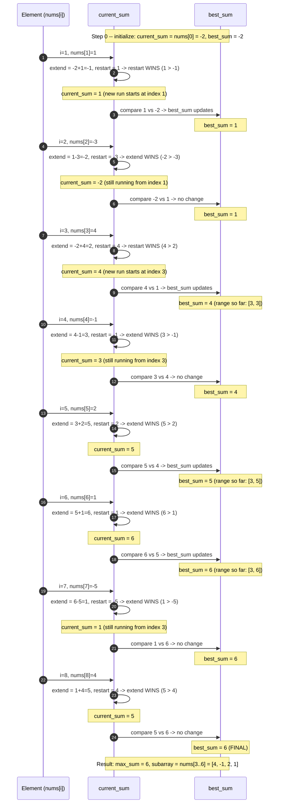

# Kadane's Algorithm — Trace Diagram (Worked Example)

This traces the exact `current_sum` / `best_sum` values across the classic Maximum Subarray example used in [problems/01-maximum-subarray.cpp](../problems/01-maximum-subarray.cpp):

```
nums  = [-2, 1, -3, 4, -1, 2, 1, -5, 4]
index:    0   1   2  3   4  5  6   7  8
```



## How to read it

Each "round trip" in the sequence diagram is one loop iteration of the algorithm in [flow-diagram.md](flow-diagram.md): the current element is folded into `current_sum` via the extend-vs-restart comparison, and then `current_sum` is unconditionally compared against `best_sum`. Notice the two **restart** points in this trace — at index 1 (`-2` extending to `1` loses to restarting at `1` alone) and at index 3 (`-2` extending to `4` loses to restarting at `4` alone). Both restarts happen precisely because the running sum being carried forward had gone negative (`-2` in both cases) — exactly the situation the README's Solution section describes: a negative prefix can only subtract from what follows, so abandoning it is always at least as good as keeping it.

Also notice that `best_sum` is compared **every single iteration**, not only at the two restart points — the winning value (`6`, reached at index 6) occurs in the *middle* of an ongoing extend streak (indices 3 through 6), not at a restart boundary. This is exactly the detail called out in this module's Common Mistakes: an implementation that only checks `best_sum` when a restart happens would have compared `4` (at the restart on index 3) and then never checked again until the next restart at some later negative dip — silently missing the true maximum of `6` found mid-run at index 6.
