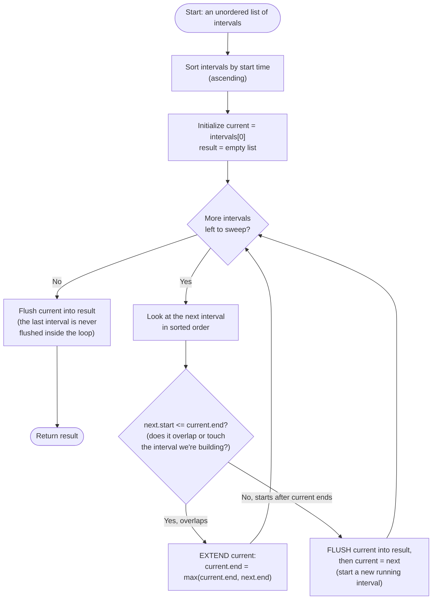

# Merge Intervals — Flow Diagram

This traces the control flow of the general sort-then-sweep-and-merge-or-flush algorithm — the shape behind Merge Intervals itself, and (with the sort key and the "flush" action swapped) behind Insert Interval, Non-overlapping Intervals, and Minimum Arrows to Burst Balloons. See [trace-diagram.md](trace-diagram.md) for a concrete worked example with actual numbers.

## How to read it

The single sort at the top is what makes everything below it a simple O(1)-per-step decision instead of an O(n) re-scan: once intervals are ordered by start time, the *only* interval that can possibly overlap the one currently being built is the very next one in the sorted list — nothing later can have a smaller start, and nothing earlier is still being considered. That is the entire complexity argument for why the sweep afterward is O(n): every interval is looked at exactly once, in order, and the decision at each step is a single comparison.

The diamond in the middle — `next.start <= current.end?` — is the whole pattern. Take the "extend" branch whenever the next interval starts at or before the current one's end (a touch counts as overlap for closed intervals, which is a deliberate boundary choice explained in the README's Common Mistakes section); take the "flush" branch the moment an interval starts strictly after the current one ends, because sortedness guarantees `current` can *never* grow again after that point — everything remaining only has an even larger start. Notice the loop only flushes on the "no overlap" branch or when the sweep runs out of intervals — the *last* `current` interval being built is never flushed inside the loop body, which is the single most common off-by-one bug in a first implementation (see Common Mistakes in the [README](../README.md)).
