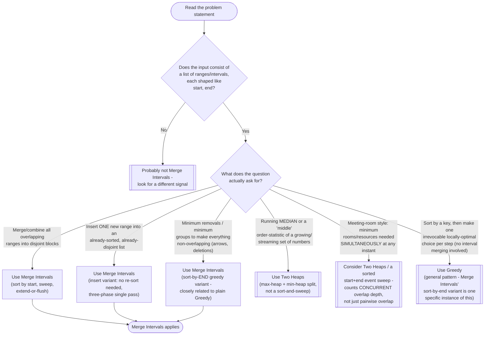

# Merge Intervals — Recognition Diagram

Use this flowchart when you are staring at a new problem and trying to decide whether Merge Intervals is the right tool, or whether the problem actually wants Two Heaps or a plain Greedy sort instead.

## How to read it

Start at the top: the very first gate is shape, not intent — if the input is not literally a collection of `[start, end]` ranges, none of the rest of this diagram matters, because Merge Intervals is fundamentally a sort-and-sweep technique over ranges, not a general-purpose optimization tool. Once you have confirmed the shape, the second diamond is where the real decision happens, and it hinges on one question: **does the problem want you to describe the merged/disjoint shape of the data, or does it want a count** (of removals, arrows, or concurrent rooms)?

The two "sort by start" outcomes (plain merge, and inserting one new interval into an already-sorted list) both actually build and return interval data — you need the *resulting ranges*, not just a number. The two "sort by end" outcomes (non-overlapping intervals, minimum arrows) only need a *count* of how many disjoint groups exist, which is why they sort by end time instead: end time gives the tightest possible boundary for closing out the current group as early as possible, which is exactly what a greedy counting argument needs (see this module's Common Mistakes section for why sorting by the wrong key here is a frequent, subtle bug). If instead the question is about a **running median** or another order statistic of a stream, that is Two Heaps' territory, not Merge Intervals' — Two Heaps deliberately does *not* sort or sweep a fixed list; it maintains two balanced heaps as data arrives. And if the question is "how many rooms/resources are needed at the busiest simultaneous instant" (not just "do any two intervals overlap"), that usually wants a sorted start/end **event** sweep (or a min-heap of active end times) rather than the simple two-interval overlap check Merge Intervals uses — worth double-checking against the Similar Patterns section of the [README](../README.md) before committing to an approach.
