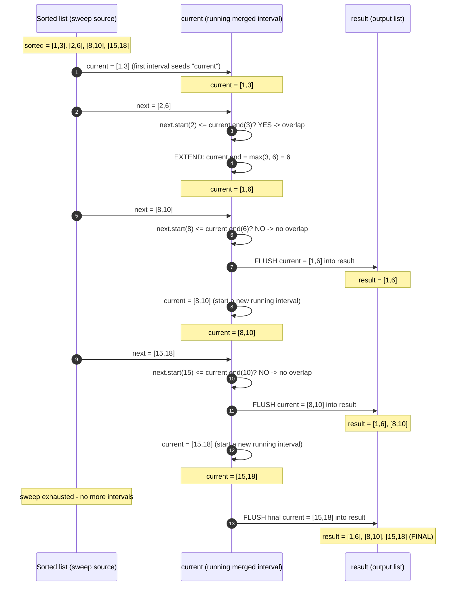

# Merge Intervals — Trace Diagram (Worked Example)

This traces the exact sweep state for the classic **Merge Intervals** example used in [problems/01-merge-intervals.cpp](../problems/01-merge-intervals.cpp):

```
input (unsorted) = [[1,3], [8,10], [2,6], [15,18]]
after sorting by start = [[1,3], [2,6], [8,10], [15,18]]
```



## How to read it

Each "round trip" is one iteration of the sweep in [flow-diagram.md](flow-diagram.md): `current` is compared against the next interval in sorted order, and exactly one of two things happens — it either **extends** (absorbs the next interval by growing its end) or **flushes** (the next interval cannot possibly connect, given sortedness, so `current` is finalized into `result` and a brand-new `current` starts at the next interval). Notice `current.end` only ever moves in one direction across its own lifetime — up, via `max()` — and once it is flushed it is never revisited; that one-way movement is exactly why the whole sweep is a single O(n) pass with no backtracking.

Also notice the trace's final step: `[15,18]` never gets a chance to be compared against anything after it (the sweep runs out of input), so it must be flushed *after* the loop ends, not inside it. This is the exact off-by-one this module's Common Mistakes section warns about — forgetting that final flush silently drops the last merged interval from the output, and because the bug only manifests on the very last group, it is easy for a quick manual test (which often only checks two or three intervals) to miss it entirely.
