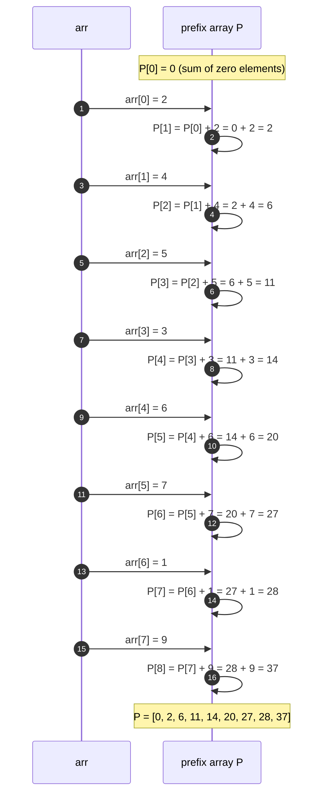
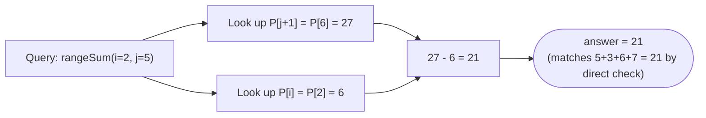

# Prefix Sum — Trace Diagram (Worked Example)

This traces the exact construction of the prefix array and one range-sum query for a concrete example, matching the first test case in [code.cpp](../code.cpp):

```
arr    = [2, 4, 5, 3, 6, 7, 1, 9]   (0-indexed)
index:     0  1  2  3  4  5  6  7
Query: rangeSum(2, 5) -- sum of arr[2..5] = 5 + 3 + 6 + 7 = 21
```

## Building the prefix array



## Answering rangeSum(2, 5)



## How to read it

The first diagram shows the build phase's one defining fact: `P` is always exactly **one element longer** than `arr`, starting from `P[0] = 0` (the sum of "nothing yet"), with every subsequent entry adding exactly one new element of `arr` to the running total. Notice the index shift: `P[6]` is the sum of `arr[0..5]` (six elements: indices 0 through 5), *not* "the sum up to `arr[6]`" — this is precisely the shift that the query formula is built around, and the shift that causes off-by-one bugs when it is not tracked carefully.

The second diagram shows why the query is O(1) regardless of the range's width: `rangeSum(2, 5)` needs `arr[2]` through `arr[5]` (four elements), so it looks up `P[5+1] = P[6] = 27` (everything through index 5) and `P[2] = 6` (everything through index 1, i.e. everything *before* the range starts), and subtracts. The subtraction `27 - 6 = 21` removes exactly the two elements (`arr[0]=2, arr[1]=4`, summing to 6) that were included in `P[6]` but are outside the requested range — leaving exactly `arr[2]+arr[3]+arr[4]+arr[5] = 5+3+6+7 = 21`, confirmed by direct addition. Whether the range were 4 elements wide or 4,000, this would still be exactly one lookup, one lookup, and one subtraction.
