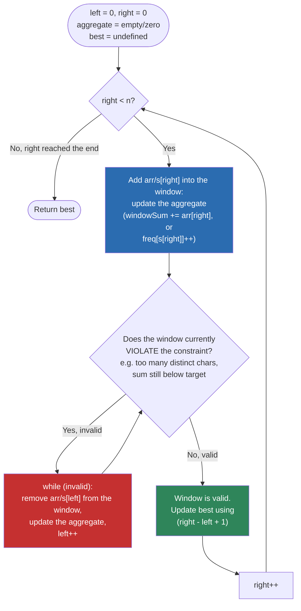

# Sliding Window — Flow Diagram (Variable-Size Window)

This is the control flow every variable-size Sliding Window solution follows, regardless of whether the aggregate is a running sum or a frequency map, and regardless of whether you are hunting for the longest or shortest valid window.

**How to read it:** every iteration does exactly one thing to `right` (always advances) and a *variable* number of things to `left` (advances zero or more times inside the inner shrink loop). The two colored boxes are the two places state actually changes: the blue "Expand" box always runs once per outer iteration; the red "Shrink" box runs zero-or-more times, and it is the box people forget to update correctly (see Common Mistakes in the README — the running aggregate must be decremented on every shrink step, not just at the end). The green "Record" box is where you decide whether you are tracking the **longest** valid window (record right after confirming validity, as drawn here) or the **shortest** valid window (record instead right before/during the shrink, since every step of a valid shrink is a shorter candidate — see `problems/04-minimum-size-subarray-sum.cpp` for that variant). The overall shape — expand, conditionally shrink, record — never changes; only *where* you record and *what* counts as "invalid" changes per problem.
