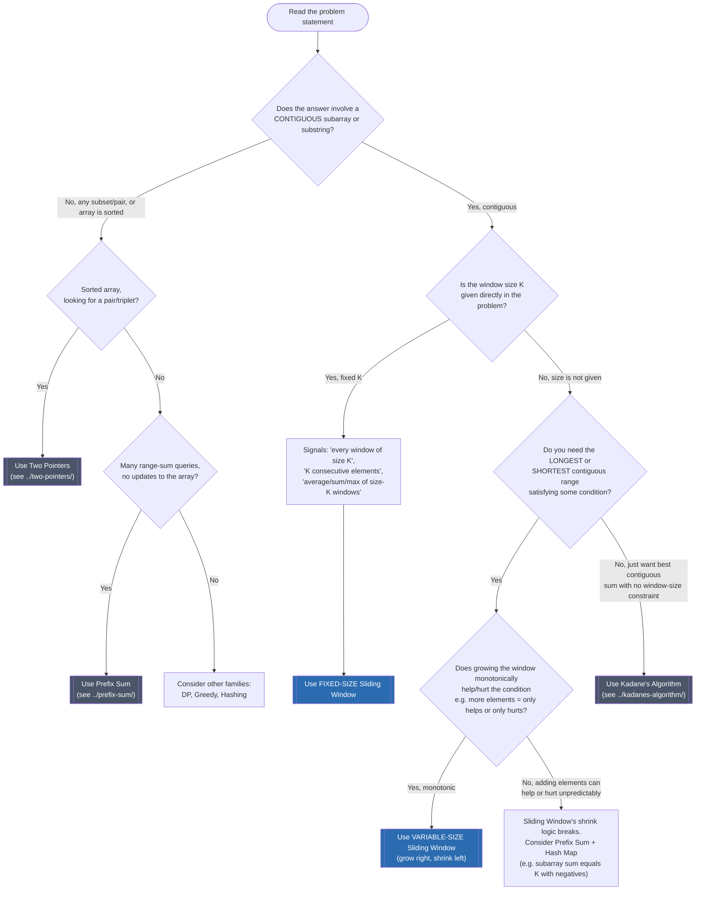

# Sliding Window — Recognition Diagram

Use this diagram when you read a new problem statement and are not yet sure which pattern applies. Follow the diamonds top to bottom.

**How to read it:** the first diamond is the gate — Sliding Window only applies to **contiguous** ranges (a subarray or substring), never to arbitrary subsets. Once you know it is contiguous, the second diamond splits on whether the window's size is an *input* (fixed-size) or an *output* of the search (variable-size, longest/shortest). The variable-size branch has one more gate that people often skip: the condition must be **monotonic** with window size — growing the window must only ever help or only ever hurt, never both, or the shrink loop's "shrink while invalid" logic is unsound. That is exactly why Sliding Window works for non-negative sum thresholds (Minimum Size Subarray Sum) but not for "subarray sum equals K" when negative numbers are allowed — that problem needs Prefix Sum + a hash map instead, because a bigger window can have either a bigger or smaller sum.
