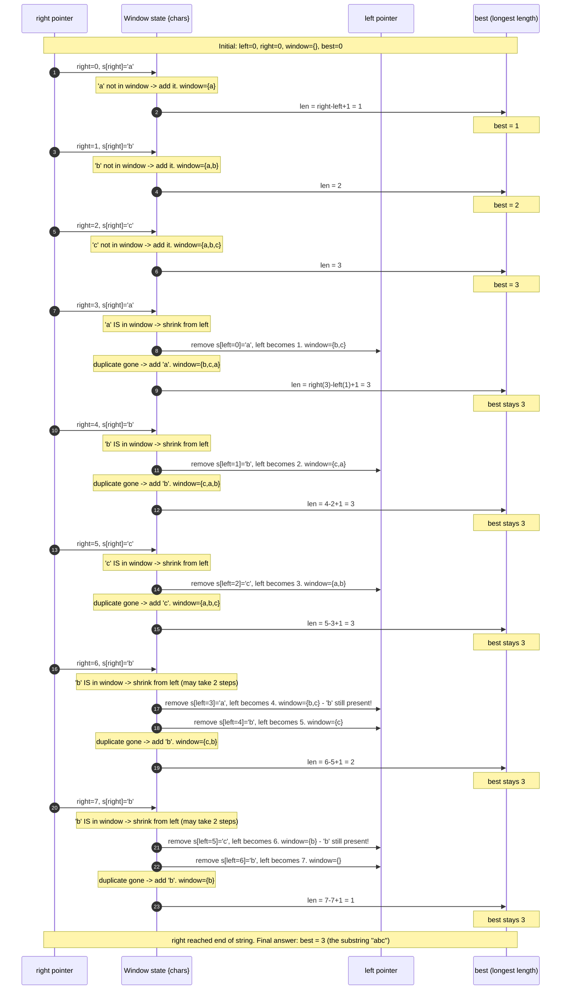

# Sliding Window — Trace Diagram

A step-by-step trace of the **Longest Substring Without Repeating Characters** problem on `s = "abcabcbb"` (indices 0-7: `a b c a b c b b`), using the classic "window is a set of characters" version of the algorithm: expand `right`; if `s[right]` is already in the window, shrink from `left` one character at a time until the duplicate is gone; then add `s[right]` and update `best`.

**How to read it:** each numbered step is one iteration of `right`. Most steps are cheap — `right` grows the window by exactly one character with no shrinking (steps 1-3). The interesting steps are 4-8, where a duplicate character forces the shrink loop to run: notice at right=6 and right=7 the shrink loop runs **twice** in a single outer iteration, because one `left++` was not enough to evict the duplicate. This is exactly why the shrink step must be a `while`, not an `if` — a single-step shrink would leave a stale duplicate in the window and silently produce a wrong (too-large) answer. Also notice `best` never decreases — it only updates when a strictly longer valid window is found, which is why the final answer (3) was actually locked in as early as step 3 and every later step just fails to beat it.
