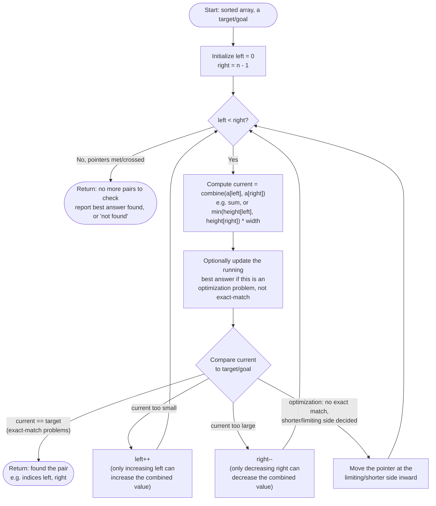

# Two Pointers — Flow Diagram (Converging Variant)

This traces the control flow of the general converging two-pointers algorithm — the shape behind pair-sum search, 3Sum's inner loop, and container-with-most-water. See [trace-diagram.md](trace-diagram.md) for a concrete worked example with actual numbers.

## How to read it

The single loop condition `left < right` is the entire lifetime of the algorithm — every iteration does a fixed amount of O(1) work (one comparison, one pointer move), and the loop runs at most `n` times total because `left` and `right` are converging toward each other and never move apart. That is the whole argument for the O(n) time bound: **total work equals total pointer movement**, and total pointer movement is capped by the initial gap `n - 1`.

The branch after "Compare" is where the two sub-flavors diverge. In an **exact-match** search (Two Sum II, the inner loop of 3Sum), hitting `current == target` ends the algorithm immediately — there is nothing left to optimize, you found the unique answer. In an **optimization** search (Container With Most Water), there usually is no single "correct" stopping point — every configuration is evaluated, the best one is tracked in a running variable, and the "compare" step decides which pointer is *provably* safe to discard rather than which one to keep, because you are searching for a maximum, not a match.
