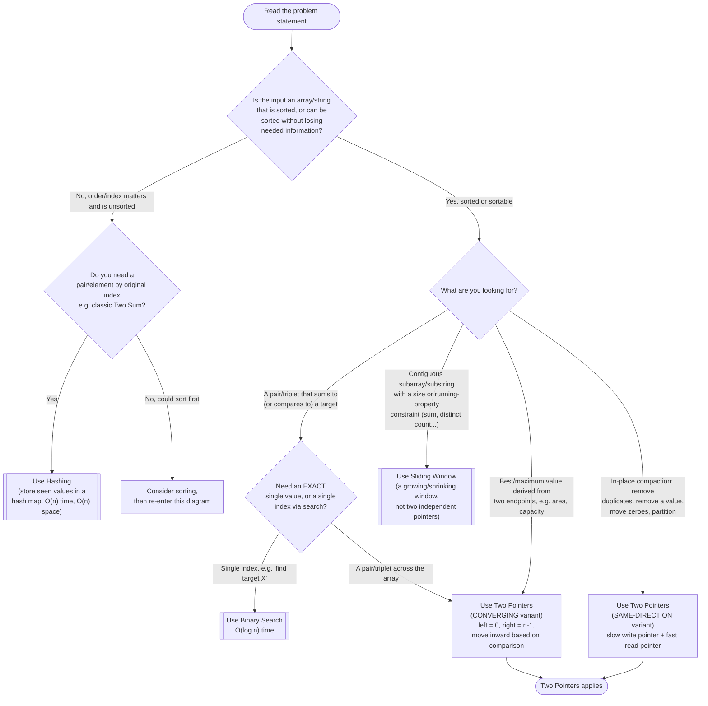

# Two Pointers — Recognition Diagram

Use this flowchart when you are staring at a new problem and trying to decide whether Two Pointers is the right tool, or whether the problem actually wants Sliding Window, Hashing, or Binary Search instead.

## How to read it

Start at the top and answer each diamond honestly before moving on — the most common mistake is skipping the sortedness check because "the array looks small enough." The **first real fork** is sortedness: Two Pointers' converging variant leans entirely on the fact that moving a pointer inward has a *predictable, monotonic* effect on the sum/comparison being tracked, and that guarantee only holds on sorted data. If the input is unsorted and you cannot sort it without losing information you need (like original indices), you almost always want a hash map instead — that is the "Hashing" exit on the left.

The **second fork** separates the three sorted-input outcomes: an exact pair/triplet search or an area-maximization problem is the *converging* flavor (pointers start at opposite ends and move toward each other); an in-place removal/compaction problem is the *same-direction* flavor (both pointers start together and move forward at different rates). If instead the problem wants a *contiguous run* of elements satisfying a running property (not two anchored endpoints), that is Sliding Window's territory, not Two Pointers' — the two patterns are siblings and it is easy to confuse them, so the "How to tell them apart" section in the [family README](../../README.md) and the Similar Patterns section of this module's [README](../README.md) are worth re-reading whenever you are unsure.
