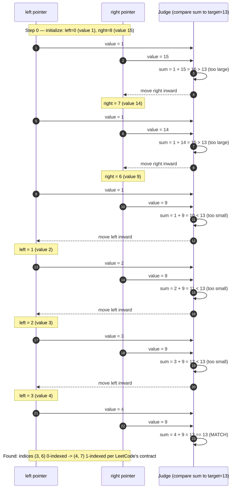

# Two Pointers — Trace Diagram (Worked Example)

This traces the exact pointer positions and comparisons for the **Pair with Target Sum** example used in [problems/01-pair-with-target-sum.cpp](../problems/01-pair-with-target-sum.cpp):

```
numbers = [1, 2, 3, 4, 6, 8, 9, 14, 15]   (0-indexed)
index:      0  1  2  3  4  5  6   7   8
target  = 13
```



## How to read it

Each "round trip" in the sequence diagram is one loop iteration of the algorithm in [flow-diagram.md](flow-diagram.md): both pointers report their current value to the "Judge" (the comparison logic), the judge computes the sum, and exactly one pointer is told to move — never both in the same step (except on a match, where the search simply ends). Notice the **monotonic narrowing**: `right` only ever decreases (15 -> 14 -> 9) and `left` only ever increases (1 -> 2 -> 3 -> 4); neither pointer ever backtracks. That monotonicity is precisely why the algorithm terminates in at most `n` steps and why it can never accidentally skip past the answer — every value discarded (15, 14, 1, 2, 3) is discarded because it is mathematically provable that it cannot be part of a valid pair given everything already ruled out.

Also notice this trace needed **six pointer moves across both directions** before converging on the answer — a deliberately less trivial example than "the first comparison happens to match," to make clear that both pointers actively participate in narrowing the search, not just one of them.
