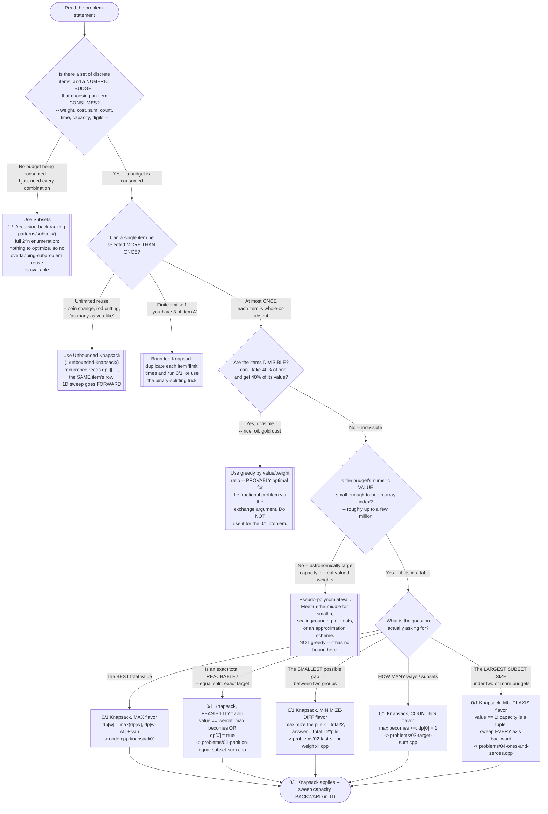

# 0/1 Knapsack — Recognition Diagram

Use this flowchart when you are staring at a new problem and trying to decide whether 0/1 Knapsack is the right tool, or whether the problem actually wants Unbounded Knapsack, plain Subsets, or a greedy pass instead. The hard part of this pattern is almost never the recurrence — it is noticing that a problem about stones, signs, or binary strings *is* a knapsack at all.

## How to read it

Start at the top and answer each diamond honestly, because the **first fork is the one people skip**. Before asking anything about items or values, ask whether choosing an item *consumes a finite numeric budget*. If nothing is being consumed — the problem just wants every combination listed — you are in the Subsets pattern, not here. That distinction matters more than it looks: 0/1 Knapsack's entire `2^n → n·W` win exists *because* the question narrowed from "show me all the answers" to "give me one number." Enumeration cannot exploit overlapping subproblems, since two different subsets are genuinely different outputs even when they share a `(items considered, budget left)` state. A single number can be reused; a list of subsets cannot.

The **second fork — reuse rules — is the one that silently produces wrong answers** rather than obviously wrong ones. "At most once" versus "unlimited" is a one-symbol difference in the recurrence (`dp[i-1][w-wt]` versus `dp[i][w-wt]`) and a one-word difference in the 1D loop (`--w` versus `++w`), so a mistake here compiles, runs, and returns a plausible number that answers *the other problem*. Read the statement for the phrase that settles it — "each item may be used at most once," "you may reuse coins," "you have exactly 3 of these" — and write the sweep direction down before writing the loop.

The **third fork is the greedy trap**, and it is worth pausing on because it is the most commonly misunderstood fact in this family. Greedy by value-to-weight ratio is not a heuristic that "usually works" for knapsack — it is *provably optimal* for the fractional version and *structurally broken* for the 0/1 version. The exchange argument that proves it correct requires being able to trade an infinitesimal amount of a worse-ratio item for a better-ratio one; when items are whole-or-absent, that trade is unavailable, and greedy's early commitment can permanently block a better combination (the `W = 50` counterexample in the [README](../README.md) loses 27% of the optimal value on a three-item input). Divisibility is the *only* thing separating those two worlds, so it deserves its own question rather than being assumed.

The **fourth fork is the pseudo-polynomial wall**, and it is a real engineering decision, not a footnote. `O(n · capacity)` is polynomial in the capacity's *magnitude*, not in the number of bits needed to write it down — so a capacity of one billion (a perfectly ordinary 32-bit integer, about 30 bits) demands a billion columns per row. When you hit that wall, greedy is *not* the fallback: it carries no approximation bound for 0/1 Knapsack. Meet-in-the-middle (viable when `n` is small even though the capacity is huge) or an explicit approximation scheme is.

The **fifth fork picks the flavor**, and all five flavors share one table, one fill order, and one backward sweep — they differ only in what a cell holds and how two cells combine. `max` for best-value, OR for reachability, `+=` for counting, and a constant value of 1 when the "value" is really just "how many items did I fit." Two tricks make the whole family collapse into one implementation: setting **`value == weight`** (which turns a maximization recurrence into a subset-sum question, and is what makes flavors 2 and 3 possible at all), and noticing that **minimizing a gap between two groups is maximizing one group under a `total/2` cap** (flavor 3). Once you see those, the five boxes at the bottom of this diagram are the same twelve lines of code with one operator swapped.

Whichever flavor you land in, the exit condition is the same and is worth repeating out loud every time: **in the 1D form, capacity descends.** That single rule is what enforces "each item at most once," and it is the one detail every file in [problems/](../problems/) has a dedicated test for.
