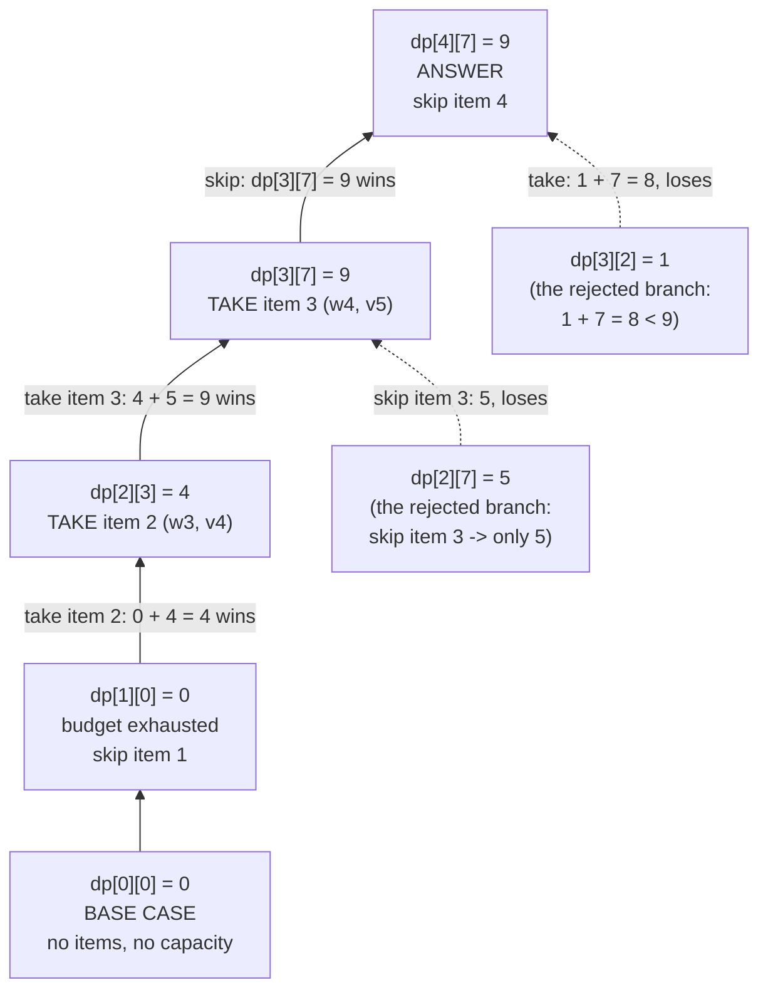
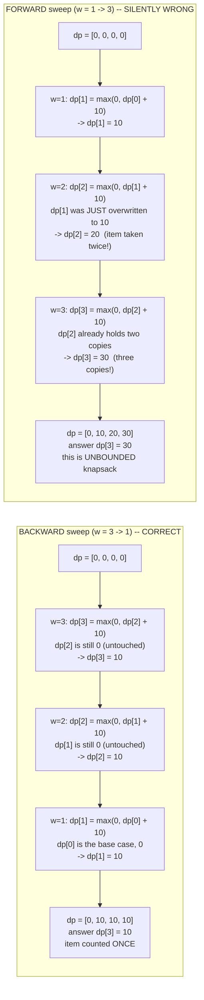

# 0/1 Knapsack — Trace Diagram (Worked Example)

This traces the dp table being filled, cell by cell, for the four-item example used throughout the module — the same input as the first test case in [code.cpp](../code.cpp):

```
items (1-indexed):   i=1: weight 1, value 1
                     i=2: weight 3, value 4
                     i=3: weight 4, value 5
                     i=4: weight 5, value 7

capacity W = 7
expected answer = 9   (take items 2 and 3: weight 3+4 = 7, value 4+5 = 9)
```

## The 2D table, row by row

Each row is finished completely before the next row starts. Every value in row `i` is computed **only** from values in row `i - 1`.

**Row 0 — no items available.** Nothing can be bought at any budget.

| w → | 0 | 1 | 2 | 3 | 4 | 5 | 6 | 7 |
|---|---|---|---|---|---|---|---|---|
| **i = 0** | 0 | 0 | 0 | 0 | 0 | 0 | 0 | 0 |

**Row 1 — item 1 available (weight 1, value 1).** It fits everywhere except `w = 0`, and there is nothing else to combine it with, so every reachable cell is worth exactly 1.

| w → | 0 | 1 | 2 | 3 | 4 | 5 | 6 | 7 |
|---|---|---|---|---|---|---|---|---|
| **i = 1** | 0 | 1 | 1 | 1 | 1 | 1 | 1 | 1 |

**Row 2 — items 1–2 available (item 2: weight 3, value 4).** Item 2 is a forced skip for `w < 3`. At `w = 3` it exactly fits and beats item 1 alone (`4 > 1`). At `w = 4` both items fit together (`1 + 4 = 5`), and that combination then carries across every wider budget because nothing better exists yet.

| w → | 0 | 1 | 2 | 3 | 4 | 5 | 6 | 7 |
|---|---|---|---|---|---|---|---|---|
| **i = 2** | 0 | 1 | 1 | **4** | **5** | 5 | 5 | 5 |

Worked cells:
- `dp[2][2] = max(dp[1][2] = 1, — )` → item 2 weighs 3 > 2, forced skip → `1`
- `dp[2][3] = max(dp[1][3] = 1, dp[1][0] + 4 = 4)` → `4`
- `dp[2][4] = max(dp[1][4] = 1, dp[1][1] + 4 = 5)` → `5`
- `dp[2][7] = max(dp[1][7] = 1, dp[1][4] + 4 = 5)` → `5`

**Row 3 — items 1–3 available (item 3: weight 4, value 5).** This is the row where the answer appears. At `w = 7`, taking item 3 leaves a budget of `7 - 4 = 3`, and row 2 already knows the best value at budget 3 is `4` (item 2 alone) — so `4 + 5 = 9` beats the `5` that row 2 had at `w = 7`.

| w → | 0 | 1 | 2 | 3 | 4 | 5 | 6 | 7 |
|---|---|---|---|---|---|---|---|---|
| **i = 3** | 0 | 1 | 1 | 4 | 5 | **6** | **6** | **9** |

Worked cells:
- `dp[3][4] = max(dp[2][4] = 5, dp[2][0] + 5 = 5)` → `5` (a tie; item 3 alone equals items 1+2)
- `dp[3][5] = max(dp[2][5] = 5, dp[2][1] + 5 = 6)` → `6` (items 1 and 3)
- `dp[3][7] = max(dp[2][7] = 5, dp[2][3] + 5 = 9)` → **`9`** (items 2 and 3)

**Row 4 — all items available (item 4: weight 5, value 7).** Item 4 is individually the most valuable single item and wins at `w = 5` and `w = 6`, but at the full budget of 7 it cannot beat the pairing already found: taking it leaves only `7 - 5 = 2`, where the best available value is a mere `1`.

| w → | 0 | 1 | 2 | 3 | 4 | 5 | 6 | 7 |
|---|---|---|---|---|---|---|---|---|
| **i = 4** | 0 | 1 | 1 | 4 | 5 | **7** | **8** | 9 |

Worked cells:
- `dp[4][5] = max(dp[3][5] = 6, dp[3][0] + 7 = 7)` → `7` (item 4 alone beats items 1+3)
- `dp[4][6] = max(dp[3][6] = 6, dp[3][1] + 7 = 8)` → `8` (items 1 and 4)
- `dp[4][7] = max(dp[3][7] = 9, dp[3][2] + 7 = 8)` → **`9`** (items 2 and 3 survive)

**Answer: `dp[4][7] = 9`.**

## Where the winning cell's value came from



Solid arrows are the choices that won; dashed arrows are the alternatives the `max` discarded. Reading the solid chain from the bottom up gives the actual chosen subset: **item 2 and item 3**, total weight `3 + 4 = 7` (an exact fit), total value `4 + 5 = 9`.

That chain is also exactly how you *reconstruct* the chosen items after the fact, which the full 2D table permits and the 1D optimization does not. Walk backward from `dp[n][W]`: if `dp[i][w] == dp[i-1][w]`, item `i` was not taken, so move to `dp[i-1][w]`; otherwise item `i` *was* taken, so record it and move to `dp[i-1][w - weight[i]]`. Here: `dp[4][7] == dp[3][7]` (9 == 9) → item 4 skipped; `dp[3][7] != dp[2][7]` (9 != 5) → item 3 taken, jump to `dp[2][3]`; `dp[2][3] != dp[1][3]` (4 != 1) → item 2 taken, jump to `dp[1][0]`; `dp[1][0] == dp[0][0]` → item 1 skipped. Done.

## The 1D version reaches the same numbers

The space-optimized `knapsack01Optimized` in [code.cpp](../code.cpp) keeps a single row of length 8 and rewrites it in place, once per item, sweeping capacity from 7 downward. After each item's pass, the row is **bit-for-bit identical to the corresponding 2D row above** — that equality is the entire correctness claim of the optimization:

| after item | 0 | 1 | 2 | 3 | 4 | 5 | 6 | 7 | matches 2D row |
|---|---|---|---|---|---|---|---|---|---|
| (initial) | 0 | 0 | 0 | 0 | 0 | 0 | 0 | 0 | row 0 |
| item 1 (w1,v1) | 0 | 1 | 1 | 1 | 1 | 1 | 1 | 1 | row 1 |
| item 2 (w3,v4) | 0 | 1 | 1 | 4 | 5 | 5 | 5 | 5 | row 2 |
| item 3 (w4,v5) | 0 | 1 | 1 | 4 | 5 | 6 | 6 | 9 | row 3 |
| item 4 (w5,v7) | 0 | 1 | 1 | 4 | 5 | 7 | 8 | 9 | row 4 |

## Why the sweep direction decides the answer

The smallest input that exposes the bug: **one** item of weight 1 and value 10, capacity 3. The correct answer is 10 — there is only one item, so it can contribute at most once.



## How to read it

The four row-tables at the top are the algorithm's entire state, snapshotted at the only four moments it is ever observable from outside the inner loop: once per item. Read them as a stack of increasingly informed answers to the *same* eight questions ("what is the best value at budget `w`?") — row 1 answers all eight using only item 1, row 2 answers all eight using items 1–2, and so on. No cell ever gets worse as you move down a column, because "skip the new item" is always available as a floor. If you ever see a value *decrease* down a column while debugging, the bug is that the skip branch is missing or conditional.

The bolded cells mark where each new row actually *changed* something. Notice how few there are: item 4, despite having the highest single value in the set, changes only two cells and does not touch the final answer at all. That is the shape of this pattern's real work — most cells inherit, and the interesting cases are the handful of budgets where the new item's value beats what the previous row already achieved with a different combination.

The dependency graph shows why `dp[3][7]` is the pivotal cell rather than `dp[4][7]`. Its take branch reads `dp[2][3]`, and that cell holds `4` — item 2 alone, exactly filling the residual budget of 3. This is the concrete instance of the recurrence's core claim: **committing to item 3 does not require knowing anything about item 3's interaction with items 1 and 2, only the already-final best answer for a smaller budget over fewer items.** The 9 assembles itself out of a number computed one row earlier and four columns to the left, and neither of those two facts was known when row 2 was being written.

The dashed arrows matter as much as the solid ones. `dp[4][7]`'s take branch evaluates to `dp[3][2] + 7 = 1 + 7 = 8`, which *loses* to the 9 already in hand. This is the greedy trap made visible: item 4 has the largest individual value (7) and the second-best value-per-weight ratio, yet taking it is wrong at this budget, because committing 5 of 7 units of capacity to it leaves a residual budget too small to hold anything worthwhile. Greedy has no mechanism to discover that — it would take item 1 (ratio 1.0)… actually greedy-by-ratio here takes item 2 (ratio 1.33) then item 3 (ratio 1.25) and lands on 9 by luck on this particular input. The `W = 50` counterexample in the [README](../README.md) is the case where that luck runs out. The DP does not rely on luck: the dashed arrow *is* the reconsideration, performed for every item at every budget.

The final side-by-side is the same trace reduced to its smallest possible failing case, and it is worth reading the two columns as a matched pair. Both compute `dp[w] = max(dp[w], dp[w - 1] + 10)` at every step — identical code, identical arithmetic. The only difference is **whether `dp[w - 1]` has already been written during this same item's pass.** Backward, it has not, so it still describes a world without this item, and adding the item to it is legitimate. Forward, it has, so it may already contain this item, and adding it again duplicates a physical object that exists exactly once. The forward column's answer of 30 is not a garbage value or a crash — it is the *correct answer to Unbounded Knapsack*, which is why this bug survives casual testing and why every worked problem in [problems/](../problems/) ships with a dedicated test designed to fail if the direction is ever flipped.
