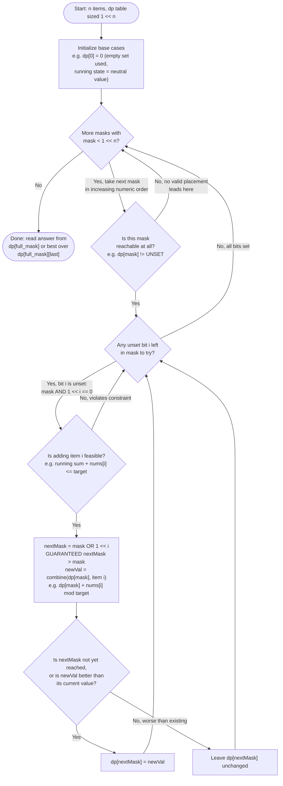

# Bitmask DP — Flow Diagram (Iterating Masks and Transitions)

This shows the control flow of the canonical bottom-up bitmask DP — the shape behind the k-subset partition in [code.cpp](../code.cpp), Partition to K Equal Sum Subsets, and any `dp[mask]`-only formulation. See [trace-diagram.md](trace-diagram.md) for a concrete worked example with actual numbers.

## How to read it

There are exactly two loops and one transition. The **outer loop** walks masks from `0` (or the smallest seed) up to `(1 << n) - 1` in plain increasing integer order. The **inner loop** scans bits `0..n-1` looking for unset ones — each unset bit `i` is one candidate "add item `i` to the subset" move. The heart of the algorithm is the single line `nextMask = mask | (1 << i)`: setting a previously-clear bit always produces a *strictly larger* integer, which is precisely why the outer loop's numeric order doubles as a topological order for the dependency DAG — by the time the outer loop reaches `nextMask`, every mask that can flow into it has already been processed. No separate ordering logic is ever needed.

The two guard diamonds do the real problem-specific work. **Reachability** (`is this mask reachable?`) matters because many subsets cannot arise from any valid placement — e.g. in the equal-sum partition, masks whose running sum overshoots `target` never get written, so processing them would be wasted work at best and wrong answers at worst if you treated their garbage values as real. **Feasibility** (`can item i be added?`) encodes the problem's constraint — sum bounds, divisibility rules for arrangement counting, game rules for win/loss transitions.

The final decision diamond is where min/max/counting problems differ: an optimization writes only when the new value beats the old; a pure reachability/counting formulation may write unconditionally or accumulate counts. Either way, the answer lives at the top: `dp[(1 << n) - 1]`, or the best over all `dp[full_mask][last]` when a `last` dimension exists (the TSP shape in [code.cpp](../code.cpp)). For the top-down flavor of the same graph — recursion plus a memo table instead of an explicit loop — the iteration order argument is replaced by memoization itself, but the DAG and its complexity are identical.
