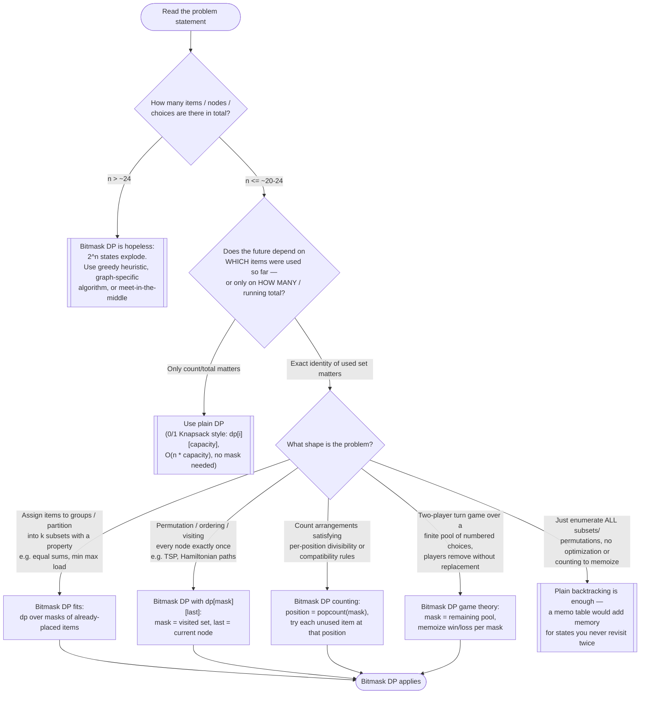

# Bitmask DP — Recognition Diagram

Use this flowchart when you are staring at a new problem and trying to decide whether Bitmask DP is the right tool, or whether the problem actually wants plain DP, backtracking, or a greedy instead.

## How to read it

Start at the top and answer each diamond honestly before moving on — the most common mistake is jumping to "small n, use bitmask" before checking whether subset identity is genuinely needed. The **first fork** is size: `2^n` states means `n = 20` is already a million-entry table per extra dimension, and `n = 30` is a billion — if `n` exceeds roughly 24, no amount of clever bit manipulation saves you, and you need a different technique entirely.

The **second fork** is the one that separates this pattern from its closest sibling: if two different choices that have consumed the same *number* of items always have interchangeable futures, then a mask adds exponential blowup for zero information — plain 0/1 Knapsack-style DP (see the [0-1-knapsack module](../0-1-knapsack/)) is smaller and simpler. Bitmask DP earns its cost only when the exact identity of the chosen set changes what transitions remain possible. Ask yourself concretely: "could I shuffle which specific items were picked earlier and still get the same optimal continuation?" If yes, no mask needed.

The **third fork** picks the state shape among the four common flavors (assignment/partition, permutation with `last`, position-counting, game pools). Note the backtracking exit: if the task is literally to enumerate all solutions rather than compute one optimal value or a count, memoization buys nothing — each state's subtree is explored exactly once anyway, so a memo table only wastes memory. For problems where several signals overlap (BFS over `(node, mask)` states, greedy pruning inside a masked search), re-check the Similar Patterns section of the [README](../README.md) and the worked examples under [problems/](problems/) before committing to a shape.
