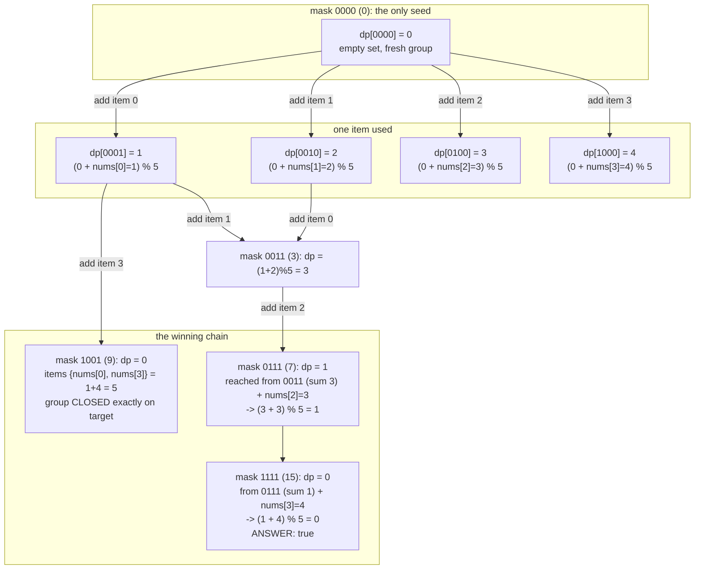

# Bitmask DP — Trace Diagram (Worked Example)

This traces the exact mask-by-mask execution of the **k-subset equal-sum partition** DP from [code.cpp](../code.cpp) (`canPartitionIntoKSubsets`) on the input `nums = [1, 2, 3, 4]`, `k = 2`:

```
n = 4, total = 10, k = 2, target = 5
bit i of the mask corresponds to nums[i]:
    bit 0 -> value 1, bit 1 -> value 2, bit 2 -> value 3, bit 3 -> value 4
dp[mask] = (current group's running sum) % target once exactly the items
           in `mask` are placed; -1 means the mask was never reached.
full_mask = 1111 (binary) = 15; success iff dp[15] == 0.
```



## How to read it

The trace walks masks in **increasing numeric order**, matching [flow-diagram.md](flow-diagram.md): all size-1 masks (values 1, 2, 4, 8) are written while processing mask `0000`, then size-2 masks (3, 5, 9, ...) while processing size-1 masks, and so on. Each arrow is one inner-loop iteration: pick an unset bit `i`, check feasibility (`dp[mask] + nums[i] <= target`), and write `(dp[mask] + nums[i]) % target` into `mask | (1 << i)` if that mask has not been reached before.

Three details deserve attention. **First, the modulo encodes group boundaries for free**: when a running sum hits exactly `target` (e.g. `dp[1001] = (1 + 4) % 5 = 0`), the value wraps to 0, meaning "previous groups are complete and a fresh group starts here" — no extra dimension tracking *how many* groups have closed is needed, because reaching full coverage with running sum 0 proves every group closed exactly on target. **Second, first-write-wins is safe here**: several placement histories reach the same mask with the same running sum (e.g. mask `0011` is reached as `{item0 then item1}` or `{item1 then item0}`, both giving running sum 3), so keeping only one entry per mask loses nothing — the future genuinely depends only on (used set, running sum), which is why this is DP and not just search. **Third, unreachable masks are simply never written** and get skipped by the `dp[mask] == -1` guard, e.g. any path placing `nums[3]=4` and `nums[2]=3` into one group would hit running sum 7 > target and is pruned at feasibility time.

The final answer reads `dp[1111]`: it equals 0, so `[1, 2, 3, 4]` splits into two groups summing to 5 each — concretely `{1, 4}` and `{2, 3}`. The same machinery in [problems/02-partition-to-k-equal-sum-subsets.cpp](../problems/02-partition-to-k-equal-sum-subsets.cpp) scales this to arbitrary `n <= 16`.
