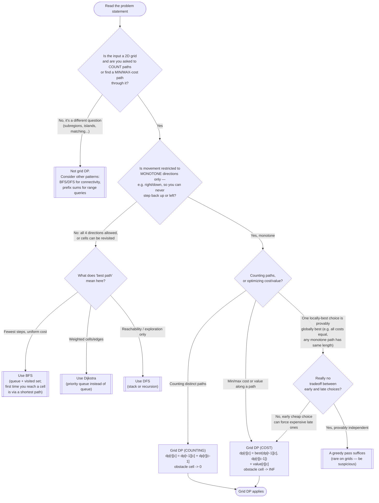

# DP on Grids — Recognition Diagram

Use this flowchart when you are staring at a new grid problem and trying to decide whether grid DP is the right tool, or whether the problem actually wants BFS/DFS, Dijkstra, or a greedy pass instead.

## How to read it

Start at the top and answer each diamond honestly before moving on. The **first fork** is whether the question is even about paths through the grid at all — many grid problems (largest island, number of islands, flood fill) are connectivity questions and belong to BFS/DFS, not this pattern. The **second fork is the decisive one**: monotone movement. Grid DP's entire correctness argument rests on being able to order the cells so that every dependency is computed before its consumer; right/down-only movement gives you that order for free (row by row, left to right). The moment upward or leftward steps are legal, a cell's answer may depend on cells *below or to its right* — the table becomes unfillable in one pass, and you have left DP's jurisdiction. That is the exit toward BFS (unweighted shortest path), Dijkstra (weighted), or plain DFS (reachability).

The **third fork** picks the recurrence flavor: counting problems sum the two predecessors (and zero out obstacles); cost problems take the min/max of the two predecessors plus the current cell's own weight (and poison obstacles with infinity). The greedy exit exists because interviewees occasionally reach for greedy on grids ("always step onto the cheaper neighbor") — on real grids an early cheap step routinely forces an expensive corridor later, which is precisely the tradeoff dynamic programming exists to handle, so treat that exit as rare and requiring proof.

For the boundary between this pattern and LCS-style sequence tables — same neighbor-reading mechanics, different underlying shape — see the Similar Patterns section of this module's [README](../README.md).
