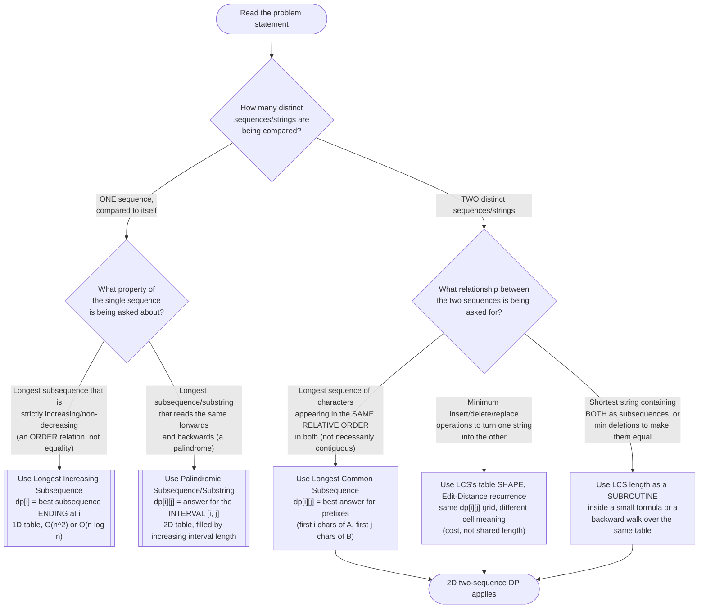

# Longest Common Subsequence — Recognition Diagram

Use this flowchart when you are staring at a new DP problem and trying to decide whether it wants LCS's two-sequence 2D table, or whether it actually wants Longest Increasing Subsequence (LIS) or the Palindromic Subsequence pattern instead — all three use a similarly-shaped `dp` table, and confusing them is the single most common way to waste time setting up the wrong recurrence.

## How to read it

The **first fork** is the most important one and the easiest to skip past under time pressure: *how many sequences does the problem actually mention?* If the problem talks about only **one** string or array and asks a question purely about its own internal structure — "is this a palindrome," "what's the longest increasing run" — you are not looking at LCS at all, even if the eventual `dp` table also happens to be 2D (Palindromic Subsequence's `dp[i][j]` is indexed by an *interval* `[i, j]` inside one sequence, not by two independent prefix lengths from two different sequences — a subtle but critical difference explained further in the Similar Patterns section of the [README](../README.md)).

The **second fork** only applies once you have confirmed there are genuinely **two** sequences being compared. Here the signal is *what kind of relationship* is being asked for: "longest subsequence shared by both, in the same relative order" is the LCS question in its rawest form. "Minimum operations to transform one into the other" is Edit Distance — it reuses the identical `dp[i][j]` grid and fill order, but the *meaning* of each cell and the recurrence inside it change (see the Flow Diagram for the side-by-side contrast). Finally, a surprising number of problems (Shortest Common Supersequence, Delete Operation for Two Strings, Uncrossed Lines) are not new patterns at all — they are the plain LCS length or LCS table used as a **subroutine** inside one extra line of arithmetic or one extra backward walk, which is why recognizing "this is secretly LCS" is often harder than writing the recurrence once you have recognized it.
