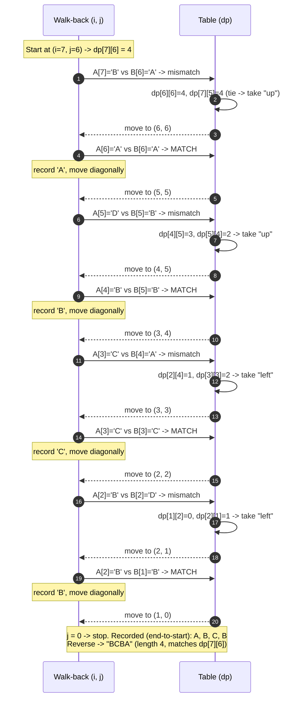

# Longest Common Subsequence — Trace Diagram (Worked Example)

This traces the exact `dp` table fill and the walk-back reconstruction for the classic textbook example used in [code.cpp](../code.cpp):

```
A = "ABCBDAB"   (1-indexed: A[1]=A, A[2]=B, A[3]=C, A[4]=B, A[5]=D, A[6]=A, A[7]=B)
B = "BDCABA"    (1-indexed: B[1]=B, B[2]=D, B[3]=C, B[4]=A, B[5]=B, B[6]=A)
```

## Step 1 — Fill the table forward

Each cell is `dp[i-1][j-1] + 1` on a match, or `max(dp[i-1][j], dp[i][j-1])` on a mismatch. Row 0 and column 0 (the empty-prefix base case) are all zero:

| `dp[i][j]` | j=0 ("") | j=1 (B) | j=2 (D) | j=3 (C) | j=4 (A) | j=5 (B) | j=6 (A) |
|---|---|---|---|---|---|---|---|
| **i=0 ("")** | 0 | 0 | 0 | 0 | 0 | 0 | 0 |
| **i=1 (A)** | 0 | 0 | 0 | 0 | 1 | 1 | 1 |
| **i=2 (B)** | 0 | 1 | 1 | 1 | 1 | 2 | 2 |
| **i=3 (C)** | 0 | 1 | 1 | 2 | 2 | 2 | 2 |
| **i=4 (B)** | 0 | 1 | 1 | 2 | 2 | 3 | 3 |
| **i=5 (D)** | 0 | 1 | 2 | 2 | 2 | 3 | 3 |
| **i=6 (A)** | 0 | 1 | 2 | 2 | 3 | 3 | 4 |
| **i=7 (B)** | 0 | 1 | 2 | 2 | 3 | 4 | 4 |

The final answer, `dp[7][6] = 4`, sits in the bottom-right corner — the LCS of the full strings has length 4.

## Step 2 — Walk backward from dp[7][6] to reconstruct the actual subsequence



## How to read it

The **table (Step 1)** is filled once, left to right within each row, top to bottom across rows — every cell only ever reads its up, left, and diagonal-up-left neighbors, all of which are already computed by the time that cell is reached. Notice how the value only increases along a row or column when a match extends the diagonal (e.g. `dp[6][6] = 4` because `A[6]` and `B[6]` are both `'A'`, extending `dp[5][5] = 3`), and otherwise simply carries forward the better of its two non-diagonal neighbors — the table never "loses" progress once a shared character has been found.

The **walk-back (Step 2)** retraces the forward pass in reverse, starting from the bottom-right corner and using the exact same comparisons the forward pass made. On a mismatch, it re-derives which neighbor (`dp[i-1][j]` or `dp[i][j-1]`) the forward pass must have copied from, and steps that direction — note the tie at the very first step (`dp[6][6] == dp[7][5] == 4`), where either direction would be a valid choice, and this walk consistently prefers "up" on ties (matching the `>=` in [code.cpp](../code.cpp)'s `reconstructLCS`). On a match, there is no ambiguity: a matching character is always part of *some* valid LCS at that cell, so the walk records it and steps diagonally without needing to consult the table's neighbors at all.

Also notice the final answer, `"BCBA"`, is not the *only* valid length-4 answer for these two strings — `"BDAB"` is another, found by making different tie-breaking choices at cells where two directions are equally valid. This is expected and is exactly the point made in the README's Common Mistakes section: **the LCS is a length, and often more than one distinct subsequence achieves it.**
