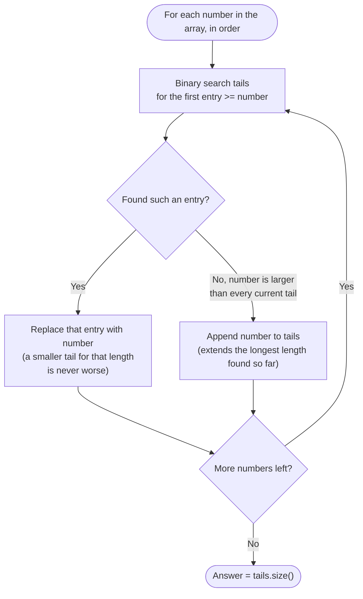

# Longest Increasing Subsequence — Flow Diagram

**How to read it:** every number in the input triggers exactly one binary search and one of two O(1) actions — replace an existing tail with a smaller value, or extend the piles by one. The diagram's key insight is that "replace" never shrinks the answer (it only makes a future extension easier by lowering a tail value), and "append" is the only action that actually grows the answer. By the time every number has been processed, the final size of `tails` is the LIS length.
