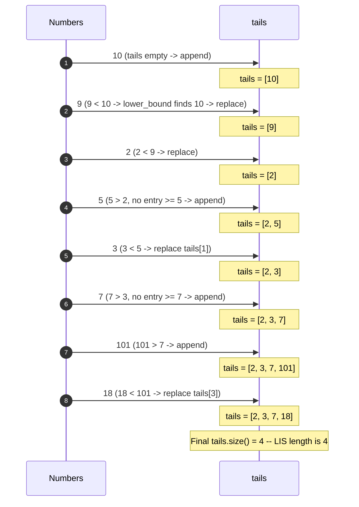

# Longest Increasing Subsequence — Trace Diagram

Tracing `tails` as the classic example `[10, 9, 2, 5, 3, 7, 101, 18]` is processed one number at a time.

**How to read it:** watch how `tails` never actually holds one single real subsequence at any point — by the end it reads `[2, 3, 7, 18]`, which *does* happen to be a valid increasing subsequence of the original array here, but that's a coincidence of this particular example, not a guarantee. What's guaranteed is only the *length* (4) and the *invariant* that `tails[k]` is always the smallest possible tail value achievable by any increasing subsequence of length `k+1` seen so far. Each "replace" (9, 2, 3, 18) makes some future extension easier by lowering a tail value; each "append" (10, 5, 7, 101) is the only action that actually grows the answer.
