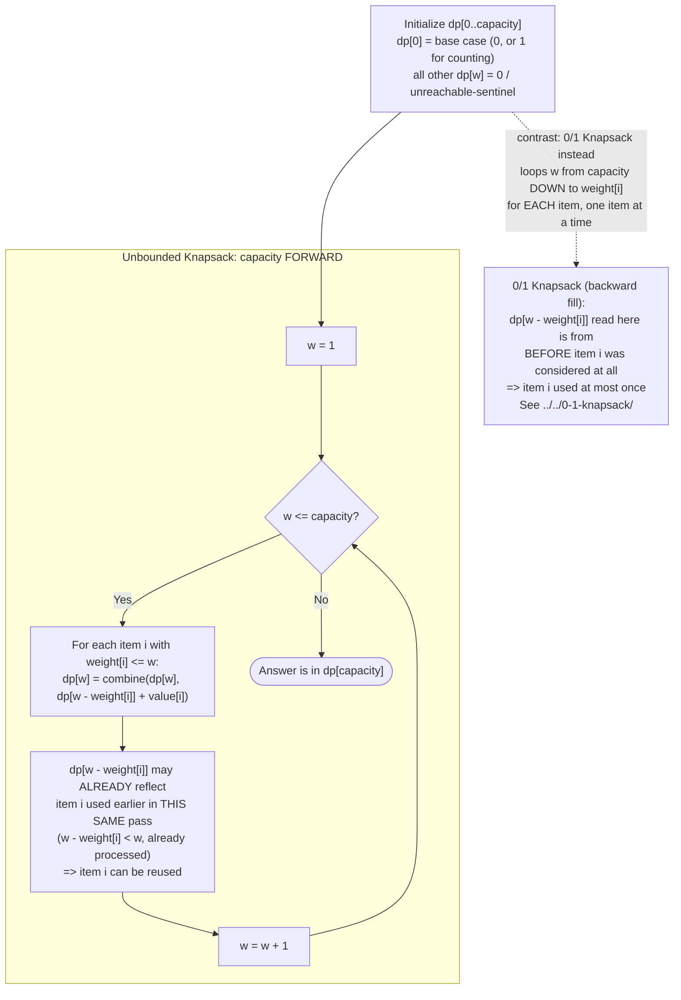

# Flow Diagram

The control flow of the 1D dp forward-fill loop that is the entire mechanical core of Unbounded Knapsack, with the contrast against 0/1 Knapsack's backward fill made explicit at the one point where they diverge.

## How to read it

Follow the `Unbounded` subgraph top to bottom first — this is the loop that appears, in some form, in every file in this module (`code.cpp`'s `unboundedKnapsack`/`coinChangeMinCoins`, and all four files in `problems/`). The critical box is `Note1`: because `w` increases and the inner update for capacity `w` reads `dp[w - weight[i]]`, and `w - weight[i]` is strictly smaller than `w`, that smaller-capacity slot **has already been updated during this same forward pass** — possibly using item `i` itself. That is the entire mechanism by which "reuse" happens. There is no explicit "use item i again" instruction anywhere in the code; reuse is a *consequence* of the fill direction, not a separate step.

The dashed arrow and the `ZeroOneNote` box exist purely as a contrast, not as part of this pattern's own flow: 0/1 Knapsack, when using the same style of 1D-array optimization, must iterate `w` **backward** (from `capacity` down to `weight[i]`) for each item, one item fully processed before the next. Filling backward means `dp[w - weight[i]]` is read while it still holds the value from **before** the current item was considered at all in this row — guaranteeing at most one use per item. If you accidentally fill Unbounded Knapsack backward, or 0/1 Knapsack forward, you silently get the other pattern's semantics without any error or warning — see the main [README](../README.md)'s Common Mistakes section, which calls this out as the single most important thing to get right in this whole module.
