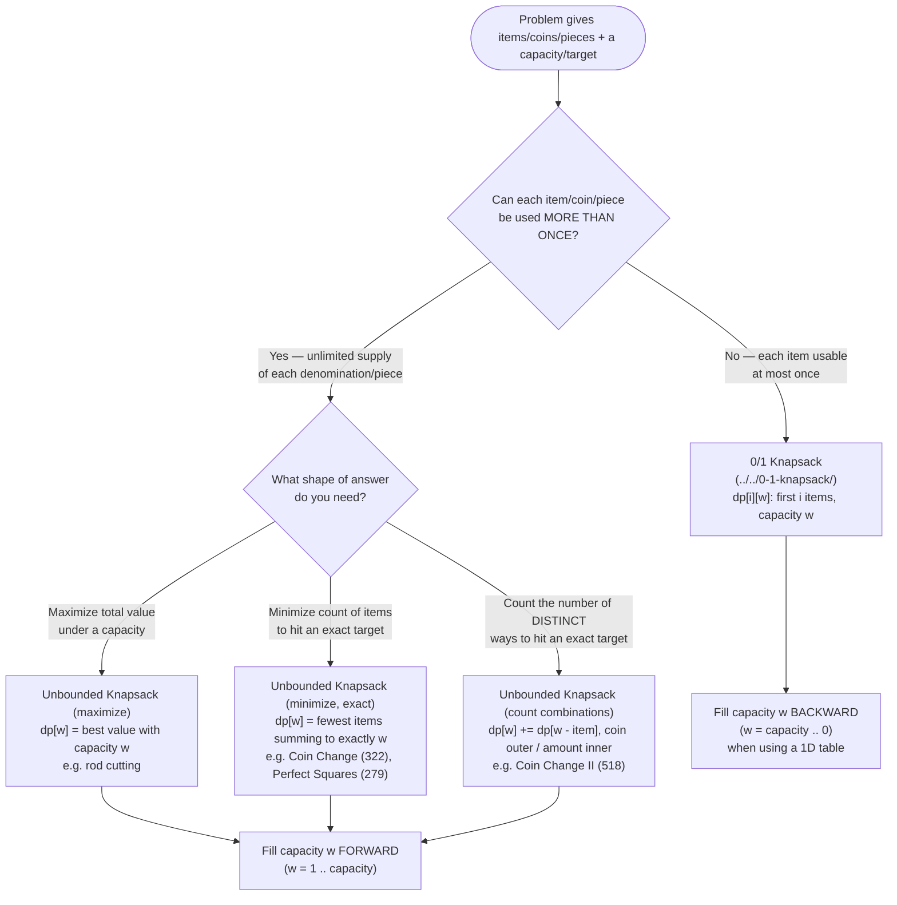

# Recognition Diagram

Deciding between Unbounded Knapsack and its sibling, 0/1 Knapsack ([../../0-1-knapsack/](../../0-1-knapsack/)), comes down to a single question the problem statement almost always answers directly, plus a second question about what shape of answer you need.

## How to read it

The first fork is the whole ballgame: **"can I use the same item again after I've already used it?"** If the answer is no, you are in 0/1 Knapsack territory — a different module entirely, even though the dp table shape and much of the surrounding machinery looks nearly identical. If the answer is yes, you are here, in Unbounded Knapsack.

The second fork only matters for *which aggregation* you write into `dp[w]` — it does not change the reuse mechanism at all. Maximize-value problems (rod cutting, "best value under a weight limit") take a `max` and default `dp[0] = 0`. Minimize-count-to-an-exact-target problems (Coin Change, Perfect Squares) take a `min` and need an explicit "unreachable" sentinel, because unlike a maximize problem, not every capacity is achievable. Count-the-number-of-ways problems (Coin Change II) sum (`+=`) instead of taking a `min`/`max`, and additionally require choosing the item as the **outer** loop specifically to count combinations instead of permutations — this is covered in depth in the main [README](../README.md)'s "Common Mistakes" section and in [problems/02-coin-change-ii.cpp](../problems/02-coin-change-ii.cpp).

Whichever branch you land in among the three Unbounded Knapsack variants, the bottom of the diagram converges on the same structural fact: capacity is filled **forward** (increasing). That forward fill is the one mechanical detail that distinguishes every box in this diagram from 0/1 Knapsack's backward fill — see [flow-diagram.md](flow-diagram.md) for exactly why that direction matters.
