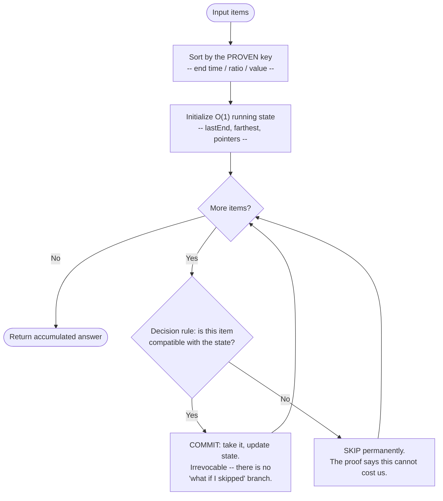
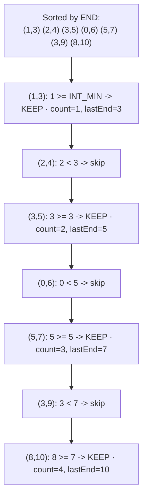

# Greedy


> **In one line:** sort by end time, then greedily keep any interval whose start doesn't overlap the last one kept — keeping the earliest-ending option always leaves the most room for what comes after.

```cpp
std::sort(intervals.begin(), intervals.end(),
          [](auto& a, auto& b) { return a.second < b.second; });   // sort by END time

int count = 0;
int lastEnd = INT_MIN;
for (const auto& interval : intervals) {
  if (interval.first >= lastEnd) {   // no overlap with the last one KEPT
    ++count;
    lastEnd = interval.second;
  }
}
```

**O(n log n)** time (the sort dominates) · **O(1)** extra space. Full runnable version: [code.cpp](code.cpp)

### Pick your depth

| Time | Path |
|------|------|
| **5 min** — refresher | [cheatsheet.md](cheatsheet.md) → answer its recall questions from memory |
| **20 min** — never seen this before | the code above → run [code.cpp](code.cpp) yourself → [problems/](problems/) |
| **40 min** — want the *why* | read on ↓ for the reasoning and tradeoffs, then [exercises.md](exercises.md) |

---
## Intent

Make the locally-optimal choice at each step — usually after sorting by some key — and prove that choice never needs to be reconsidered, rather than exploring both "take it" and "skip it" the way Dynamic Programming does.

## Real Life Analogy

Think of **one shared meeting room and a stack of booking requests for today**, each with a fixed start and end time. You want to fit in as many meetings as possible. The instinct most people have is "book the shortest meetings first" or "book whatever starts earliest." Both feel reasonable and both are wrong. The rule that actually maximizes the count is **book the meeting that *finishes* earliest**, then, from what remains, again book the earliest-finishing one that starts after your last booking ended. The reason is not visible from staring at examples — it comes from an argument: whichever meeting you book first, replacing it with the earliest-finishing one cannot cost you anything, because it frees up at least as much of the rest of the day.

That gap between "feels reasonable" and "is provably right" is the whole personality of this pattern, and here is the second analogy that makes the danger concrete: **making change at a till.** With normal coins (1, 5, 10, 25) the cashier's instinct — always hand over the largest coin that still fits — genuinely gives the fewest coins every time. Now imagine a currency with coins worth 1, 3, and 4, and a customer owed 6. The instinct takes a 4, then a 1, then a 1: three coins. The right answer is 3 + 3: two coins. Nothing about the algorithm changed and nothing about the code changed — the *denominations* changed, and the instinct quietly stopped being correct. So Greedy is not "the pattern where you pick the best-looking option." It is **the pattern where you pick the best-looking option and then owe a proof** — and without the proof you have written an algorithm that will pass your samples and be wrong in production.

## Problem

### What engineering problem exists?

A large class of optimization problems asks you to select, order, or partition items to maximize or minimize something:

- **Interval scheduling.** Maximize the number of non-overlapping intervals you can keep (equivalently, minimize how many you must delete); find the minimum number of arrows that puncture every interval; find the minimum number of rooms needed.
- **Reachability under a per-step budget.** Can you reach the end of an array where `nums[i]` is your maximum jump from index `i`? What is the fewest jumps? Can you complete a circular route given fuel gains and costs at each station?
- **Assignment, pairing, and frequency-driven arrangement.** Match cookies to children so the most children are satisfied; pair the heaviest and lightest people into weight-limited boats; given task counts and a mandatory cooldown between identical tasks, find the shortest schedule.

Every one of these has the same shape: **a sequence of irrevocable decisions**, where at each step you commit to something and never look back. The engineering problem is not making the decisions — it is knowing *which* decision rule is safe to commit to.

> **Term: greedy choice property.** A problem has it when there is *always* an optimal solution that includes the choice your rule makes at the current step. Not "your rule's choice is in *every* optimal solution" (usually false, because ties exist), but "in *at least one*" — which is enough, because you only need to find one optimum, not all of them.

> **Term: optimal substructure.** After committing to that choice, what remains is a *smaller instance of the same problem*, and solving that remainder optimally, combined with the choice already made, yields an optimum for the whole. Without it, a locally-safe first choice tells you nothing about steps two through n.

**Recognition signal, stated precisely:** the problem can be solved by sorting on the right key and then making one irrevocable choice per step. The defining feature — the thing separating it from Dynamic Programming — is that **you only ever explore ONE branch, never both.** If you catch yourself wanting to compute "the answer if I take this" *and* "the answer if I skip this" so you can compare them, you have left Greedy and entered DP.

### Why is this problem difficult?

- **A plausible-looking greedy algorithm can be silently, subtly wrong.** This is the one fact that makes Greedy different from every other pattern in this repository. A broken Tree DFS crashes on a null pointer. A broken binary search loops forever. A broken greedy algorithm **runs fine, terminates, returns a number of the right magnitude, and passes the three examples in the problem statement** — and is wrong on the fourth. The coin-change case above is not contrived: it is the same algorithm that is provably correct for US coinage, applied to a different input distribution.
- **The sort key is the entire algorithm, and there are usually three plausible ones.** For interval scheduling: sort by start, by end, or by duration. Two of the three are wrong, the code is four lines either way, and the wrong versions read exactly as reasonably as the right one. Nothing in the source distinguishes them — only a proof or a counter-example does.
- **Testing does not establish correctness here, and normally it does.** For most patterns, covering the edge cases (empty, single element, duplicates, negatives) gives real confidence. For Greedy, passing tests only tells you the rule is right *on the inputs you thought of* — and the failure mode is an input distribution you did not imagine, which is exactly what production traffic is.
- **The proof techniques are unfamiliar to most working engineers.** Exchange arguments and "greedy stays ahead" inductions are standard in an algorithms course and essentially absent from day-to-day backend work, so the one skill the pattern demands is the one least likely to be practised.

### What happens if we ignore it?

- **You ship an algorithm that is right on your data and wrong on your customers' data.** A "pack the largest bundle that still fits" heuristic, a "route to the least-loaded shard" balancer, an "evict the largest object" cache policy — each is a greedy rule, and each may or may not be optimal depending on constraints nobody wrote down.
- **You conclude "greedy doesn't work here" and reach for DP when a valid greedy rule existed** — trading `O(n log n)` time and `O(1)` space for `O(n · W)` time and memory, sometimes by orders of magnitude, on a problem that never needed it.
- **You cannot debug the failure when it arrives.** With no crash and no stack trace, a wrong greedy rule surfaces as "the scheduler produces slightly worse plans than the old system" — a symptom nobody localizes to a comparator.

## Solution

Sort the input by a carefully-chosen key, then walk through it once, committing to a decision at each step that is never revisited. Maintain one small piece of state (the end time of the last kept interval, the farthest index reached so far, a pointer into a second sorted list) and use it to decide, in `O(1)`, whether to take or skip the current item. That is the code, and the code is the easy part. Here is the part that matters.

### Earning the guarantee

A greedy algorithm is correct if and only if two conditions hold, and you should be able to state both for any rule you propose: the **greedy choice property** (there exists an optimal solution containing the choice your rule makes right now) and **optimal substructure** (after making that choice, the remaining problem is a smaller instance of the same problem, and stitching an optimal remainder onto your choice gives an overall optimum).

### The exchange argument

The standard proof technique for the first condition, and the one worth internalizing because it is short and mechanical: assume some optimal solution `OPT` disagrees with your greedy choice `g` at the first point of disagreement; show you can **swap** `g` into `OPT`, removing whatever `OPT` chose instead, and end up with a solution that is **no worse** — same size, same cost, still valid. Therefore an optimal solution containing `g` exists, so choosing `g` was safe. Then repeat inductively at each subsequent step.

Applied to **Activity Selection** (maximize non-overlapping intervals — `maxNonOverlappingIntervals` in [code.cpp](code.cpp)): sort by **END** time, not start time, which is the common wrong instinct. Greedily pick the first activity, then repeatedly pick the next activity whose start is at or after the previously-picked activity's end. The exchange argument in one sentence: *among all activities that could be picked first, the one ending soonest leaves at least as much room for everything after it, so swapping it in for whatever `OPT` picked first can never reduce the count.* That is the entire proof, and it is the cleanest one in this pattern — build the reflex against `maxNonOverlappingIntervals` in [code.cpp](code.cpp).

### The counter-example, worked

Now the same discipline applied to a rule that **fails**. Coin change, denominations {1, 3, 4}, target 6, rule "always take the largest coin that fits." Step 1: remaining 6, largest fitting coin is 4, take it. Step 2: remaining 2, largest fitting coin is 1, take it. Step 3: remaining 1, take a 1. Greedy returns `4 + 1 + 1` = **3 coins**. The optimum is `3 + 3` = **2 coins**.

Which condition broke? **The greedy choice property.** There is no optimal solution for target 6 that contains a 4 — taking the 4 leaves 2, and 2 can only be made from two 1s, so *every* solution containing a 4 uses at least 3 coins. The exchange argument fails at the very first step: swapping the 4 into the optimal `{3, 3}` does not leave a solution that is no worse, it leaves one that is strictly worse. Optimal substructure is actually *fine* here — the best way to make 6 really does decompose into a coin plus the best way to make the remainder — which is precisely why **DP works and greedy does not**: DP exploits the substructure without assuming any particular first coin is safe.

The lesson to carry: greedy succeeded for US coinage because {1, 5, 10, 25} happens to satisfy the greedy choice property (roughly, each denomination is at least twice the previous). That is a property of the *input distribution*, not of the algorithm, and it can never be inferred from examples that happened to work. Restating the DP boundary once more: if you need to consider *both* "take it" and "skip it" and compare results, that is DP — the defining feature of Greedy is that a proof lets you skip the comparison entirely.

## Architecture

Greedy has four participants, and the fourth is the one people forget:

1. **The sort key (comparator).** The single most important design decision. It converts an unordered set of items into the order in which decisions become locally decidable. Wrong key, wrong algorithm — with identical-looking code. In `maxNonOverlappingIntervals` this is the lambda comparing `a.second < b.second` (end time).
2. **The running state.** One or two scalars summarizing everything the past decisions imply for the future: `lastEnd` in `maxNonOverlappingIntervals`, `farthest` in `canJumpToEnd`, a pair of indices in a two-pointer assignment. It must be `O(1)`-updatable and must capture *everything* the next decision needs — if it cannot, you are not looking at a greedy problem.
3. **The irrevocable decision rule.** A single `if` inside the loop: given the current item and the running state, take it or skip it. No `else` branch revisits an earlier decision, no undo, no second pass. That absence is the pattern's signature.
4. **The proof obligation.** Not code, but genuinely part of the architecture — the exchange argument justifying (1) and (3) together. A greedy implementation without it is an untested hypothesis, and unlike most untested hypotheses in software, this one will not announce itself when it is false.

Responsibilities in one line each — **comparator:** puts items in the order that makes each local choice safe · **running state:** compresses the entire past into `O(1)` bytes the next decision can consult · **decision rule:** commits, once, per item, without lookahead or backtracking · **proof:** the reason you are allowed to skip exploring the other branch.

## Execution Flow

**Interval scheduling — maximize non-overlapping intervals** (this is `maxNonOverlappingIntervals` in [code.cpp](code.cpp)):

1. Sort all intervals ascending by **end** time. Ties among equal ends may be broken arbitrarily; it does not affect the count.
2. Initialize `count = 0` and `lastEnd = INT_MIN` — a sentinel meaning "nothing kept yet, so everything is compatible so far."
3. Walk the sorted intervals left to right, in one pass.
4. For the current interval, test `start >= lastEnd`. That is the whole decision: does it begin at or after the last kept interval finished?
5. If yes, **keep it**: increment `count` and set `lastEnd = end`, irrevocably. No "what if I had skipped it" alternative is computed, because the exchange argument already established that skipping cannot help.
6. If no, **skip it** permanently. The skipped interval overlaps the last kept one, and since we sorted by end time the last kept one ends no later, so swapping them could only tie or hurt.
7. When the loop finishes, `count` is the maximum achievable number of non-overlapping intervals. For LeetCode 435's phrasing (minimum intervals to *remove*), the answer is `n - count`.

**The proof procedure — how to decide whether a candidate greedy rule is safe.** Run this *before* writing the loop:

1. State the candidate rule in one sentence, naming the sort key explicitly ("sort by end time ascending, keep any interval starting at or after the last kept end").
2. State what an optimal solution looks like as an object you can manipulate: a set of kept intervals, a sequence of coins, an assignment of cookies to children.
3. Assume an optimal solution `OPT` and locate the **first** step where `OPT`'s choice differs from your rule's choice `g`.
4. Attempt the swap: replace `OPT`'s choice with `g`. Verify the result is still **valid** (no constraint violated) and **no worse** (size or cost unchanged or improved).
5. If the swap succeeds you have the greedy choice property; confirm optimal substructure — after fixing `g`, is the remainder the same problem on a smaller input? — and write the four-line loop.
6. If the swap **fails**, stop. Construct the smallest concrete input where it fails, as with {1, 3, 4} and target 6. That counter-example is now your evidence, and DP is your algorithm.
7. Sanity-check against small adversarial inputs regardless: duplicates, all-identical items, one item, zero items, and — critically — an input where the "obvious" alternative sort key gives a different answer. Passing tests never *proves* a greedy rule, but a failing test disproves one instantly and cheaply.

## Why Not Other Approaches?

**"Brute force, or backtracking with pruning."**
Enumerating every subset or ordering is correct by construction and completely infeasible — `2^n` subsets, `n!` orderings. Backtracking with pruning (see [../../recursion-backtracking-patterns/backtracking/](../../recursion-backtracking-patterns/backtracking/)) improves the constant but still explores *both* branches at each decision, abandoning only the hopeless ones, so the worst case stays exponential. For the problems in this module that exponential search is entirely wasted: a proof exists that one branch is never worse, so exploring the other computes a result you already knew. Both are worth naming aloud as the correctness baseline your greedy answer must match, then discarding.

**"Dynamic Programming — the honest contrast."**
This deserves real space, because DP is the alternative that always works. DP considers both "take it" and "skip it" at every decision and lets a recurrence pick the winner, memoizing overlapping subproblems so the total stays polynomial. Coin Change (LeetCode 322) solved by DP is `O(amount · coins)` and gives the minimum coin count for *any* denomination set, including {1, 3, 4}. It never needs a proof about the denominations, because it never assumes anything — it computes both alternatives and compares.

Greedy trades that unconditional guarantee for speed. Where DP is `O(n · W)` time and `O(W)` space, Greedy is typically `O(n log n)` time and `O(1)` extra space, with no table to allocate and no state to carry. **You are buying an order of magnitude by promising, in advance, that comparison is unnecessary — and the proof is how you pay for it.** No proof, no guarantee, and you have not saved time; you have hidden a defect. The practical decision rule: if you can state a one-sentence exchange argument, take the greedy win; if you cannot, write the DP, because a correct `O(n · W)` solution beats a fast wrong one at any scale. (Coin Change lives in [../../dynamic-programming-patterns/unbounded-knapsack/](../../dynamic-programming-patterns/unbounded-knapsack/) rather than here, and that filing is not an accident.)

**"Sort, then do something clever with two pointers or a heap."**
Often this *is* the greedy algorithm in disguise, which is fine. What is not fine is treating "I sorted the input" as evidence of correctness. Sorting is the enabling step, not the argument — a comparator on the wrong key produces an algorithm with exactly the same shape and a different answer.

**Tradeoff summary:** brute force is correct and exponential; backtracking is correct and still exponential in the worst case; DP is correct and polynomial but pays time and memory for comparisons it may not need; Greedy is the only option that is `O(n log n)` and `O(1)` — and the only one that can be *wrong*. Every other pattern in this repository fails loudly. This one fails quietly, which is why the proof is not an academic flourish but the load-bearing part of the work.

## Diagrams

### Recognition

```mermaid
flowchart TD
    Start([Optimization problem:<br/>maximize or minimize]) --> Q1{Must I compare<br/>'take it' vs 'skip it'<br/>to decide?}
    Q1 -- Yes --> DP[["Dynamic Programming<br/>(explore both branches,<br/>the recurrence decides)"]]
    Q1 -- "No -- one branch is<br/>provably always safe" --> Q2{Can I name a SORT KEY<br/>making each local<br/>choice decidable in O(1)?}
    Q2 -- No --> DP
    Q2 -- Yes --> Q3{Can I state an EXCHANGE<br/>ARGUMENT for that key<br/>in one sentence?}
    Q3 -- "No / not sure" --> Danger[["STOP. Write the DP.<br/>An unproven greedy rule<br/>fails silently, not loudly."]]
    Q3 -- Yes --> Greedy[["Greedy: sort by the key,<br/>one pass, O(1) state,<br/>never revisit a choice"]]
```

See [images/recognition-diagram.md](images/recognition-diagram.md) for the full flowchart and a prose walkthrough of each fork, including how to spot problems where a greedy rule exists but the obvious key is the wrong one.

### Flow



See [images/flow-diagram.md](images/flow-diagram.md) for the control-flow diagram plus an explanation of why the *absence* of a compare-both-branches box is the pattern's defining feature.

### Trace



See [images/trace-diagram.md](images/trace-diagram.md) for the full step-by-step trace of this exact input (the one asserted in [code.cpp](code.cpp)'s first test), **plus a side-by-side trace of the failing {1, 3, 4} coin-change case** showing precisely where the greedy choice diverges from the optimum.

## The Code

[code.cpp](code.cpp) is a **generic, problem-agnostic template**, not a solution to one specific LeetCode question — the goal is to see the *shape* of the pattern clearly before looking at the worked, problem-specific solutions in [problems/](problems/). It provides two small functions covering the two structurally distinct flavors of greedy state:

- `maxNonOverlappingIntervals` — the **sort-then-commit** flavor: the sort key carries the proof, and the running state is a single `lastEnd` compared against each candidate's start.
- `canJumpToEnd` — the **no-sort, running-frontier** flavor: nothing is sorted at all; the greedy insight is that only "the farthest index reachable so far" matters, so one `max` update per element suffices.

That second function is deliberately there as a reminder that greedy does not *require* sorting. The pattern's essence is the irrevocable local commitment; sorting is merely the most common way to make such commitments safe.

### Code walkthrough

**`maxNonOverlappingIntervals`** (in [code.cpp](code.cpp)). Takes its vector **by value** deliberately: it sorts in place, and a caller's input should not be reordered as a side effect of asking a question about it. The comparator compares `a.second < b.second`, i.e. **end** time — the single line that makes the algorithm correct, and the single line that would make it wrong if changed to `a.first < b.first`. `lastEnd` starts at `INT_MIN` rather than `0` so intervals with negative or zero starts are still accepted on the first iteration. The comparison is `>=`, not `>`: an interval starting at exactly the moment the previous one ended does not overlap it, which is why [code.cpp](code.cpp)'s second test asserts that `{1,2},{2,3},{3,4}` keeps all three.

**`canJumpToEnd`** (in [code.cpp](code.cpp)). Walks the array once with no sort. `farthest` holds the highest index reachable using any combination of jumps from indices already visited. The check `if (i > farthest) return false` fires the moment the loop's cursor overtakes the frontier — every index from there on is unreachable, so we stop immediately. Then `farthest = max(farthest, i + nums[i])` extends the frontier. The subtle part: we never decide *which* jump to take. The greedy claim is that the specific route is irrelevant and only the frontier's extent matters, which is why one scalar of state suffices. The `static_cast<int>` calls exist because `i` is `size_t` (unsigned) and comparing it against a signed `int` without the cast trips a sign-comparison warning under `-Wall`.

**`main()`** (in [code.cpp](code.cpp)). A local `check` lambda prints `[PASS]`/`[FAIL]` per named assertion and tallies both counts, returning non-zero on any failure so the file works as a CI check. The interval tests cover the seven-interval example traced in [images/trace-diagram.md](images/trace-diagram.md), the touching-endpoints case that validates `>=` over `>`, and empty input; the jump tests cover reachable, blocked-by-a-zero, and single-element inputs.

**Files in [problems/](problems/).** Each is a complete, standalone solution to one named LeetCode problem, with its own includes and `main()`, and each header comment states **the greedy choice** and **the one-line argument for why it is safe** — the discipline this README argues for, applied four times. Briefly: `01` is the two-pointer assignment greedy (smallest sufficient resource to the least demanding consumer); `02` is interval scheduling, the cleanest exchange argument, with runnable demonstrations of why sorting by start *and* by duration both fail; `03` generalizes the frontier greedy from "can I reach the end" to "in how few jumps"; `04` is the hardest, where the insight is that the *most frequent* task dictates the schedule's skeleton. See [problems/README.md](problems/README.md) for the index.

## Tradeoffs

**What greedy buys you**

- **`O(n log n)` time, `O(1)` extra space** in the typical case — the sort dominates and the decision pass allocates nothing. Where no sort is needed (`canJumpToEnd`), it drops to `O(n)`.
- **Tiny implementations with very few moving parts.** A comparator, a scalar, and one `if`. No table to size, no recursion to bound, no memo keys to design — very little surface area for implementation bugs, as opposed to reasoning bugs.
- **Streams naturally.** Because state is `O(1)` and decisions are irrevocable, most greedy algorithms work on input you cannot rewind — genuinely useful when the "array" is a Kafka topic or a cursor over a large Postgres result set.
- **Explains itself to non-engineers.** "We always take the booking that frees the room soonest" is a sentence a product manager can audit. A DP recurrence is not.
- **Composes as a subroutine inside bigger algorithms.** Dijkstra's shortest path (always expand the closest unvisited node) and Kruskal's MST (always add the cheapest non-cycling edge) are greedy at their core — see [../../tree-graph-patterns/dijkstras-algorithm/](../../tree-graph-patterns/dijkstras-algorithm/) and [../../tree-graph-patterns/union-find/](../../tree-graph-patterns/union-find/).

**What it costs you**

- **It can be wrong, and it will not tell you.** The one disadvantage that really matters: an incorrect greedy rule terminates normally and returns a plausible answer. Every other pattern's failures are louder.
- **Correctness depends on the input distribution, not just the code.** Greedy coin change is correct for {1, 5, 10, 25} and wrong for {1, 3, 4} — meaning a greedy algorithm can be correct today and incorrect after a configuration change nobody thought of as touching the algorithm.
- **The proof is real work and is not always short.** Some rules (Huffman coding, the Task Scheduler formula in [problems/04-task-scheduler.cpp](problems/04-task-scheduler.cpp)) need a genuinely non-trivial argument. Budget for it, and be honest when you are past your depth.
- **No partial credit on the sort key.** Right shape and wrong key yields an algorithm that is wrong, not approximately right — unlike DP, where an awkward recurrence is usually still correct, just slower.
- **Not extensible.** Add one constraint and the greedy rule frequently collapses rather than adjusting: unweighted interval scheduling is greedy, weighted interval scheduling is DP, and there is no incremental path between them.

**Versus DP directly:** an order-of-magnitude drop in both time and space — `O(n log n)`/`O(1)` against `O(n · W)`/`O(W)` — in exchange for the unconditional correctness guarantee. DP is correct for every input satisfying the problem statement; Greedy is correct for every input satisfying the problem statement **and** the greedy choice property. That second clause is the entire risk, and DP does not have it.

**Versus brute force and backtracking:** a near-linear runtime instead of exponential, by declining to explore branches a proof has already ruled out — but brute force needs no cleverness and no proof, so for a genuinely tiny `n` under time pressure, an exhaustive search you are sure about beats a greedy rule you are guessing at.

**The meta-tradeoff:** greedy moves work from *runtime* to *design time*. The cost you avoid at execution reappears as reasoning you must do before writing the loop — a good trade when you actually do the reasoning, and a bad one when you skip it.

## Complexity

**Time:** `O(n log n)` — dominated by the sort; the greedy pass itself is `O(n)`. When no sort is needed (`canJumpToEnd`, and [problems/02-jump-game-ii.cpp](problems/02-jump-game-ii.cpp)) it is `O(n)`. When the greedy choice is served by a heap rather than a full sort (top-k style selection, or Huffman), each of `n` steps costs `O(log n)`, so the total is again `O(n log n)`.

**Space:** `O(1)` extra beyond the sort's own space. `std::sort` is introsort and uses `O(log n)` stack space; if the input must be copied to avoid mutating a caller's vector — as `maxNonOverlappingIntervals` does by taking its parameter by value — that copy is `O(n)`, which is an interface choice rather than an algorithmic requirement.

| Approach | Time | Extra space | Correct for all inputs? |
|---|---|---|---|
| Brute force (all subsets/orderings) | `O(2^n)` or `O(n!)` | `O(n)` | Yes |
| Backtracking with pruning | exponential worst case | `O(n)` | Yes |
| Dynamic Programming | `O(n · W)` typical | `O(W)` or `O(n · W)` | Yes |
| **Greedy** | **`O(n log n)`** | **`O(1)`** | **Only if the greedy choice property holds** |

That last column is the whole pattern in one table cell.

## Common Mistakes

- **Sorting by the wrong key.** Activity Selection sorted by START time does not work — the classic trap. Sorted by **duration** (shortest first) also fails, and it fails on a smaller example, which makes it the better disproof to memorize: intervals `(0,10)`, `(9,11)`, `(10,20)` — shortest-first takes `(9,11)`, which collides with both others, giving 1; end-time-first takes `(0,10)` then `(10,20)`, giving 2. *Avoid:* before coding, write down all three candidate keys and try to break two of them on a three-element input, exactly as `main()` in [code.cpp](code.cpp) does with runnable assertions.
- **Assuming a greedy approach exists without proving it.** Not every "sort and pick" problem has a valid greedy solution — if there is no exchange argument, the problem may genuinely need DP instead. *Avoid:* make "state the exchange argument in one sentence" a hard gate before writing the loop, and treat inability to state it as a signal rather than a formality to skip.
- **Treating passing samples as proof.** The coin-change rule passes every example built from {1, 5, 10, 25}. Samples can only disprove a greedy rule, never establish one. *Avoid:* when you cannot prove the rule, brute-force small random inputs and diff the two answers — a 20-line randomized differential test finds counter-examples hand-picked cases never will.
- **Confusing "greedy" with "any simple sort-based approach."** A greedy algorithm commits to one choice per step without reconsidering it; an approach that revisits or compares alternatives after sorting is doing something closer to DP. *Avoid:* look for the absence of a "what if I had skipped it" computation — if it is present, the algorithm is not greedy, whatever you call it.
- **Off-by-one on the boundary comparison.** `start >= lastEnd` versus `start > lastEnd` decides whether touching intervals (`[1,2]` and `[2,3]`) count as overlapping. Both conventions appear in real problem statements, and choosing wrong changes the answer without changing the shape. *Avoid:* find the sentence in the problem statement that settles it, and assert the touching case explicitly, as [code.cpp](code.cpp)'s second test does.

## When To Use

- **You can state the exchange argument in one sentence.** This is the real gate, and it belongs at the top of any "when to use" list for this pattern.
- The input can be sorted by a key such that processing it in that order and committing to each choice never needs to be undone (interval scheduling, jump games, gas station, task assignment).
- The problem asks for a **count or an extremum** ("maximum number of…", "minimum number of…") rather than an enumeration of every solution — greedy produces one optimal answer, not all of them.
- The structure is "irrevocable decisions under an `O(1)`-summarizable constraint": a single frontier, a single last-used resource, a single running deficit.
- The input is enormous or arrives as a stream, so `O(n · W)` DP memory is not available — and a proof is available in exchange.
- You have already written the DP, it is correct, and it is too slow — greedy as a deliberate optimization, with the DP retained as an oracle to differential-test against.

## When NOT To Use

- **You need to consider both "take it" and "skip it" and compare outcomes** — that is Dynamic Programming, not Greedy.
- **No exchange argument exists** for the candidate greedy rule — if you cannot prove the local choice is always safe, do not trust it just because it "seems to work" on a few examples. The {1, 3, 4} coin-change case is what ignoring this looks like.
- **The problem adds weights or values to what was a counting problem.** Unweighted interval scheduling is greedy; weighted interval scheduling is DP. A value per item usually destroys the exchange argument, because "ends soonest" stops being comparable to "worth most."
- **You must enumerate all optimal solutions, or explain after the fact why a particular one was chosen.** Greedy commits and forgets; it retains no record of the alternatives.
- **The constraint cannot be summarized in `O(1)` state.** If deciding on item `i` requires knowing the full set of previously-chosen items rather than one scalar summary, the local choice is not actually local, and DP or search is the honest tool.
- **The cost of being subtly wrong is high and the proof is shaky** — billing, capacity planning, safety limits. Prefer a slower algorithm you can defend line by line.

## Where This Shows Up

Greedy is one of the most commonly asked interview families, and interviewers use it specifically to see whether a candidate volunteers a correctness argument unprompted. Non-overlapping Intervals (435), Jump Game (55), Jump Game II (45), Gas Station (134), Task Scheduler (621), Assign Cookies (455), and Minimum Number of Arrows to Burst Balloons (452) are all standard, and in each the gap between a passing and a strong answer is whether you said *why* the sort key is safe.

In real systems:

- **Huffman coding, inside every gzip/DEFLATE and JPEG payload you have ever served.** Repeatedly merge the two least-frequent symbols into a subtree. The greedy choice property here has a real proof, and the algorithm has been correct in production for sixty years — the canonical example of greedy done properly.
- **Dijkstra's shortest path, in every routing table and map application.** Always finalize the closest unvisited node. Its proof depends on a precondition — non-negative edge weights — and introducing a negative edge breaks the greedy choice property, which is exactly why Bellman-Ford exists. A perfect illustration that greedy correctness is a property of the input, not the code.
- **Kruskal's and Prim's minimum spanning tree, in network topology and clustering.** Always take the cheapest edge that does not create a cycle; see [../../tree-graph-patterns/union-find/](../../tree-graph-patterns/union-find/) for the disjoint-set structure that makes the cycle check fast.
- **CPU and Kubernetes schedulers.** Shortest-Job-First provably minimizes average waiting time via an exchange argument on adjacent jobs, while the bin-packing heuristics that place pods on nodes are greedy and only *approximately* optimal — bin packing is NP-hard, so its greedy rules come with a ratio bound rather than a guarantee.
- **Rate limiters and token buckets.** "Serve the request if tokens remain, else reject" is an irrevocable local decision against `O(1)` running state with no lookahead — greedy in the structural sense, even though nobody calls it that.

Five realistic ideas for your own backend/systems work:

1. **Meeting-room or resource booking in a NestJS scheduling service.** Given today's requests for a shared resource, return the largest conflict-free subset — literally `maxNonOverlappingIntervals` over Postgres rows, with `ORDER BY ends_at` letting the database do the `O(n log n)` part and your service the `O(n)` pass.
2. **Compacting overlapping retention or maintenance windows before writing them to a config table.** Merging adjacent/overlapping windows into the minimum set covering the same time is a greedy sweep — see [../../array-string-patterns/merge-intervals/](../../array-string-patterns/merge-intervals/), one concrete, provably-correct instance of this pattern.
3. **Batching queue jobs under a payload size limit.** Sort pending jobs by size and greedily fill each batch — but note honestly in the design doc that this is bin packing, so the rule is a *heuristic with a bound*, not an optimum. Naming that distinction in a PR description is exactly the skill this module teaches.
4. **A Redis-backed rate limiter or connection-pool admission controller.** Admit or reject each request against a single running counter, with no ability to revisit past decisions. Framing it as greedy makes the design question explicit: is "admit whenever tokens remain" really the policy that maximizes served requests, or would reserving capacity for high-priority callers beat it? That question is an exchange argument in disguise.
5. **Choosing which cached objects to evict when a memory ceiling is hit.** "Evict the largest object" and "evict the least recently used" are both greedy rules over different sort keys, optimizing different things — comparing them is the same reasoning as comparing sort keys for interval scheduling. See [../../advanced-ds-patterns/lru-cache/](../../advanced-ds-patterns/lru-cache/) for the structure that makes the LRU key cheap to maintain.

## Similar Patterns

- **Merge Intervals** ([../../array-string-patterns/merge-intervals/](../../array-string-patterns/merge-intervals/)): itself a specific, provably-correct greedy strategy (sort by start, extend-or-flush) — one concrete application of the general pattern. Note that it sorts by **start** while Activity Selection sorts by **end**: the key follows the goal, not the data type. Merging asks "what is the union," where start order lets each interval either extend the current run or begin a new one; scheduling asks "how many fit," where finishing soonest is what leaves room.
- **Dynamic Programming** ([../../dynamic-programming-patterns/](../../dynamic-programming-patterns/)): the fallback when no safe greedy rule exists — DP explores both branches and lets the recurrence decide, rather than committing upfront. Reach for it the moment the exchange argument fails, and keep it as a slow oracle to differential-test a greedy replacement against.
- **Backtracking** ([../../recursion-backtracking-patterns/backtracking/](../../recursion-backtracking-patterns/backtracking/)): explores both branches like DP but without memoization, pruning branches proven *invalid* rather than proven suboptimal. Greedy is the extreme end of the same spectrum — it prunes every alternative branch, on the strength of a proof.
- **Two Pointers** ([../../array-string-patterns/two-pointers/](../../array-string-patterns/two-pointers/)): the mechanical vehicle for many assignment-style greedy algorithms (the classic example is LeetCode 455, Assign Cookies) — two sorted sequences walked in lockstep, each advance an irrevocable commitment. When the greedy choice is instead "the current best of many," a heap replaces the full sort and the pattern becomes `O(n log k)`; see [../../searching-sorting-patterns/top-k-elements/](../../searching-sorting-patterns/top-k-elements/).

| Pattern | Branches explored per decision | Needs a correctness proof? | Typical time | Fails how? |
|---|---|---|---|---|
| **Greedy** | One (the proof rules out the rest) | **Yes — this is the work** | `O(n log n)` | **Silently: a plausible wrong answer** |
| Dynamic Programming | Both, memoized | No (the recurrence is the proof) | `O(n · W)` | Loudly: obviously bad output |
| Backtracking | Both, pruned when invalid | No | Exponential worst case | Loudly: timeout or missing results |
| Brute force | All | No | `O(2^n)` / `O(n!)` | Loudly: timeout |

## Interview Discussion

Experienced engineers do not spend interview time on the loop — `sort`, then one pass with a scalar, is four lines nobody argues about. What they probe is whether you **volunteer the correctness argument without being asked**, because that is the only signal distinguishing someone who understands greedy from someone who pattern-matched "intervals, so sort them."

Here is how a working engineer actually sanity-checks a greedy claim, in the order they do it:

1. **Name the sort key out loud, then name the two keys you rejected.** "End time — not start, and not duration." If you cannot name plausible alternatives, you have not really chosen one.
2. **State the exchange argument in one sentence.** Not a formal induction; one sentence on why swapping your choice into any optimal solution cannot hurt. If the sentence will not come out, that is information — the rule may be false.
3. **Try to break it on three elements.** Almost every wrong greedy rule dies on a hand-built three-item input, and building one takes thirty seconds: `(0,10) (9,11) (10,20)` kills shortest-first.
4. **Ask what the DP would be, and what it would cost.** Knowing the fallback's complexity is how you know what the proof is buying — if DP is `O(n)` anyway, the greedy risk was not worth taking.
5. **For anything shipping, differential-test against brute force on small random inputs.** A few hundred random 8-element cases compared against exhaustive search catches wrong sort keys essentially always, cheaply enough that there is no excuse for skipping it.

Common follow-up questions:
- *"Prove it."* — the actual question behind every greedy problem. Expects an exchange argument, not "it works on the examples."
- *"What if I sorted by start time instead?"* — expects a concrete counter-example produced on the spot, not a vague "that wouldn't be optimal."
- *"When would you use DP here instead?"* — expects you to name the specific modification that breaks greedy: weights on intervals, a cooldown that depends on history, arbitrary coin denominations.
- *"Your solution is `O(n log n)` because of the sort. Can you do better?"* — expects recognition that some greedy problems need no sort at all (Jump Game's frontier, Gas Station's running deficit) and are therefore `O(n)`, and that counting-sortable keys drop the log factor.
- *"How would you test this?"* — expects randomized differential testing against a brute-force oracle, plus the observation that example-based tests are structurally incapable of validating a greedy rule.

Common misconceptions:
- **"Greedy means whatever looks locally best, and if the samples pass it is right."** The most damaging belief in this module. Samples can only *disprove*. Greedy coin change passes every US-coinage sample and is wrong for {1, 3, 4}, target 6. What makes an algorithm greedy is the irrevocable local commitment; what makes it *correct* is a separate, provable property of the problem that no amount of sample-passing establishes.
- **"Greedy is the easy pattern."** The code is easy. The pattern is the hardest one here to be *sure* about, because it is the only one whose failures are invisible at runtime.
- **"Greedy always needs a sort."** `canJumpToEnd` in [code.cpp](code.cpp) sorts nothing, and neither does Gas Station. Sorting is the usual way to make local choices safe, not a definitional requirement.
- **"If greedy agrees with DP on my test cases, greedy is correct."** It means they agree on those cases. Agreement on a chosen set of inputs is not equivalence — which is precisely why the differential test must be *randomized* and *exhaustive on small sizes*, not hand-picked.
- **"Greedy and DP are alternatives you pick between by taste."** They are alternatives you pick between by *proof*. The proof either exists, in which case greedy is strictly better, or it does not, in which case greedy is wrong and DP is the only option.

## Key Takeaways

1. Greedy = one irrevocable local choice per step, one branch explored, `O(1)` running state — and a proof you owe before you trust it.
2. The sort key **is** the algorithm. Wrong key, wrong answer, identical-looking code.
3. Learn the exchange argument as a mechanical procedure: find the first disagreement with `OPT`, swap your choice in, verify still-valid and no-worse.
4. Two conditions must hold — greedy choice property and optimal substructure. Name both for any rule you propose.
5. Coin change {1, 3, 4} making 6 is the counter-example to memorize: greedy gets 3 coins, the optimum is 2, and the broken condition is the greedy choice property.
6. Greedy fails **silently**; every other pattern here fails loudly. That asymmetry is the reason this module exists.
7. Passing samples cannot establish a greedy rule, only disprove one — randomized differential testing against brute force is the practical substitute for a proof.
8. Activity Selection sorts by end time; Merge Intervals sorts by start time. The key follows the *goal*, not the data type.
9. If you need to compare "take it" versus "skip it," you are in DP — and a correct `O(n · W)` DP beats a fast wrong `O(n log n)` greedy at any scale.
10. Greedy is not always sort-based: Jump Game and Gas Station track a running frontier or deficit in one `O(n)` pass with no sort at all.

---

## Further Reading

**Books**
- *Algorithm Design* — Kleinberg & Tardos — Chapter 4 is the best treatment of greedy correctness anywhere: interval scheduling, the exchange argument, and the "greedy stays ahead" technique, developed slowly and explicitly.
- *Introduction to Algorithms* (CLRS) — Cormen, Leiserson, Rivest, Stein — Chapter 16 covers exchange-argument correctness proofs for classical greedy algorithms (activity selection, Huffman coding) and formally defines the greedy-choice property and optimal substructure.
- *The Algorithm Design Manual* — Steven Skiena — a notably practical section on when greedy heuristics are acceptable versus when they are only approximations, including bin packing's ratio bounds.
- *Algorithms* (4th edition) — Sedgewick & Wayne — Kruskal's and Prim's MST algorithms and Dijkstra, with emphasis on the invariants that make each greedy step safe.

**Open Source Projects / GitHub Repositories**
- zlib's DEFLATE implementation (`trees.c`) — a real, heavily-optimized Huffman coding implementation: greedy symbol merging in production since 1995.
- `TheAlgorithms/C++` — the `greedy_algorithms/` directory collects activity selection, Dijkstra, Huffman, and Kruskal side by side, useful for seeing the shared shape.
- Linux kernel CFS and the older SJF-style schedulers — greedy selection rules operating under hard real-time constraints, with the tradeoffs documented in-tree.

**Official Documentation**
- LeetCode — Jump Game (55), Jump Game II (45), Gas Station (134), Task Scheduler (621), Non-overlapping Intervals (435), Assign Cookies (455), Minimum Number of Arrows to Burst Balloons (452), Coin Change (322 — the DP contrast).
- cppreference.com — `std::sort` (complexity guarantees and the strict-weak-ordering requirement on comparators) and `std::priority_queue` for heap-driven greedy selection.

**Blog Articles**
- Jeff Erickson's *Algorithms* (free online textbook) — the greedy chapter, with unusually careful and readable exchange-argument proofs.
- Topcoder — "Greedy is Good" — the classic tutorial on recognizing when greedy applies and when it quietly does not.
- Educative.io — "Grokking the Coding Interview" — the merge-intervals and greedy chapters, the pattern-based framing this repository's structure follows.
