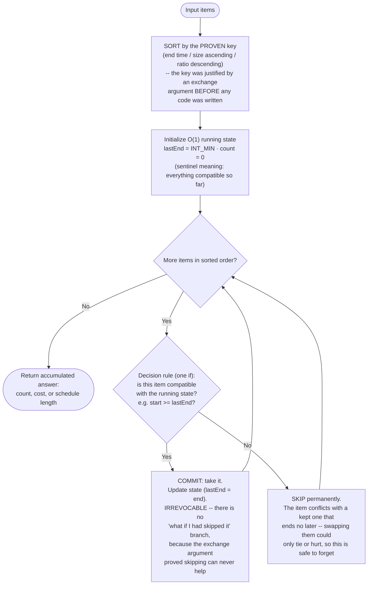

# Greedy — Flow Diagram (Sort-Then-Sweep Control Flow)

This traces the control flow of the canonical sort-then-sweep greedy — the shape behind interval scheduling, Assign Cookies, and boats-to-save-people. The frontier flavor (Jump Game, Gas Station) is the same loop with the sort box deleted. See [trace-diagram.md](trace-diagram.md) for a concrete worked example with actual numbers.

## How to read it

The entire algorithm is two boxes and one `if`. The **sort box** looks mechanical but carries all the intellectual weight: its comparator is the physical embodiment of the exchange argument, and changing the key changes the answer while leaving every other line of code identical. That is why the diagram annotates it "the key was justified BEFORE any code" — in this pattern the proof precedes the implementation, not the other way around. The **state box** is deliberately minimal: one or two scalars that compress everything the past decisions imply about the future (`lastEnd` says nothing about *which* intervals were kept — only where the last one ended, because that is the only fact the next decision needs). If you find yourself wanting more state than fits in a couple of scalars, the choice is not local, and per [recognition-diagram.md](recognition-diagram.md) you should exit toward DP.

The **absence of a box is the defining feature**: nowhere in this flowchart is there a "try both and compare" node. Every other optimization pattern has one — DP's recurrence compares take/skip, backtracking descends into both branches. Here the test branch commits or skips permanently; no edge ever goes backward, no decision is revisited. That is what the exchange argument purchases, and it is also why the whole thing runs in `O(n log n)` (sort) + `O(n)` (one pass, `O(1)` work per item): total work equals sort plus total items processed exactly once. Delete the sort box and the pass alone is `O(n)` — which is precisely the Jump Game / Gas Station flavor, where the original order already makes each local choice safe.
