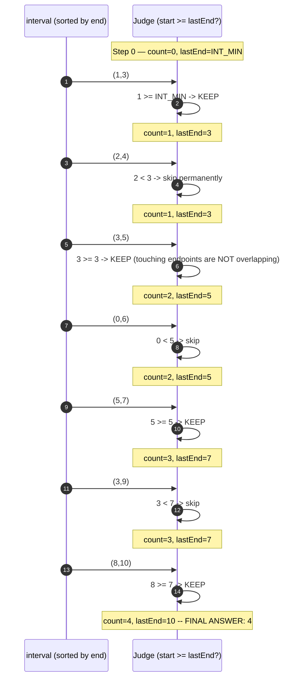
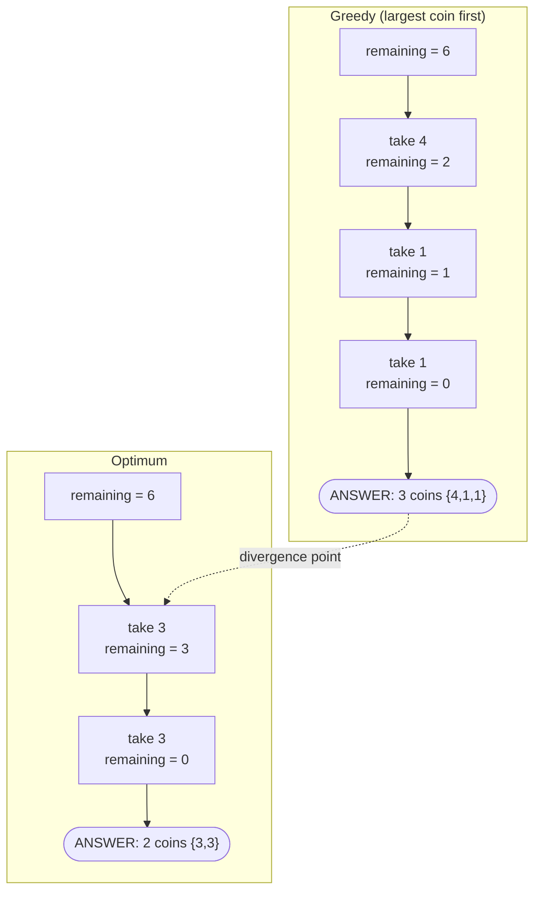

# Greedy — Trace Diagram (Worked Examples)

Two traces: first the **success case** — Activity Selection on the exact seven-interval input asserted in [code.cpp](../code.cpp)'s first test — then a **side-by-side failure case**, greedy coin change with denominations {1, 3, 4} making 6, showing precisely where the greedy choice diverges from the optimum.

## Trace 1 — Interval scheduling (the rule that works)

```
intervals (unsorted): (1,3) (2,4) (3,5) (0,6) (5,7) (3,9) (8,10)
sorted by END time:   (1,3) (2,4) (3,5) (0,6) (5,7) (3,9) (8,10)
index:                   0     1     2     3     4     5     6
rule: keep iff start >= lastEnd;  lastEnd starts at INT_MIN
```



The exchange argument in action on step 2: `(2,4)` overlaps `(1,3)`, and since `(1,3)` ends no later than anything else available, keeping it instead can never shrink what remains — so skipping `(2,4)` is safe to do *permanently*, with no "what if I had skipped `(1,3)`" computation anywhere.

## Trace 2 — Coin change {1, 3, 4}, target 6 (the rule that fails)

```
denominations: {1, 3, 4}      target: 6
greedy rule:   always take the largest coin that fits (no sort needed --
               descending denomination IS the order)
```



## How to read it

In Trace 1, every decision is one comparison against one scalar (`lastEnd`), no edge ever goes backward, and each skipped interval is skipped *forever* — the monotonicity of `lastEnd` is why four keeps fall out in a single pass. Two details worth pausing on: step 3 keeps `(3,5)` because `start == lastEnd` counts as compatible (`>=`, not `>` — LeetCode's convention for this problem), and steps 4 and 6 discard intervals that look "longer-lived" than what was kept, which feels wasteful until you recall the proof: an earlier end always leaves at least as much room downstream.

Trace 2 is the same discipline pointed at itself. The divergence marker sits between the two graphs because it happens at the very **first** choice: greedy takes the 4, leaving 2 — which only two 1s can make. The exchange argument dies right there: swapping the 4 into the optimal `{3,3}` does not leave a solution that is no worse, it leaves `{3,1,1}`-at-best — strictly worse. The broken condition is the **greedy choice property** (no optimal solution for 6 contains a 4), while **optimal substructure still holds** — which is exactly why DP works on this problem where greedy does not: DP never assumes any particular first coin is safe, it computes both and compares. The practical lesson: nothing in greedy's code or output announces the failure — both traces terminate normally and print plausible answers. Only the proof (or a differential test against brute force) separates them.
