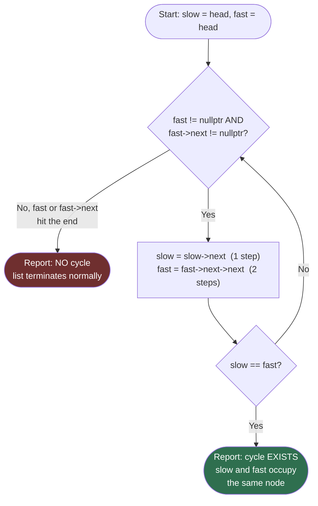

# Flow Diagram — Floyd's Cycle Detection

This diagram traces the control flow of Floyd's Tortoise and Hare algorithm (Phase 1: does a cycle exist), independent of any specific problem.

## How to read it

There is exactly one loop and exactly two ways out of it, and that shape is the entire algorithm. Every iteration does the same two things in order: first confirm `fast` (and `fast->next`) are non-null so the two-step advance is safe, then move `slow` by one node and `fast` by two.

The `Meet` diamond is checked once per iteration, right after both pointers move — checking it before the first move would be wrong, because `slow == fast` is trivially true at the very start (both begin at `head`). If `slow` and `fast` land on the same node after a move, a cycle exists and the loop exits immediately with that answer; there is no need to keep iterating once a collision happens.

The other exit is via the `Check` diamond at the top: if `fast` (or `fast->next`) becomes `nullptr` before a collision ever happens, the list has a genuine end, so no cycle can exist — the loop exits with "no cycle" instead of ever reaching the `Meet` check for that iteration. Note that both exits are reached from the same two lines of code; the diagram is really just unrolling a single `while` loop with one `if` inside it.
