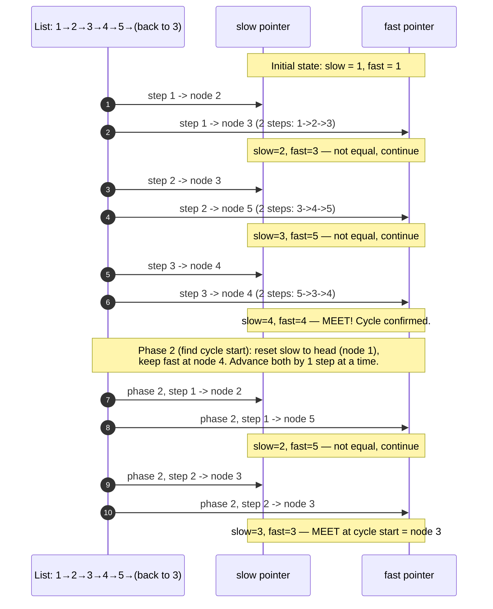

# Trace Diagram — Worked Example

This traces Floyd's cycle detection step by step on one concrete list:

```
1 -> 2 -> 3 -> 4 -> 5 -> (back to 3)
```

Node `5`'s `next` points back to node `3`, forming a cycle of length 3 (`3 -> 4 -> 5 -> 3 -> ...`). `slow` starts at `1` and moves one node per step; `fast` starts at `1` and moves two nodes per step.



## How to read it

Read this top to bottom as a timeline, not as message-passing between real objects — "List" here just represents the act of following a `next` pointer; it is not a participant with its own behavior. Each pair of arrows (one to `slow`, one to `fast`) represents one iteration of the `while` loop in `has_cycle()`: `slow` always gets exactly one arrow (one `next` hop) while `fast` always gets one arrow labeled with two hops, because it moves twice as fast.

The first three iterations are Phase 1. Watch the position notes after each iteration: the gap between `slow` and `fast` shrinks by one node per iteration once `fast` is inside the cycle (iteration 2: gap is 2 nodes apart going into the cycle; iteration 3: they land on the same node). That shrinking gap — not a fixed distance — is *why* they are guaranteed to meet rather than `fast` perpetually skipping over `slow`.

The last two iterations are Phase 2, which only runs after Phase 1 confirms a cycle exists. Notice `slow` is reset all the way back to the list's head while `fast` stays exactly where the two pointers first met — then both move at the *same* speed (one step each) until they meet again. That second meeting point, node 3, is mathematically guaranteed to be the cycle's entry node; the full proof (distance from head to cycle start equals distance from the meeting point back around to the cycle start) is in the README's Execution Flow section.
