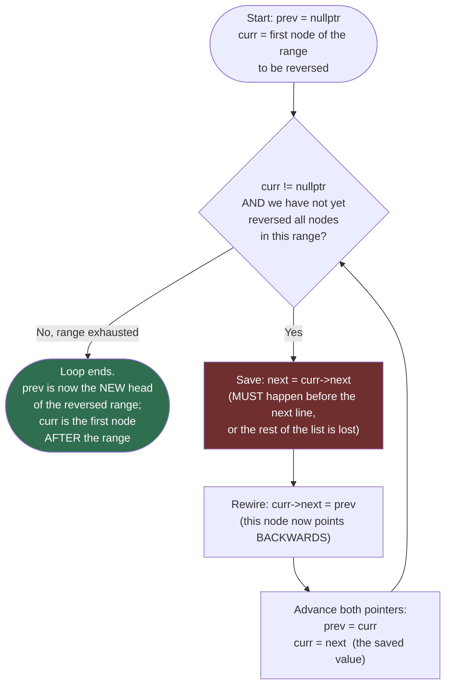

# Flow Diagram — The prev / curr / next Rewiring Loop

This diagram traces the control flow of the core In-place Reversal loop — the same three-pointer shape underneath `reverseList`, `reverseBetween`, and `reverseKGroup` — independent of which variant is being run.

## How to read it

There is exactly one loop with one guard and three statements inside it, run in a fixed order every iteration — that order is the entire algorithm, and it never changes across `reverseList`, `reverseBetween`, or `reverseKGroup`. Only the loop's *starting point*, *stopping condition*, and *what happens after the loop exits* differ between the three variants; the four boxes inside the loop are identical in all of them.

The red `SaveNext` box is highlighted deliberately: it is the one line that must execute **before** the rewire step, not after. `curr->next` is the *only* remaining reference to the rest of the original list at the moment you reach this node — the moment you overwrite it with `curr->next = prev` (the next box), that original link is gone. If you swap the order of these two boxes, the loop still runs without crashing, but every node after the first one becomes unreachable garbage, silently losing most of the list. This is the single most common bug in this entire pattern (see the README's Common Mistakes).

The `Advance` box moves both pointers forward together: `prev` becomes the node that was just rewired (so the next iteration's rewire points at it), and `curr` becomes the node that was saved before the rewire happened. Notice `curr` is never advanced using `curr->next` directly — by the time `Advance` runs, `curr->next` has already been overwritten to point backwards, so advancing must use the `next` variable saved earlier. The loop exits the moment `curr` runs off the end of the range being reversed (`nullptr` for a whole-list reversal, or the node just past `right`/the group's boundary for the sub-range and k-group variants) — at that point `prev` holds the new head of whatever was just reversed, ready to be reconnected to its neighbors.
