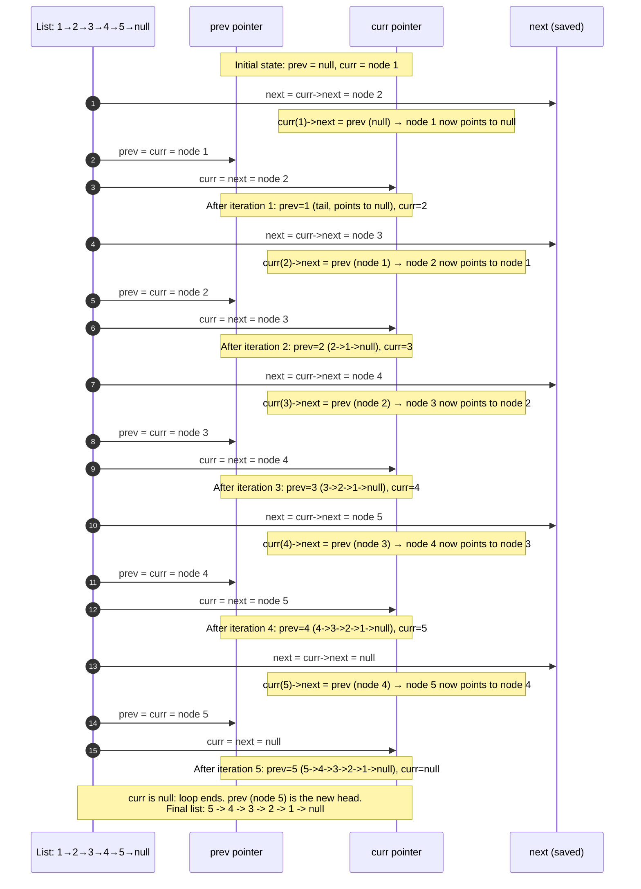

# Trace Diagram — Worked Example

This traces the whole-list reversal (`reverseList`) step by step on one concrete list:

```
1 -> 2 -> 3 -> 4 -> 5 -> nullptr
```

`prev` starts at `nullptr` (there is nothing reversed yet). `curr` starts at node `1` (the whole unreversed list). Each iteration saves `curr->next`, rewires `curr->next` to point at `prev`, then slides both `prev` and `curr` forward by one node.



## How to read it

Read this top to bottom as a timeline, not as message-passing between real objects — "List" here just represents "the structure we are reading pointers from," not a participant with independent behavior. Each block of four arrows is exactly one iteration of the `while (curr != nullptr)` loop in `reverseList`: save `next`, rewire `curr->next`, advance `prev`, advance `curr` — always in that order.

Watch the `next` row carefully at every step: it is captured **before** the rewire note directly below it changes `curr->next`. That ordering is not incidental — it is the entire reason the algorithm does not lose the rest of the list. If you mentally swap those two lines at any iteration (rewire first, save second), `next` would read the pointer *after* it had already been overwritten to point backwards, and every node past that point would become permanently unreachable.

Also notice what `prev` is silently accumulating: after iteration 1, `prev` points at a one-node reversed list (`1 -> null`). After iteration 2, it points at a two-node reversed list (`2 -> 1 -> null`). By iteration 5, `prev` points at the complete five-node reversed list. The loop's invariant — "everything from the original head up to (but not including) `curr` has already been correctly reversed, with `prev` as its head" — is true at the start of every single iteration, which is exactly why the algorithm needs no special-casing for where it currently is in the list. The loop ends the instant `curr` becomes `nullptr`, at which point `prev` is standing on the very last node visited (originally node `5`), which is now the new head of the fully reversed list.
