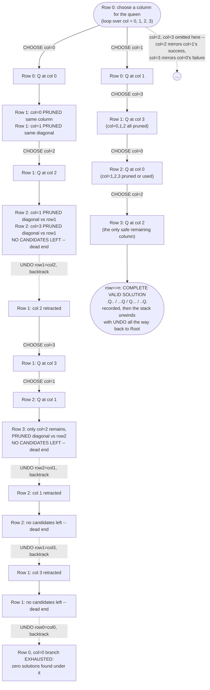

# Backtracking — Trace Diagram (Worked Example: N-Queens, n=4)

This traces the actual decision tree explored by [code.cpp](../code.cpp)'s `solveNQueens(4)`, showing one branch that gets **pruned and fully backtracked** (row 0's queen at column 0 leads nowhere) and one branch that **succeeds** (row 0's queen at column 1 leads to a complete solution). Recall `n=4` has exactly 2 solutions total; this trace walks through finding the first one and shows why the column-0 start fails completely.

## How to read it

Follow the **left branch** (row 0's queen at column 0) first: it descends two more levels before hitting a row with **zero safe candidates** (`R2DeadA`), at which point the dotted `UNDO ... backtrack` edges take over -- each one retracts exactly the single choice made at that level and returns control to the loop one level up, which then tries its *next* candidate column rather than giving up entirely. Notice this happens **twice** in sequence (row 1's `col=2` is undone and replaced by `col=3`; then, after that also dead-ends two levels deeper, row 1's `col=3` is undone too) before the algorithm finally concludes the *entire* column-0 start is fruitless and backtracks all the way to row 0. This is the mechanical reality behind "explore, hit a wall, retreat to the last decision point, try the next option" from the maze analogy in the README.

Follow the **right branch** (row 0's queen at column 1) to see the mirror image: every choice happens to be forced (only one safe column remains at each subsequent row), and the recursion reaches `row == n` with a fully valid board -- the base case that records a solution rather than triggering a prune. Even after a successful solution is recorded, the call stack still unwinds through the same `UNDO` steps on the way back to `Root`, because the search must continue to check whether *other* columns in row 0 (`col=2`, `col=3`, both omitted here for space) also lead to valid boards -- backtracking does not stop at the first solution unless the caller explicitly tells it to.

The key visual takeaway: **dashed arrows are always `UNDO`, and they always point back up to a shallower row than the solid arrows that led down into the dead end** -- the tree is walked depth-first, and every dead end is a wasted *sub*-tree, not the whole remaining search, precisely because pruning happens at each row rather than only at the leaves.
