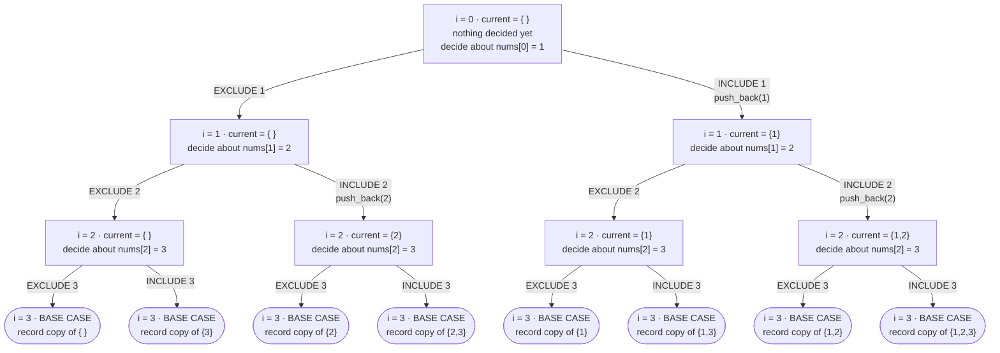

# Subsets — Flow Diagram

This is the full include/exclude recursion tree for `nums = {1, 2, 3}` — every branch, down to all `2^3 = 8` leaves. It is the decision tree that `subsetsRecursive` in [code.cpp](../code.cpp) walks depth-first. Each level of the tree decides exactly one element; each leaf is one complete subset. See [trace-diagram.md](trace-diagram.md) for the same eight subsets produced by the *iterative doubling* framing instead.

Depth-first visit order of the leaves, matching the `exclude`-before-`include` order in `subsetsRecursiveHelper`:

| # | Leaf recorded | Decisions taken (nums[0], nums[1], nums[2]) | As a bitmask (bit `i` = include `nums[i]`) |
|---|---|---|---|
| 1 | `{ }` | out, out, out | `000` = 0 |
| 2 | `{3}` | out, out, **in** | `100` = 4 |
| 3 | `{2}` | out, **in**, out | `010` = 2 |
| 4 | `{2,3}` | out, **in**, **in** | `110` = 6 |
| 5 | `{1}` | **in**, out, out | `001` = 1 |
| 6 | `{1,3}` | **in**, out, **in** | `101` = 5 |
| 7 | `{1,2}` | **in**, **in**, out | `011` = 3 |
| 8 | `{1,2,3}` | **in**, **in**, **in** | `111` = 7 |

## How to read it

**Every level of the tree is one element, and every node has exactly two children.** That is the entire correctness argument for this pattern, and it is worth stating as a sentence you could defend out loud: element `nums[i]` is decided at depth `i`, both of its possible decisions are explored, and no element is ever decided twice — therefore every distinct combination of `n` yes/no decisions appears exactly once as a root-to-leaf path, and there are exactly `2^n` such paths. No subset can be missed (every decision combination has a path) and none can be duplicated (two different paths must differ at some level, which means they differ on some element's membership). This is the "provably complete" claim from the [README](../README.md)'s *Advantages* section, drawn out.

**The index `i` is the recursion's only sense of progress, and its invariant is what keeps the tree from tangling.** At any node labelled `i = k`, every index below `k` has already been decided (its choice is baked into `current`) and every index from `k` onward is still open. This is why the recursion terminates at `i == nums.size()` rather than at "current is full" — there is no such thing as "full" here, since a valid subset can have any length from 0 to `n`. Contrast the permutation shape in `permutations` (also in [code.cpp](../code.cpp)), whose base case genuinely *is* `current.size() == nums.size()`, because there every element must appear exactly once.

**`current` is one single shared buffer, not one buffer per node.** Look at the diagram again and notice that the label on each node is not a stored object — it is the *momentary* state of the one shared `std::vector<int> current` at the instant the recursion is standing on that node. When the walk moves from `C00` down to leaf `L2` it pushes `3`; when it comes back up it pops `3`, restoring `current` to exactly what `C00`'s label says before control returns to `B0`. That push-recurse-pop bracket is why the diagram is legible at all: without the pop, `current` would still be carrying `3` when the walk descends into `C01`, and every subsequent leaf would be contaminated with a value from a branch that was already finished. The [README](../README.md)'s *Common Mistakes* section calls this out; the diagram is the picture of what "contaminated" means — leaf `L3` would record `{3,2}` instead of `{2}`.

**The base-case boxes say "record a *copy*" deliberately.** `result.push_back(current)` copies the vector by value, which is the only reason the eight recorded answers survive. Storing a pointer or reference to `current` at each leaf would leave all eight entries aliasing the same buffer, which by the end of the traversal is empty — you would get eight empty subsets. This is the second mechanical trap in *Common Mistakes*, and it is invisible in the diagram precisely because the diagram shows what *should* happen.

**The rightmost column of the table is the bridge to bitmask enumeration.** Read each root-to-leaf path as a binary number — bit `i` set means "included `nums[i]`" — and every leaf maps to exactly one integer in `[0, 2^n)`. The recursion visits those integers in a scrambled order (`0, 4, 2, 6, 1, 5, 3, 7`, because the tree decides the *low* bit at the *top* level), while the bitmask loop in [problems/01-subsets.cpp](../problems/01-subsets.cpp) visits them in plain counting order `0..7`. Same eight subsets, same `2^n` count, different visit order — which is exactly the *Solution* section's point that the framings are equivalent mechanics over one enumeration, not competing algorithms.

**What is conspicuously absent: any box that says "check whether this is valid."** Every one of the eight leaves is recorded unconditionally. Adding a validity test at a node — and returning early when it fails, cutting off that node's entire subtree — is the single structural change that turns this diagram into a Backtracking diagram (see [../../backtracking/](../../backtracking/)). [problems/04-combination-sum.cpp](../problems/04-combination-sum.cpp) is where that first prune appears in this module.
