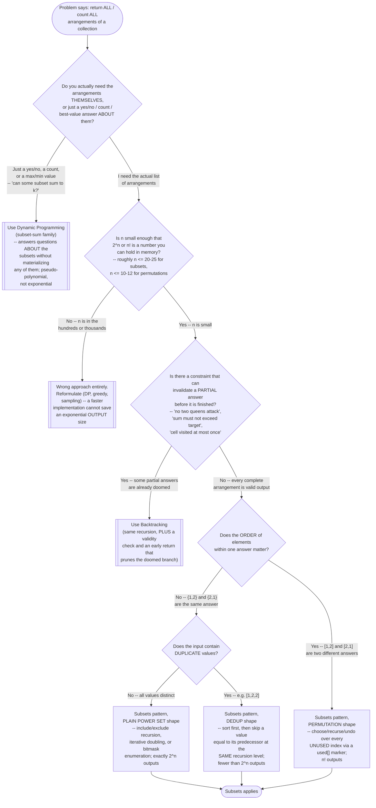

# Subsets — Recognition Diagram

Use this flowchart when a problem says "return all …" and you need to decide whether it is plain Subsets enumeration, its sibling [Backtracking](../../backtracking/), or something that should not be enumerated at all (Dynamic Programming).

## How to read it

The **first diamond is the one people skip, and it is the most expensive mistake in this whole family.** Before asking *how* to enumerate, ask whether you need the enumeration at all. "Does some subset of these numbers sum to exactly `k`?" and "list every subset that sums to `k`" look like the same question and are not: the first is a yes/no fact about the power set that Dynamic Programming answers in pseudo-polynomial time by tracking reachable sums, never building a single subset; the second genuinely requires producing the subsets, so exponential cost is the price of the output, not a symptom of a bad algorithm. The [README](../README.md)'s *When NOT To Use* section makes this same call — if the question is "does at least one satisfy X," you are in DP territory.

The **second diamond is a sanity check on `n`, not on your code.** `2^20` is about a million subsets, which is comfortable; `2^25` is 33 million, which is seconds and real memory pressure; `2^30` is over a billion, which no request handler should ever attempt. Permutations blow up sooner — `10!` is 3.6 million while `2^10` is only 1,024, so the same "small input" intuition that is safe for subsets is already dangerous for orderings. If the constraints allow large `n`, no amount of implementation polish helps, because the output itself is the thing that does not fit. This is the concrete, operational version of the *Disadvantages* section's point that the exponential cost is inherent to the problem.

The **third diamond is the exact boundary between this module and [Backtracking](../../backtracking/)**, and it is worth stating precisely: the question is not "is there a constraint" but "can the constraint reject a **partial** answer." "Return every subset whose length is even" has a constraint, but you cannot know a partial subset's final length, so you enumerate everything and filter — still Subsets. "Return every subset whose sum is at most 10" *can* reject a partial answer, because a partial sum already over 10 can never come back down — that is a prunable constraint, and pruning is Backtracking. Subsets, by design, has zero pruning: every leaf of the decision tree is valid output, which is why the pattern has no constraint-checking code that could carry a subtle bug (see *Advantages*).

The **fourth and fifth diamonds pick which of this module's three shapes you write.** Order-matters sends you to the `used[]`-marker permutation shape (`permutations` in [code.cpp](../code.cpp), worked out in [problems/03-permutations.cpp](../problems/03-permutations.cpp)); order-does-not-matter with distinct values sends you to the plain power set (`subsetsRecursive` / `subsetsIterative` in [code.cpp](../code.cpp), worked out in [problems/01-subsets.cpp](../problems/01-subsets.cpp) alongside the bitmask alternative); order-does-not-matter with duplicate values sends you to the sort-then-skip-same-level shape ([problems/02-subsets-ii.cpp](../problems/02-subsets-ii.cpp)). Notice that the duplicate check is the *last* fork, not the first — the dedup rule is a modification layered onto the plain enumeration, not a different algorithm, and reading it that way is what keeps the "same recursion level, not same branch" distinction straight.
