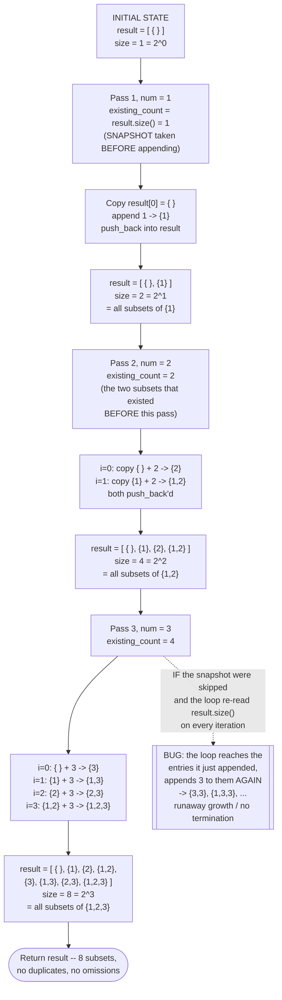

# Subsets — Trace Diagram (Worked Example)

This traces `subsetsIterative` in [code.cpp](../code.cpp) — the BFS-style doubling framing — building all `2^3 = 8` subsets of `nums = {1, 2, 3}`. Compare with [flow-diagram.md](flow-diagram.md), which produces the same eight subsets via depth-first include/exclude recursion instead.

State of `result` after each pass, laid out so the doubling is visible as a literal split:

| After pass | `num` folded in | `result` contents | Size | Reading of the invariant |
|---|---|---|---|---|
| — (init) | — | `{ }` | 1 = 2^0 | Every subset of `{}` |
| 1 | `1` | `{ }` · `{1}` | 2 = 2^1 | Every subset of `{1}` — the old 1, plus the old 1 each with `1` added |
| 2 | `2` | `{ }` `{1}` · `{2}` `{1,2}` | 4 = 2^2 | Every subset of `{1,2}` — the old 2, plus the old 2 each with `2` added |
| 3 | `3` | `{ }` `{1}` `{2}` `{1,2}` · `{3}` `{1,3}` `{2,3}` `{1,2,3}` | 8 = 2^3 | Every subset of `{1,2,3}` — the old 4, plus the old 4 each with `3` added |

The `·` in each row marks the boundary between "subsets that already existed" (left, untouched) and "the copies just created" (right). Those two halves are always the same length, which is the doubling.

## How to read it

**Read the rightmost column as a loop invariant, not as a description.** After the pass that folds in the `k`-th element, `result` contains *exactly* the `2^k` subsets of the first `k` elements — no more, no fewer, no duplicates. That is the claim from the [README](../README.md)'s *Architecture* section, and this trace is its proof by induction laid out flat: the base case (`result = [{}]`, the one subset of the empty set) is true by construction, and each pass preserves the invariant because a subset of the first `k` elements either contains element `k` or does not — the untouched left half covers "does not," and the freshly-copied right half covers "does," with nothing overlapping between them.

**Every subset in the right half is a *fresh copy*, and that is the pattern's real cost.** `std::vector<int> extended = result[i];` allocates and copies; the original `result[i]` is never mutated. If it were mutated in place instead, the left half would be destroyed and you would end up with `2^n` subsets that all contain the last element. The copy is also where the extra factor of `n` in the `O(2^n · n)` complexity comes from — the eight subsets of a three-element set hold 12 integers between them, and every one of those integers was written by a copy at some point.

**The dotted branch on the right is the single most important thing in this diagram.** `existing_count` is snapshotted *before* the inner loop starts, and the inner loop compares against that frozen value. Writing `for (size_t i = 0; i < result.size(); ++i)` instead looks harmless and is catastrophic: `result.size()` is re-evaluated on every iteration, and the loop is appending to `result` inside its own body, so the bound keeps outrunning the counter. The loop reaches the entry it appended two iterations ago, copies *that* and appends `3` to it, producing `{3,3}` — and then reaches *that*, producing `{3,3,3}`. It never terminates (and would exhaust memory first). This is the *Common Mistakes* entry about off-by-one in the doubling loop; note that the symptom is not a wrong answer at the edges, it is a program that hangs, which is why the fix has to be structural (freeze the bound) rather than an adjustment to the comparison.

**The doubling is per-element, not per-subset — the passes are what makes this "BFS-style."** There are exactly `n` outer passes regardless of how large `result` gets, and pass `k` touches the whole collection built so far at once. The recursive framing in [flow-diagram.md](flow-diagram.md) instead completes one full root-to-leaf decision path (`{ }`, then `{3}`, then `{2}`, …) before backing up, touching one subset at a time. Same eight results, different order of appearance: the iterative version emits them grouped by "which prefix they came from" (`{ }, {1}, {2}, {1,2}, {3}, {1,3}, {2,3}, {1,2,3}` — bitmask order `0,1,2,3,4,5,6,7`, since the last element folded in becomes the highest bit), while the recursion emits them in `0,4,2,6,1,5,3,7` order. `main()` in [code.cpp](../code.cpp) asserts the two agree *after* sorting both, precisely because the orders differ but the sets do not.

**Where this framing stops being enough.** Nothing in this trace can skip work — there is no point at which the algorithm could look at a half-built subset and decide not to extend it, because the pass structure is "extend everything, always." That is fine when every subset is valid output, and it is exactly why the iterative framing does not generalize to Backtracking: pruning needs a *partial* answer you are standing on and can abandon, which only the recursive framing gives you. It is also why the duplicate-input problem ([problems/02-subsets-ii.cpp](../problems/02-subsets-ii.cpp)) is awkward here and natural in the recursion — "skip a value equal to its predecessor at the same recursion level" needs a recursion level to talk about.
