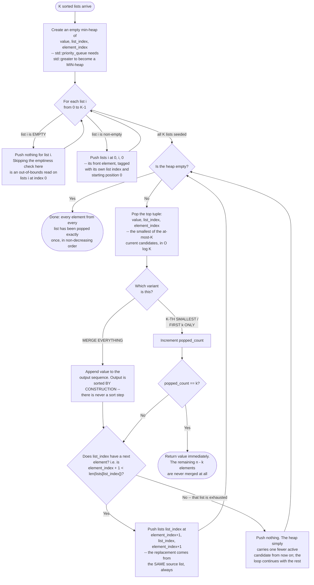

# K-way Merge — Flow Diagram

This traces the control flow of the seed-then-pop-and-replace loop that every K-way Merge problem in this module runs, matching the numbered steps in the Execution Flow section of the [README](../README.md). The two variants (merge everything vs. stop at the k-th pop) diverge at exactly one diamond. See [trace-diagram.md](trace-diagram.md) for the same loop walked through with concrete values.

## How to read it

The diagram has two loops, and confusing them is the first thing to avoid. The **upper loop** (`SeedLoop`) runs exactly K times, once per input list, and it runs to completion before a single value is emitted — its only job is to put one representative from every non-empty list into the heap so that the very first pop is genuinely the smallest element across *all* the lists, not just the first one. The **lower loop** (`HeapCheck` → `Pop` → `Advance` → back to `HeapCheck`) runs exactly `n` times in the merge-everything variant, once per element across all lists combined. That split is where the O(K log K) + O(n log k) complexity in the README's Complexity section comes from, and why the second term dominates.

The single most load-bearing box is **`PushNext`**. Every pop is followed by at most one push, and that push always draws from the *same* `list_index` the popped entry came from — this is the reason each heap entry has to carry `list_index` and `element_index` at all, rather than being a bare `int`. If you drop the `PushNext` step for even one popped entry, that list's entire remaining tail is silently lost, and the output is short by however many elements were behind the one you popped. Nothing throws, nothing warns; the merged result is simply incomplete. Treat `Pop` and `Advance` as one indivisible operation, never two things you do separately.

The **`Advance` diamond's condition is `element_index + 1 < len(list)`, not `element_index < len(list)`** — the off-by-one called out in the README's Common Mistakes. Getting it wrong in the loose direction re-reads past the end of the list; getting it wrong in the tight direction drops each list's final element. A single-element list is the input most likely to expose either error, which is why [code.cpp](../code.cpp)'s test suite includes one explicitly (`{{1, 10, 20, 30}, {2}, {3, 4, 5}}`).

The **`Variant` diamond** is the only structural difference between `mergeKSortedLists` and `kthSmallestInKSortedLists` in [code.cpp](../code.cpp). The merge-everything path accumulates into an output vector and always runs the heap to empty. The early-exit path keeps a counter instead of a vector and returns the moment `popped_count == k`, which is precisely how [problems/02](../problems/02-kth-smallest-element-in-a-sorted-matrix.cpp) avoids flattening an entire `n x n` matrix to answer a question about one element. Note that the early-exit return happens *before* `Advance`: once you have the answer, replenishing the heap would be pure waste.

Finally, the **`NoPush` box is not an error path** — it is the normal, expected way a merge winds down. Lists exhaust at different times (nothing requires them to be the same length), and each exhaustion just shrinks the heap by one. The loop's termination condition is the heap going empty, never "all lists reached the same index," which is exactly why uneven list lengths need no special-casing anywhere in the code.
