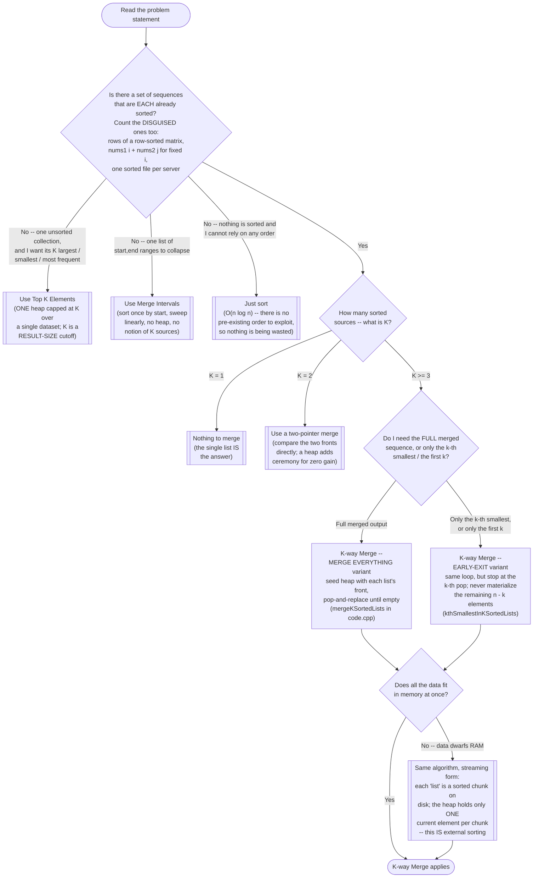

# K-way Merge — Recognition Diagram

Use this flowchart when you are staring at a new problem and trying to decide whether K-way Merge is the right tool, or whether the problem actually wants Top K Elements, Merge Intervals, a plain two-pointer merge, or just `std::sort`.

## How to read it

The **first diamond is the whole pattern**, and it is deliberately phrased to catch the disguised cases, because that is where recognition actually fails. Nobody misses "you are given K sorted linked lists" (LeetCode 23, [problems/01](../problems/01-merge-k-sorted-lists.cpp)). What people miss is that an `n x n` matrix with sorted rows is K = n sorted lists wearing a matrix costume ([problems/02](../problems/02-kth-smallest-element-in-a-sorted-matrix.cpp)), that fixing an index `i` into a sorted `nums1` makes the sums `nums1[i] + nums2[0], nums1[i] + nums2[1], ...` an ascending sequence — so each `i` is its own implicit sorted list, never materialized in memory ([problems/03](../problems/03-find-k-pairs-with-smallest-sums.cpp)), and that "one already-time-ordered log file per server" is exactly the same shape at production scale. If you answer "no" to this diamond too quickly, you fall through to `std::sort` and pay O(n log n) to re-derive ordering you were handed for free.

The two "No" branches on the left are the patterns this one is most often confused with, and both confusions come from the letter K rather than from the mechanism. In **Top K Elements**, K is a *result-size cutoff* you were told to produce, the heap is capped at K, and there is exactly one input collection with no notion of "sources." In **K-way Merge**, K is a *count of input sources*, and the heap's size is dictated by that count — one slot per still-active list — not by how much output you want. **Merge Intervals** shares only the English word "merge": it sorts one list of `[start, end]` ranges and sweeps it linearly with no heap at all.

The **K = 1 / K = 2 / K >= 3** fork is a real decision, not a formality — it is the module's own "When NOT To Use" rendered as a diamond. For K = 2, a two-pointer merge compares the two fronts directly in O(1) per output element; the heap's O(log K) advantage over an O(K) linear scan is worth nothing when K itself is 2, and you pay tuple bookkeeping and heap push/pop overhead for it. Reach for the heap once K is more than a small constant, which is exactly when scanning all K fronts by hand every step starts to cost real time.

The last two diamonds are about **how much you are willing to build**. Needing only the k-th smallest (or the first k results) lets you stop at the k-th pop and skip merging `n - k` elements you were never going to read — the difference between `mergeKSortedLists` and `kthSmallestInKSortedLists` in [code.cpp](../code.cpp), and the reason [problems/02](../problems/02-kth-smallest-element-in-a-sorted-matrix.cpp) never flattens the matrix. Needing to merge more data than fits in RAM changes nothing about the algorithm and everything about why you chose it: the heap holds O(K) elements regardless of `n`, so each "list" can be a sorted chunk streamed off disk. That property — bounded memory, independent of total data size — is what makes this pattern the foundation of external sorting rather than merely a faster `std::sort`.
