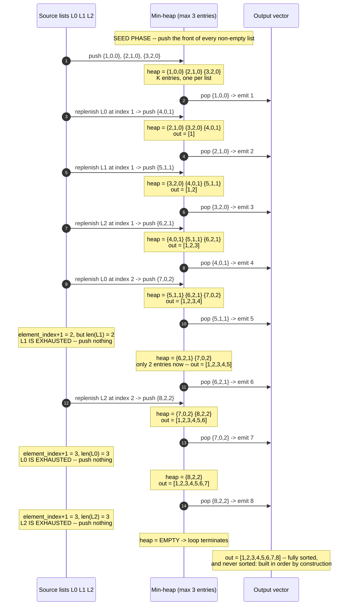

# K-way Merge — Trace Diagram (Worked Example)

This traces `mergeKSortedLists` from [code.cpp](../code.cpp) merging **three** small sorted lists, showing the heap's exact contents at every step. K = 3 (three source lists), n = 8 (eight elements total across all of them) — deliberately uneven lengths, so you can watch a list exhaust mid-merge without any special-case code running.

```
  L0 = [1, 4, 7]      (3 elements)
  L1 = [2, 5]         (2 elements -- runs out first)
  L2 = [3, 6, 8]      (3 elements)

  Heap entries are written {value, list_index, element_index}.
```



## How to read it

Every `Heap->>Out` arrow is one **pop**, and every `Src->>Heap` arrow that follows it is that pop's **replenishment** — the "advance the source pointer" step from the [README](../README.md)'s Architecture section. Read them as a single unit: pop, emit, refill from the same list. There are exactly 8 pops (one per element) and exactly 7 pushes after the seed phase, because the last element of each list has no successor to push. In general: `n` pops, at most `n` pushes, each O(log K) — that is the O(n log k) bound, derived directly off this trace.

The **seed phase is not optional and cannot be folded into the loop.** Before the first pop, all three lists must already have a representative in the heap. If you seeded only L0 and pushed the others lazily, the first pop would return L0's `1` by luck here, but on `L0 = [9, 10]`, `L1 = [1]` it would return `9` — wrong, because nothing told the heap that a smaller candidate existed elsewhere. The invariant the whole algorithm rests on is: *at all times, the heap holds the current front of every still-active list*, so the minimum of the heap is the minimum of everything unconsumed.

**Watch the `element_index` field earn its keep at step 5.** The popped entry is `{5,1,1}` — value 5, from list 1, at position 1. To decide whether to replenish, the code computes `element_index + 1 = 2` and compares it against `len(L1) = 2`. `2 < 2` is false, so L1 is done and nothing is pushed. Note what would happen with the off-by-one from the README's Common Mistakes: checking `element_index < len(L1)` (`1 < 2`, true) would push `L1[2]` — reading one past the end of a 2-element vector. And note what the `list_index` field bought: without it, the popped value `5` gives no clue *which* of the three lists to advance.

**The heap shrinking is the normal wind-down, not an error.** After step 5 the heap holds 2 entries; after step 7, one; after step 8, zero, and the loop ends. The code has no branch for "a list ran out" and no branch for "the lists have different lengths" — exhaustion is handled entirely by the `if (next_index < size)` guard declining to push. That is why the same eight-line loop merges 3 equal-length lists, 3 wildly uneven lists, and a set that includes completely empty lists (`code.cpp` Test 3) with zero special-casing.

**Finally, note what never happens: a sort.** The output vector is appended to exactly 8 times and is in ascending order at every intermediate step, because the heap guarantees each pop is `>=` the previous one. Contrast the alternative from the README's Why Not Other Approaches: concatenating L0, L1, L2 into `[1,4,7,2,5,3,6,8]` and calling `std::sort` also produces `[1,...,8]`, but it discards the fact that each input arrived sorted and pays O(n log n) to rediscover it. Here, the heap only ever compared **at most 3 candidates at a time** — never more than one per source — and that bound on the heap's size is also the reason this same trace works unchanged when each `Li` is a multi-gigabyte sorted file streamed off disk rather than a three-element vector in RAM.

**For the early-exit variant** (`kthSmallestInKSortedLists`, and [problems/02](../problems/02-kth-smallest-element-in-a-sorted-matrix.cpp)): read the same trace but stop at the k-th `Heap->>Out` arrow. For k = 4, the answer is `4` and steps 6-8 never execute — the elements `5, 6, 7, 8` are never merged, never compared, and in the streaming case never even read off disk.
