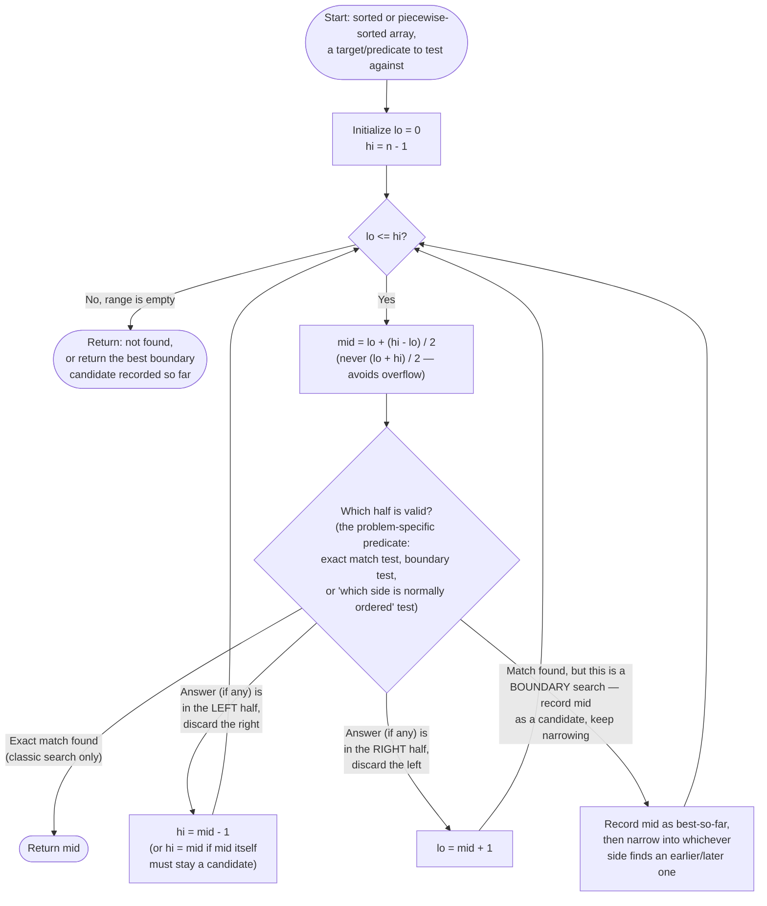

# Modified Binary Search — Flow Diagram

This traces the control flow of the general lo/hi/mid halving loop — the shape shared by classic exact-match search, first/last-occurrence (boundary) search, and rotated-array search. The only thing that changes between variants is what happens inside the "which half is valid?" box. See [trace-diagram.md](trace-diagram.md) for a concrete worked example with actual numbers.

## How to read it

The single loop condition `lo <= hi` is the entire lifetime of the algorithm — every iteration does a fixed amount of O(1) work (compute `mid`, run the predicate, move one pointer), and the loop runs at most `log2(n)` times because the range `[lo, hi]` is cut roughly in half every iteration, never scanned element by element. That is the whole argument for the O(log n) time bound: **the search space shrinks multiplicatively, not by a fixed amount**, which is the fundamental difference from a linear scan (where the space shrinks by exactly one element per step).

The box labeled "Which half is valid?" is where the four variants in [code.cpp](../code.cpp) diverge from each other, and it is the box worth studying hardest for any *new* problem you meet: classic search tests `nums[mid]` against `target` directly; boundary search (first/last occurrence) tests `nums[mid]` against `target` too, but on a match it does **not** stop — it records the candidate and keeps going, because "found *a* match" is not the same question as "found the *first* match"; rotated-array search cannot compare `nums[mid]` to `target` alone, because the array is not globally ordered, so it first asks "which half, [lo..mid] or [mid..hi], is internally sorted?" and only then checks whether `target`'s value falls inside that sorted half's range. In every case, exactly one of `lo` or `hi` moves per iteration (or `mid` is recorded and narrowing continues) — never both, and never neither, or the loop either misses the answer or never terminates.
